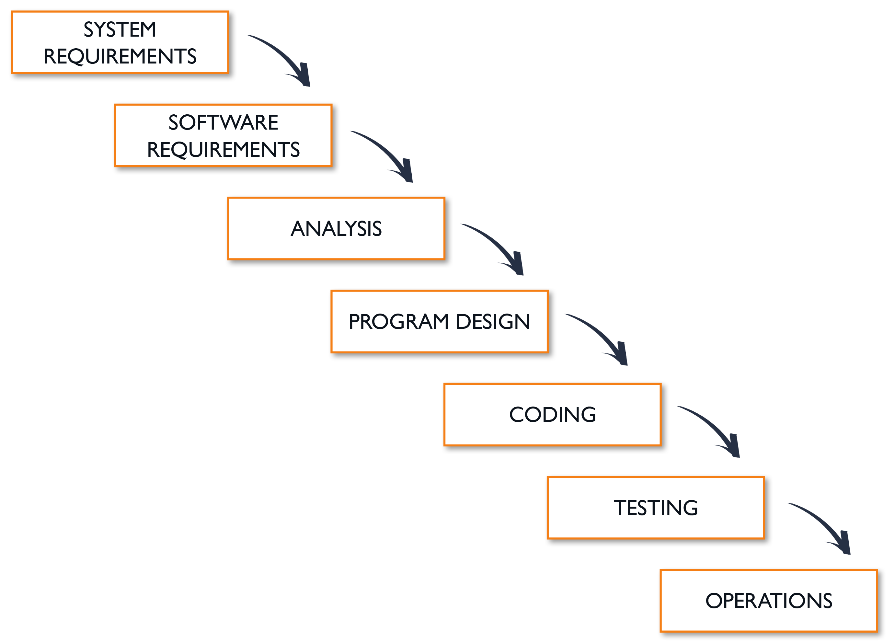
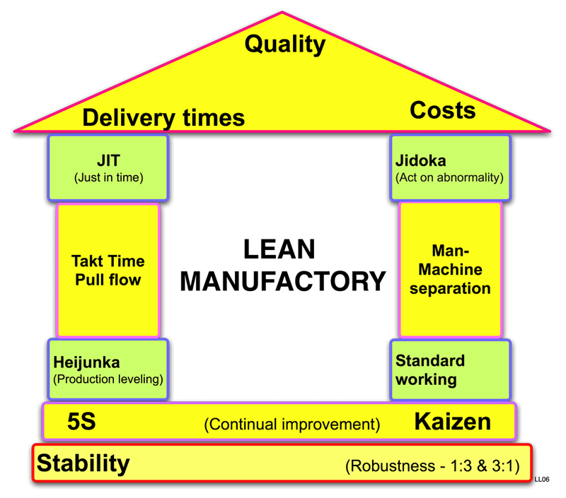
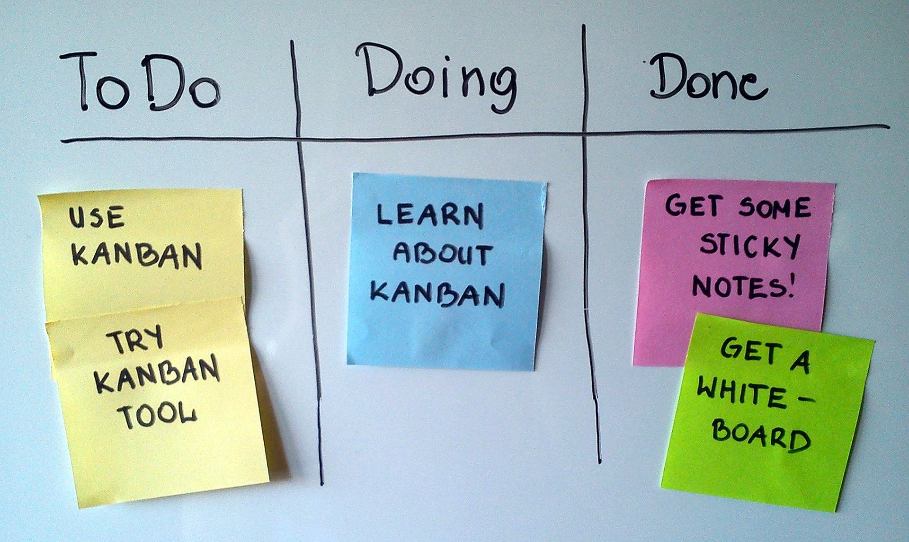
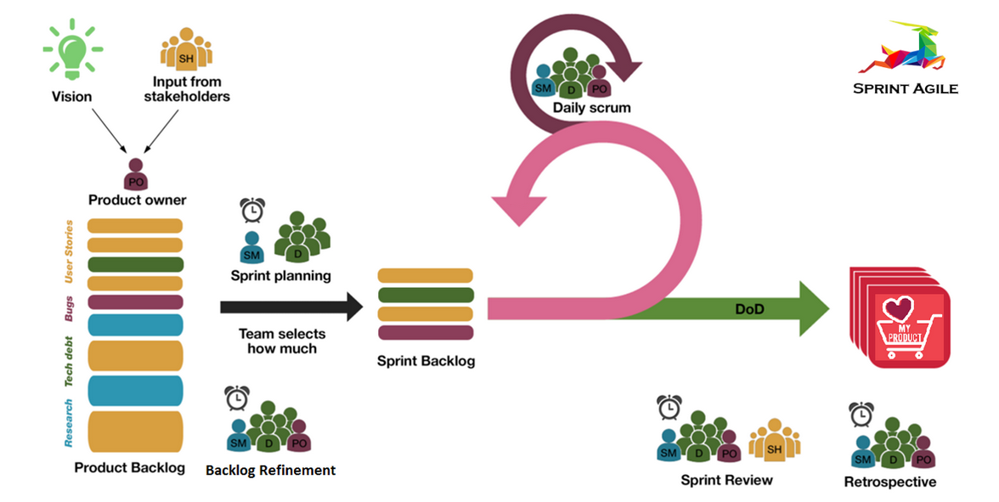
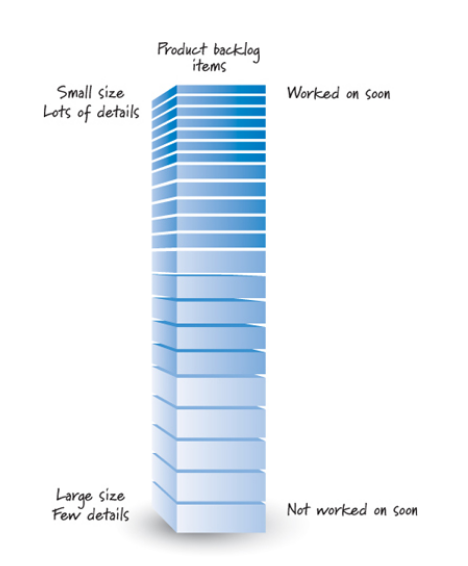
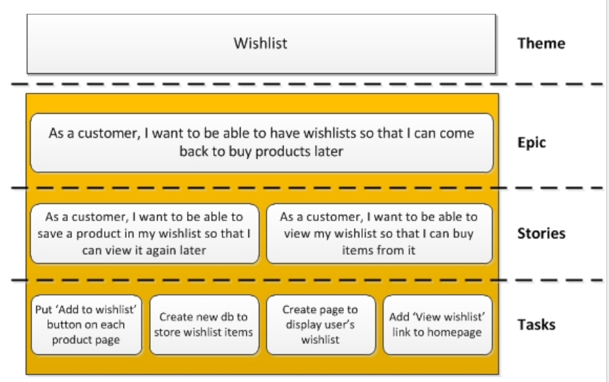
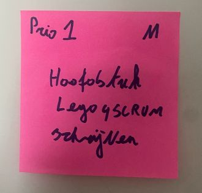

# Agile

Als we kijken naarhet hedendaagse IT landschap zien we mooie vooruitgangen in onze leefwereld maar ook heel wat problemen. We kunnen al eeuwen projecten afwerken, maar al deze methodes falen in software? We zien in het nieuws stuk voor stuk gefaalde grote software projecten gebeuren, en dit is maar het tipje van de ijsberg. Terwijl we dit in niet-IT veel minder zien. We zijn al bezig met dit fenomeen sinds 1950!

Wat is er nu zo anders?
In de IT hebben we te maken met een constante evolutie van onze technologie, veel sneller dan andere sectoren.
Daarboven kennen we een constante evolutie van eisen, de wereld rondom ons veranderd bijna op een even snel tempo.

> Software is als de antwerpse ring, je bouwt jaren aan een tunnel die veel te groot is en in 5 jaar tijd is ze al te klein. ([Lees 50 jaar Kennedytunnel](https://www.vrt.be/vrtnws/nl/2019/05/29/50-jaar-kennedytunnel/))

Maar we hebben een geluk: software is flexibel!

## Wat vooraf ging

Sinds de jaren 50 waren we hier al mee bezig, hoe kunnen we IT processen efficienter maken?
Er zijn vele verouderde methoden maar nog een is zeer bekend, de waterfall methode.

De waterfall methode gebruikt verschillende fases in een project, waar we vloeien van de ene stap naar de andere. Op het einde komen we uit in het resultaat. Net als in een waterval gaan we vlot naar beneden, maar nooit meer terug naar boven.

Waterfall is gemakkelijk te gebruiken door de simpliciteit van het model, de stappen zijn duidelijk en worden 1 voor 1 aangepakt. Na elke stap wordt duidelijk vooruitgang geboekt, wat motiverend kan werken.
Werkt erg goed voor projecten waar de _requirements erg duidelijk zijn_ en **niet zullen veranderen**.
Waterfall vereist wel veel papierwerk, wat niet altijd leuk is maar er wel voor zorgt dat nieuwe collega’s makkelijk mee aan de slag kunnen.

Maar waarom gebruiken we nu geen waterfall meer??
Eens je aan het testen bent kan je niet meer terug gaan een veranderingen maken in het project. Dit is een groot probleem als iemand tijdens analyse een fout maakt. Je hebt ook pas effectief werkende software tijdens de laatste stappen van het project, dit kan maanden of jaren later zijn.
het is geen goed model voor lange projecten (kans dat er verandering moeten gebeuren wordt groter met de tijd).
Slecht model waar de requirements van het project niet met zekerheid vast liggen, iets wat in deze wereld bijna onmogelijk is.
Toch een stap terug moeten gaan door een fout kost heel veel tijd en geld.

De IT-wereld verandert snel, het project kan achterhaald zijn voor het af is, ik wil niet berekenen hoeveel projecten door COVID-19 in het water gevallen zijn.

## LEAN

LEAN is enige tijd een model geweest dat in de IT wereld zijn intreden maakte. LEAN echter komt uit de auto wereld. Het is ontwikkeld door Toyota voor verbetering van fabricage van auto's. Toch heeft het een verbeterign kunnen leveren in vele andere sectoren, de kans dat je dit ergens hoort is dan ook enorm groot.

LEAN letterlijk vertaald is "mager" of "slank" Lean is een business strategie en vooral een manier van werken waarbij alles en iedereen in de onderneming zich richt op het creëren van waarde voor de klant in alle processen. Hierdoor worden verspillingen geëlimineerd.

Lean Manufacturing heeft een paar pijlers

-   **Waarde:** Wie is mijn klant en wat wil mijn klant?
-   **Waardestroom:** Welke activiteiten zijn er en wat is hun waarde ?
-   **Flow:** een onverstoord vloeiend proces van waardetoevoegende activiteiten
-   **Pull:** Klantvraag is leidend voor de productie.
-   **Perfectie:** Blijf altijd verbeteren. Continuous improvement.

Dit te bereiken door

-   geef een team verantwoordelijkheid en luister naar hen (the right person on the right job)
-   Verlies nooit het **geheel** uit het oog
-   Heb steeds oog voor **kwaliteit**

Voor IT heeft dit model echter een paar gevaren, het is gemaakt voor grootschalige productie. En het kan innovatie beperken.

## Agile Manifesto

Het Agile Manifesto kent zijn oorsprong in 2001.
Toen afvaardiging van tal van Agile software development methodologies en sympathisanten van een alternatief voor de klassieke, documentatie gerichte, zware software development processen, kwamen samen om hierover van gedachten te wisselen.
Resultaat: [het Agile Manifesto](http://agilemanifesto.org/)!

Wat stond er in dit manifesto? 12 punten over hoe we software moeten ontwikkelen.

1. Our highest priority is to **satisfy the customer** through **early and continuous** delivery of valuable software.
2. **Welcome changing requirements**, even late in development. Agile processes harness change for the customer's competitive advantage.
3. **Deliver working software frequently**, from a couple of weeks to a couple of months, with a preference to the shorter timescale.
4. **Business people and developers must work together daily** throughout the project.
5. Build projects around **motivated individuals**. Give them the environment and support they need, and trust them to get the job done.
6. The most efficient and effective method of **conveying information** to and within a development team is face-to-face conversation.
7. **Working software** is the primary measure of progress.
8. Agile processes promote **sustainable development**. The sponsors, developers, and users should be able to maintain a **constant pace** indefinitely.
9. Continuous attention to **technical excellence** and good design enhances agility.
10. **Simplicity** --the art of maximizing the amount of work not done-- is essential.
11. The best architectures, requirements, and designs emerge from **self-organizing teams**.
12. At regular intervals, the team **reflects** on how to become more effective, then tunes and adjusts its behavior accordingly.

Deze methodes legden de grondslag van een nieuwe werkwijze voor software development op. We merken enkele gelijkenissen met LEAN maar ook grote verschillen. Agile focust echter niet op grote schaal werken maar ik kleine teams snel kunnen opleveren en aanpassen.

Hoe dit de bereiken in de praktijk? Dat zien we verder in SCRUM en Kanban.

## Kanban bord.

Kanban van het Japanse kan (visueel) en ban (kaart of bord) is een concept gebruikt in lean manufacturing en just-in-timeproductie.
Toch is de metodologie ook in de IT gebruikt. Kanban staat voor een continue flow van taken van links naar rechts. Dit weergegeven op een bord.

Sommige DevOps teams werken vooral in het Kanban principe met flexibele tijdspannes. Zij plannen dan meetings om het bord te verfijnen en te bekijken.

Wij kijken hier vooral naarhet Kanban bord. Hoe dit te organiseren gaan we in een meer vastgelegde planning bekijken bij SCRUM.
Deze borden bestaan in hun simpelste vorm uit

-   TO DO: een lijst met taken die we gaan doen
-   DOING: een lijst met taken waar we mee bezig zijn, geef ook aan wie bezig is.
-   DONE: een lijst met taken die we zijn afgehandeld.

Meestal zien we ook nog:

-   Backlog: een categorie voor TO DO met alle taken nog te doen die voor later gepland zijn.
-   Review: taken die klaar zijn maar we nog moeten nakijken.

De Kanban methodologie gebruik je in 2 manieren:

-   Taken moeten van links naar rechts geraken
-   Bij het kiezen van een volgende taak als teamlid gaan we van rechts naar links! Een review taak heeft voorang op een taak die we nog moeten doen. Zo heeft ook ondersteuning van een taak in DOING ook voorrang op je tijd.

### Tools

De bekendste tool is [Trello](https://trello.com/), echter zijn er ook vele andere tools die ook vooral op IT gericht zijn zoals Jira, Youtrack,...
In deze cursus bekijken we GitHub Projects, hiermee kunnen we onze taken inplannen waar we onze code gaan beheren.

## SCRUM

Met Agile en Kanban bekijken we de cultuur en en een klein stukje werkmethodologie. SCRUM bekijkt hier tegenover het geheel van de flow. Inclusief rollen, meetings en organisatie.

### Rollen

We bekijken hier een aantal rollen die in de IT worden gebruikt.

-   Stakeholders

    -   enkel directe interactie tijdens "sprint reviews"
    -   Hoofd aandeelhouders: management, klant, gebruikers
    -   Delegeren hun belang aan de “product owner”
    -   Extern, niet in je team

-   Product Owner
    -   verantwoordelijk voor product backlog
    -   staat in voor de belangen van de "stakeholders", praat hier meestal mee
    -   staat in voor de waarde van het werk dat het development team uitvoert.
    -   In je team
-   Scrum Master
    -   verantwoordelijk voor het “scrum process”
    -   verzekert dat het correct wordt toegepast
    -   advocaat van "scrum" in organisatie
    -   "fixer" bij problemen
    -   In je team, maar niet je manager!
-   Development Team
    -   verantwoordelijk voor het opleveren van eventueel afleverbare bruikbare toevoegingen aan het "product" op het einde van een sprint
    -   heeft alle benodigde competenties om dit te realiseren

### Artefacts

Buiten rollen gaan we ook altijd een aantal "dingen" terug vinden bij SCRUM:

-   User Story:

    -   uitleg voor een feature vanuit oogpunt van de "stakeholders"
    -   Bestaat uit:
        -   "As a…" wie is onze gebruiker?
        -   "I want to…" wat wil ik dat ik kan?
        -   "so that…" waarom wil ik dat?
    -   Heeft een prioriteitslabel, geeft aan hoe belangrijk de feature is. Meestal is dit een nummer.
    -   Heeft een grootte, geeft aan hoe groot de feature is. Hier zijn verschillende systemen voor, vaak worden T-shirt sizes (xs-xl) gebruikt.

    
    _Inspiratie nodig? [ShitUserStory](https://twitter.com/ShitUserStory) toont grappige user stories van features waar niemand om vroeg_

-   Product Backlog
    -   Geprioriteerde lijst van product “vereisten” - vereisten in “user story” formaat
    -   ten alle tijden toegankelijk voor “iedereen”
    -   product owner is alleen verantwoordelijk voor
    -   het ordenen van de user stories
    -   Bevat ruwe inschattingen van - business value (prioriteit) - development effort (tijd)
        
-   Sprint Backlog
    -   lijst met werk dat het development team moet uitvoeren gedurende de volgende sprint
    -   Team neemt bovenaan “voldoende” items van product backlog (hoogste prioriteit volgens product owner) om de sprint te vullen
    -   Geplaatst in je Kanban bord
-   Taak

    -   kleinste eenheid
    -   eenheid werk dat uitgevoerd moet worden om een bepaalde user story te verwezenlijken
    -   uitvoerbaar in < 12h (voor volgende daily scrum meeting)
    -   Bevat een Defenition of Done
        -   checklist met activiteiten die nodig zijn om de uitwerking van een “user story” als “klaar” te beschouwen vooraf vastgelegd maar kan wijzigen tijdens het project
        -   Niet alleen “programmeren” : testen, documenteren, versie beheer, database, deployment, operations,...

    

### Meetings

-   Sprint Planning 1 - WAT

    -   Bij begin van een sprint - 60 min per sprint week
    -   ## WAT
        -   Analyse fase = WAT
        -   “Wat” moet er gebeuren tijdens volgende sprint
        -   Product Owner legt de stories uit en beantwoord vragen
    -   HOE
        -   Ontwerpfase = HOE
        -   Het team bespreekt de manier waarop ze de user stories gaan oplossen
        -   Deelt user story op in taken

-   Daily Scrum

    -   Kort - time boxed meeting (max 15 minutes niet langer!)
    -   daily, same time, same place!
    -   3 vragen voor elk team lid
        -   Wat heb ik sinds gisteren gedaan
        -   Wat ben ik van plan vandaag te doen
        -   Wat verhindert mij om dit te doen

-   Sprint Review

    -   ~60 minuten per sprint
    -   voorstelling van voltooid en onvoltooid werk
    -   demo van toegevoegde werkende functionaliteit samen met stakeholders

-   Sprint Retrospective
    -   ~45 min per sprint week
    -   Continue verbetering
    -   2 belangrijke vragen
        -   Wat ging er goed gedurende de voorbije sprint
        -   Wat kan er beter tijdens volgende sprint

# Oefening: Agile Lego

Een stad bouwen gebeurt niet in een dag en is misschien wel zo complex als software development. Deze oefening is geinspireerd op [lego4scrum](https://www.lego4scrum.com/).

Hiermee simuleren we een heel SCRUM process op een korte tijd met behulp van Lego!

## Rollen

-   Stakeholder + Product Owner - Docent
-   Scrum Master - leidt het team
-   Development team - iedereen

## Tools

-   Lego, basis sets
-   Stiften
-   Post-its
-   Papier

## Verloop

Doe verschillende sprints, 1 sprint is ~10 minuten bouwn. Houd de tijd bij!

-   Stap 0: bekijk de user stories
-   Stap 1: sprint planning

    -   Overleg wat je gaat doen
    -   Verdeel taken.
    -   Maak een Definition of Done
    -   Bepaald wie de gerbuiker is
    -   Geef een prioriteit aan de user stories van 1 (super belangrijk) tot 4 (nice to have)
    -   Geef een groote van de taak Small - XLarge

        

-   Stap 2: Bouwen! (geen daily scrum)
-   Stap 3: bekijk het wekt + mini retrospective (wat gaat goed? wat kon beter?)
-   Stap 4: zie stap 1

Werk dit af tot je stad af is! Bepaal steeds de grootte van de tickets en de prioriteit.

## User Stories

**Visie: we zijn de eerste bezetters van Mars, er zijn al meerdere vluchten onderweg vol met mensen die op Mars komen wonen. We moeten een stad bouwen die iedereen kan opvangen, levensbehoeften kan voorzien en als laatste ook mensen gelukkig kan maken in hun nieuwe leven. Een hele missie waar we constant moeten bijsturen en verbeteren.**

Elk team werkt individueel aan een habitat maar deze moet wel kunnen samenwerken met de andere habitats.

### Sprint 1

-   Als piloot wil ik een landingsplaats zodat ik veilig kan landen
-   Als bewoner wil ik een een naam voor mijn nieuwe woonplaats zodat ik me thuis voel als op aarde
-   Als bewoner wil ik een eigen slaapplaats zodat ik kan slapen/eten/...
-   Als bewoner wil ik naar andere mensen kunnen reizen zodat ik kan communiceren met andere bewoners

### Sprint 2

-   Als ouder van kinderen wil ik dat ze een leeromgeving hebben zodat ze kunnen leren
-   Als bezetter van deze habitat wil ik een werkplek zodat iedereen mij kan vinden
-   Als bewoner wil ik voedsel dat niet uit zakjes komt zodat ik gezond en lekker kan eten
-   Als bewoner wil ik andere habitats kunnen bezoeken zodat ik mijn oude vrienden kan zien

### Sprint 3

-   Als bewoner wil ik dat ongelijkeid tussen de habitats verdwijnt zodat iedereen gelijk is! (alle gebouwen blauw wit!)
-   Als bezetter wil ik geerd worden door mijn bewoners, ik heb hun leven gered!
-   Als bewoner wil ik eel luxe sportcomplex zodat ik geen rondjes rond het huis hoef te lopen
-   Als bewoner wil ik meer groen zodat deze plek meer op de aarde lijkt
-   Als 3 schepen toekomstige vluchtelingen willen we een landingsplaats een een leefbare slaapplaats.
-   Als bewoner wil ik voedsel dat niet uit zakjes komt zodat ik gezond en lekker kan eten

### Sprint 4

-   Als bezetter wil ik betere voedsel voorziening zodat het hongertekort verdwijnt en er geen opstanden komen
-   Als Elon Musk wil ik een sociaal netwerk op Mars om iedereen te verbinden (en Teslas te verkopen)
-   Als bewoner wil ik beter transport omdat elke dag 2 uur file te veel is
-   Als bewoners willen we een solide democratie zodat er een einde komt aan de dictatuur

