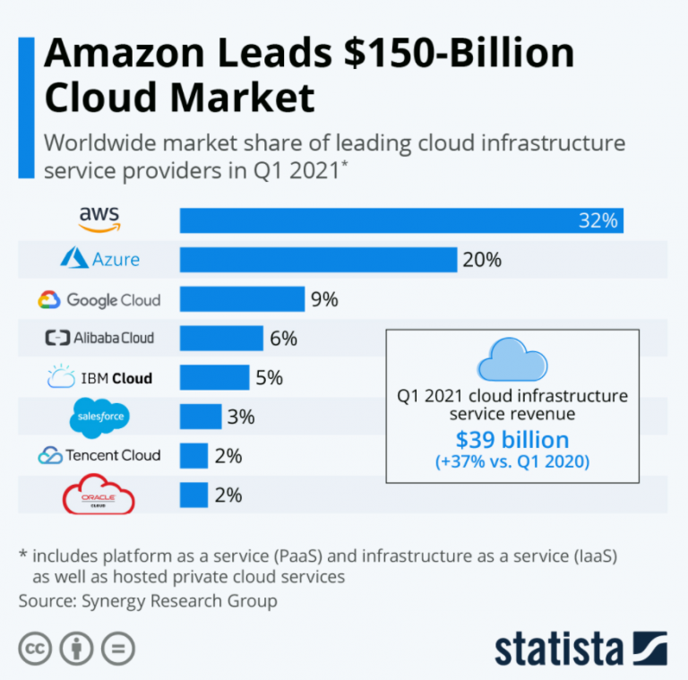
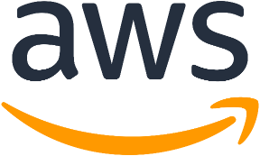
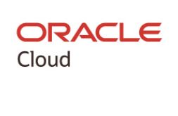
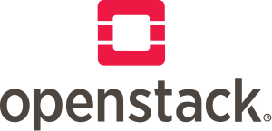

# Cloud Concepten

Wat is cloud computing? We horen er veel over, maar het antwoord is niet simpel te vormen. Allereerst moeten we de verschillende niveaus van cloud zoals beschreven in [Environments](../../concepts/environments/) in het achterhoofd houden.

Dan komen we zeer simpel uit dat een cloud provider een bedrijf is dat SaaS, PaaS or IaaS aanbied. Wat deze diensten inhouden gaan we in dieper op in in dit hoofdstuk. We leggen enkele grote cloud providers naast elkaar en bekijken dan de structuur die ze bijna allemaal delen. Pas als we wegwijs zijn in alle termen kunnen we in de praktijk aan de slag gaan.

## Providers

Een cloud provider is simpel gezegt een bedrijf dat voor jou(w bedrijf) dingen gaat hosten. Technisch gezien is zelfs een webhosting provider als [SIN](https://sinners.be) dus een cloud provider. Nu echter in de praktijk spreken we vaker eat een cloud provider meerdere diensten aanbied. In deze cursus gaan we ons vooral focussen op het domein van PaaS en IaaS, SaaS is een ander verhaal en valt niet geheel binnen het verhaal van deze cursus.

Elke cloud provider vult meestal een aantal taken in, vaak met een eigen toets. Zo heeft bijvoorveeld de "Login beheer" dienst van Microsoft Azure een diepere integratie met Windows Active Directory maar heeft Google dan weer een betere vertaal API service gebouwd uit hun ervaring met Google Translate.

Cloud providers diffentieren zichzelf vaak op de markt door diensten die ze kunnen aanbieden met kennis uit andere delen van het bedrijf. Hierdoor maken bedrijven vaak een keuze op welke cloud provider ze gaan gebruiken. Een tweede factor moeten we ook eerlijk over zijn: de prijs. Een gigabyte aan opslag bij AWS kost $0.023/GB/maand, bij Google $0.023, bij Oracle $0.0255 en bij Azure maar $0.021. Iemand met veel opslag noden zal dus eerder voor Azure gaan dan voor AWS. Maar de medaille heeft een keerzijde: willen we een VM huren met 4 CPU cores betalen we $0.166 per uur bij Azure en maar $0.1344 per uur bij AWS!
Je hebt het al door we hebben een rekenmachine nodig... die hebben we ook maar daarover verderop meer in de cursus.
Cloud providers onderhandelen ook met grote klanten voor goedkopere prijzen te bieden als dat bedrijf al hun diensten bij hun host en al meteen voor een jaar wilt betalen. Daarom merk je vaak dat grote bedrijven vaak een voorkeur hebben voor een bepaalde cloud provider (en die cloud provider [ook graag promoot dat ze een grote klant hebben die hun koos boven anderen](https://customers.microsoft.com/en-us/story/800565-national-railway-company-of-belgium-sncb-travel-transportation-azure))

Enkele grote cloud providers zijn:

-   [AWS](https://aws.amazon.com/)
-   [Azure](https://azure.microsoft.com/)
-   [Google Cloud](https://cloud.google.com/)
-   [Oracle Cloud](https://www.oracle.com/cloud/)
-   [IBM Cloud](https://www.ibm.com/cloud/)
-   [OpenStack](https://www.openstack.org/)

(Salesforce staat vermeld als SaaS CRM software maar is ook eigenaar van de populaire PaaS dienst [Heroku](https://www.heroku.com/))

Alibaba en Tencent cloud behandelen we in minder detail, deze kennen voornaamste een Chinese markt (waar vaak Amerikaanse bedrijven moeilijk liggen door de wetgeving).

### Amazon Web Services

<!-- de Automatic Warning System of AWS is een brits trein beveilingingsysteem dat met magnetische signalisatie... oh wacht andere AWS-->

Amazon Web Services of kortweg AWS is een onderdeel van de e-commerce gigant Amazon. Het kent zijn roets in het aanbieden van webshops maar maakte al snel een revolutie door te wijzigen naar aanbieden van data opslag (Amazon S3) en VMs die je per gebruik betaalde. Met zelfs Microsoft als klant kunnen we zeggen dat AWS een grote invloed had op het cloud landschap.

Met deze start en ondertussen al meer dan 200 verschillende cloud diensten gaande van de bekende S3 tot online code editors als Cloud9 kent AWS een van de grootste catalogi van diensten. AWS is ook een van de meest gebruikte cloud providers in de wereld met een marktaandeel van 32% in 2021.

### Microsoft Azure

Azure kende voornamelijk de laatste jaren een grote opkomst en is momenteel een van de grooste diensten die Microsoft aanbied. Azure, namelijk toen nog Windows Azure, bestond echter sinds 2010 als "Windows in the cloud" wat enorm verwarrend was... wat ze bedoelde was wat we vandaag kennen als onze cloud provider.

Met een rename naar Microsoft Azure gaat Azure de wereld in als een belangrijke afdeling van Microsoft. Vandaag zijn ze de grootste AWS concurrent met een marktaandeel van 20% in 2021. Ze bieden rond de [600 diensten](https://azure.microsoft.com/en-us/products/) aan! Met een recente focus op Hybrid Cloud voor bedrijven van hun eigen Windows Server naar Azure te brengen. Kijk bijvoorbeeld naar Azure AD die perfect samenwerkt met Windows Active Directory binnen je bedrijf.

### Google Cloud Platform

Als we spreken over "Web Scale" dan kunnen we Google niet wegdenken. Ook zij hebben het AWS "truckje" en hun bestaande kennis gebruikt voor het aanbieden van cloud diensten, gebouwd op de bestaande infrastructuur (kennis en datacenters) van Google Search, Youtube, Bloggger, Maps en meer. In 2008 kwam Google met App Engine een PaaS platform voor het hosten van Python code.

Later breide dit uit naar een 100-tal diensten onder de naam "Google Cloud Platform". Google bereikt met hun kennis over het schalen van systemen een marktaandeel van 9% in 2021. Maar kent een goede reputatie voor hun AI en ML diensten, waarvoor vaak voor Google wordt gekozen. Ook zijn ze record houder van [het migraten van de groottste DDoS attack](https://cloud.google.com/blog/products/identity-security/how-google-cloud-blocked-largest-layer-7-ddos-attack-at-46-million-rps) ooit (cursus geschreven 2022-09-15 je gaat zien dat Cloudflare deze titel weer gaat overnemen binnen de maand... Famous last words...).

### Oracle Cloud Infrastructure

Oracle is een vrij nieuwe speler op de cloud markt, in 2016 gestart als "Oracle Bare Metal Cloud Services" maar ondertussen bekend als Oracle Cloud Infrastructure of kortweg OCI. Hier bied oracle enkele IaaS en PaaS diensten aan in 37 datacenters in de wereld.

Hoewel OCI een vrij kleine speler is investeerd Oracle (traditioneel een databank bedrijf) veel in de Cloud afdeling, zo kochten ze Netsuite (het oudste "cloud" bedrijf) op. Ze konden ook Zoom overtuigen hun diensten te gebruiken alsook TikTok (buiten china, [na een hele politieke affaire](https://www.theverge.com/2022/6/19/23174775/tiktok-oracle-team-up-concerns-data-privacy-remain)).

### OpenStack (Open Source)

OpenStack begon in 2010 als een project van NASA en de grote server hosting gigant Rackspace. Ondertussen maken 500 bedrijven deels uit van de Open Infrastructure Foundation een non-profit vergelijkbaar met de Linux Foundation. OpenStack is een open source cloud platform met een collectie van 38 diensten die je kan hosten. Je zult dit dus vaak zien terugkomen in geavanceerde on-prem servers of onderzoeksinstellingen.

OpenStack kan vrij "eenvoudig" opgezet worden met behulp van verschillende deployment methodes, zo bijvoorbeeld Ansible. Zo draait er binnen SIN een proof of concept OpenStack omgeving voor deze lessen.

Kleinere cloud providers als [OVH](https://us.ovhcloud.com/public-cloud/compute/) bieden ook OpenStack aan als public cloud!

::: note
De fanatieke tech historicus in mij duid graag op een heraling van de jaren 80/90 met Unix. Waar Unix de oorsprong kent als een side-project binnen Bell (van de telefoon) wat uitbreide naar meerdere tech giganten die een eigen Unix maakten: HP/UX (Hewlett-Packard), SunOS (Sun Microsystems), AIX (IBM), A/UX (Apple) Windows Services for UNIX (SFU) (Microsoft), ... Met daarnaast Linux als een open source Unix variant.
:::

### Andere

Valt het op dat bovenaan geen enkel bedrijf met een Europeese roets staat? Vrijwel alle grote spelers op de markt zijn Amerikaans, tot fustratie van de Europeese Unie... Er zijn daarom enkele initiatieven om Europeese spelers beter op te kaart te zetten als [eucloud.tech](https://www.eucloud.tech/).
Een mooie vergelijking is gemaakt door [iagovar](https://iagovar.com/mapas/european-web-hosting-alternatives/) waar uit blijkt dat vele van deze spelers het gigantische aanbod van AWS niet kunnen evenaren jammergenoeg.

Er zijn vele kleinere spelers die zich focussen op IaaS, en in mindere vorm PaaS (databases, kubernetes etc) zoals [Scaleway](https://www.scaleway.com/en/), [DigitalOcean](https://www.digitalocean.com/), [Linode](https://www.linode.com/), [Vultr](https://www.vultr.com/), [Hetzner](https://www.hetzner.com/), [UpCloud](https://upcloud.com/), [Exoscale](https://www.exoscale.com/), [CloudSigma](https://www.cloudsigma.com/), [CloudAtCost](https://www.cloudatcost.com/), [Cloudways](https://www.cloudways.com/) en vele anderen. Vele zijn ook prijsbrekers en bieden een goedkoper alternatief voor de grote spelers.

## Cloud vs On Premise (aka server in de kast)

Waarom zou je hosten in de cloud?

-   Je kan je server op elk moment opschalen of verkleinen, enkel betalen voor wat je gebruikt
-   Je hebt minder onderhoudswerk
-   Total Cost of Ownership (TCO) is lager (mooie voor eens in een meeting te zeggen: TCO)
-   Je kan op verschillende locaties hosten en redundante diensten aanbieden
-   Vele diensten zijn geautomatiseerd

Nu heb ik je een hele cloud pitch gegeven wil ik je toch even tegenhouden. Cloud is niet altijd goedkoper of beter. Voor vele is het een goede oplossing maar bijvoorbeeld voor research toepassingen met GPU is het vaak goedkoper eigen hardware te kopen. Of use cases waar latency heel belangrijk is of je niet afhankelijk wil zijn van een externe provider of een verbinding. Overheden en bedrijven met zeer gevoelige data zullen ook niet snel overstappen naar de cloud, alhouwel grote providers als AWS eigen cloud datacenters hebben enkel voor hun data.

## Regions & Availability Zones

Als je inlogt op een cloud provider krijg je al meteen 1 vraag over regions en availability zones. Ze lijken misschien hetzelfde maar zijn dat niet.
Een region is een groep van datacenters die geografisch dicht bij elkaar liggen. Een region kan bestaan uit 1 of meerdere datacenters. Een region is een logische groep van datacenters die eenzelfde netwerk hebben. Een region kan dus bestaan uit 1 datacenter maar ook uit 100 datacenters die met elkaar verbonden zijn.

Een availability zone is een datacenter binnen een region. Dit geeft een meer fysieke weergave weer. Wil je beschermd zijn tegen bijvoorbeeld een stroompanne? Dan kan je je servers verspreiden over verschillende availability zones binnen 1 region. Je kan alle servers intern laten comminuceren via het interne netwerk van de region maar wel redundant zijn. Heb je heel lage latency nodig (>1ms) dan kan je beter werken in 1 availability zone.

Deze afbeelding van Microsoft geeft een mooi overzicht van de verschillende zones en regions.

Elke region heeft een code naam, bijvoorbeeld `eu-west-1` voor de eerste region in Europa. De availability zones hebben een letter toegekend, bijvoorbeeld `eu-west-1a` voor de eerste availability zone in de eerste region in Europa.

Deze naamgeving is niet altijd hetzelfde, bijvoorbeeld in Azure is de eerste availability zone `1` en niet `a`.

Hier een klein overzicht van enkele regions bij de grote spelers:

| Locatie     | Amazon Web Services (AWS) | Google Cloud Platform (GCP) | Microsoft Azure                      | Oracle Cloud Infrastructure (OCI) | OpenStack              |
| ----------- | ------------------------- | --------------------------- | ------------------------------------ | --------------------------------- | ---------------------- |
| Frankfurt   | eu-central-1              | europe-west3                | westeurope                           | eu-frankfurt-1                    | _afhankelijk provider_ |
| London      | eu-west-2                 | europe-west2                | uksouth                              | eu-london-1                       |                        |
| US East     | us-east-1 (N. Virginia)   | us-east1 (South Carolina)   | eastus                               | us-ashburn-1 (Ashburn)            |                        |
| Belgium     |                           | europe-west1                | [soon](https://aka.ms/belgiumintent) |                                   | EU-SIN-KOT-1           |
| Netherlands |                           | europe-west4                |                                      | eu-amsterdam-1                    |                        |

## Projects/Tenants

Projecten of Tenants ga je ook in elke cloud provider terugvinden. Dit is een verzameling van cloud resources binnen een bedrijf. Je gaat in kleine bedrijven vaak een of twee terugvinden. Een project is ook een isolatie systeem je kan dus systemen tussen twee projecten (tenzij publiek) niet met elkaar kunnen laten werken.

Je kan dus een project gebruiken om een staging omgeving te maken en een productieomgeving te maken. Je kan dus dezelfde namen en eventueel interne IPs gebruiken waar enkel het project verschillend is. Je gaat waarschijnlijk ook een project zien om zelf in te experimenteren zonder dat je aan productie kan komen. Je kan met je account aan meerdere projecten aan, dus geen nood om verschillende accounts aan te maken.

## Resources

Resources is de algemene benaming voor wat we in onze cloud omgeving gaan aanmaken. Mogelijkheden houden van de cloud provider af. We bekijken een aantal voorbeelden van types die je overal wel gaat terugvinden.

### Compute (VMs)

Compute resources zijn VMs, zij hebben een CPU, RAM, Netwerk en een Boot Disk. Als we gaan automatiseren gaan we sommige van deze componenten zelf definieren. Cloud VMs zijn vaak managed in dat de cloud provider je zelf op de fysieke servers indeeld (in tegendeel to Proxmox en ESXi). Vaak gebeurd het ook dat je VMs live gemigrated worden bij fysiek onderhoud. Als de cloud zijn werk goed doet merk je hier zelfs niets van!

We komen ook vaak tegen dat een cloud provider je I/O en netwerk aanpast per CPU core, zo hebben duurdere servers sneller netwerk omdat ze meer CPU hebben. Bekijk zeker de specificaties van de VMs die je gaat gebruiken.

(Vaak kan je tegenwoordig ook fysieke servers huren voor heel zware workloads we spreken dan over Bare Metal)

### Image

Een Compute image is de bron van een VM die je gaat aanmaken. Je kan een image maken van een VM die je zelf hebt aangemaakt of je kan een image gebruiken van de cloud provider. Moet je vele servers met dezelfde taak aanmaken dan denk je beter aan om 1 VM te imagen en deze als basis te gevrbruiken voor je andere VMs.

### Block Storage

Block storage kan je zien als een USB schijf, nu ja in de cloud dan. Je kan deze storage aan een VM hangen als extra storage. Deze storage is vaak makkelijk uitbreidbaar en wisselbaar tussen VMs. Je kan ze ook apart laten kopieren als backup. Block storage kan je per GB kopen en je betaalt de prijs voor hoeveel je aanvraagt, koop dus niet meteen 2PB (petabyte) aan storage als je er maar 1GB van nodig hebt.

Block storage komt vaak in 2/3 smaken: traag en goedkoop, snel en duur soms ook nog een extra snelle. Onderliggend is dit vaak SSD vs HDD. Je provider gaat deze snelheid ook vaak aangeven in IOPS (Input/Output Operations Per Second). Hoe hoger dit getal hoe sneller je storage is. De maximum IOPS op een VM is vaak ook afhankelijk van het aantal CPU cores dat je VM heeft.

### Object Storage

Object storage is een soort van NAS. Je kan hier bestanden in opslaan en deze bestanden kunnen ook publiek gemaakt worden. Je kan deze storage eventueel ook gebruiken als backup. Object storage is vaak goedkoop en je enkel betaalt per GB die je gebruikt.

Bestanden opslaan en ophalen gaat via een API. Vele moderne applicaties hebben ook integratie met object storage om hun data meteen daar op te slaan.
Vele cloud providers gebruiken de Amazon S3 API omdat deze heel populair is.

### Load Balancer & Network

Een van de eerste dingen die je doet in een cloud omgeving is een netwerk aanmaken. Je kan dit zien als een eigen VLAN (maar complexer onderliggend), je hebt een eigen IP space, een eventuele NAT router en een of meerdere publieke IPs. Deze publieke IPs zijn vaak floating IPs die je tussen servers binnen dezelfde region kan afwisselen.

Een load balancer is een service die je kan gebruiken om je netwerk te loadbalanceren. Je kan hiermee dus een publieke IP aanmaken die je kan gebruiken om je servers te bereiken. Daarmee kan je HTTP/HTTPS of zelfs TCP loadbalancen over verschillend interne servers. Dit wordt beheerd door de cloud provider en schaalt automatisch mee met je omgeving.

### Database

Vaak worden er ook managed databases gebruikt in de cloud. Hiermee moet je zelf geen database server onderhouden. Heel vaak werken deze onderliggend met managed VMs die de cloud provider maakt, backupt en upgraded met bestaande software als MySQL, PostgreSQL, MongoDB, etc.
Sommige gespecialisseerde databases als [Google BigQuery](https://cloud.google.com/bigquery) of [Amazon Redshift](https://aws.amazon.com/redshift/) zijn ook een optie maar gebruiken een eigen API en zijn vaak gedeelde resources door hun schaal.

### De rest

Ik kan verder gaan en verschillende diensten beschrijven... dat is een eindeloze job als je weet dat Azure al 600 opties heeft... Meeste wat je vindt kan je wel krijgen in een cloud omgeving. We houden het in deze cursus bij de basis, voor elke andere zichzelf respecterende cloud dienst kan je wel een certificaat halen als je er alles wil over weten!

### What's in a name?

Cloud providers hebben altijd wel een eigen naam voor een technologie. Met AWS wel als winnaar met namen als "Elastic Beanstalk", "Lamda","Corretto"...

Hieronder een klein overzicht van veel gebruikte diensten:

| Beschrijving            | Amazon Web Services (AWS)  | Google Cloud Platform (GCP) | Microsoft Azure          | Oracle Cloud Infrastructure (OCI)   | OpenStack                                            |
| ----------------------- | -------------------------- | --------------------------- | ------------------------ | ----------------------------------- | ---------------------------------------------------- |
| Virtuele Machine        | Amazon EC2                 | Compute Engine              | Virtual Machines         | Compute Instance                    | Compute (Nova)                                       |
| Containers (Kubernetes) | Amazon EKS                 | Kubernetes Engine           | Azure Kubernetes Service | Container Engine for Kubernetes     | Container Orchestration Engine Provisioning (Magnum) |
| Containers              | Amazon ECS                 | App Engine Flexible         | Azure Container Apps     |                                     | Containers (Zun)                                     |
| Database                | Amazon RDS                 | Cloud SQL                   | SQL Database             | Database Service                    | Databases (Trove)                                    |
| Object Storage          | Amazon S3                  | Cloud Storage               | Blob Storage             | Object Storage                      | Object Store (Swift)                                 |
| Load Balancer           | Elastic Load Balancing     | Cloud Load Balancing        | Load Balancer            | Load Balancer                       | Load Balancer (Octavia)                              |
| DNS                     | Route 53                   | Cloud DNS                   | DNS                      | DNS                                 | DNS (Designate)                                      |
| CDN                     | CloudFront                 | Cloud CDN                   | CDN                      | CDN                                 |                                                      |
| Firewall                | Security Groups            | Firewall Rules              | Network Security Groups  | Security Lists                      | Security Group (Neutron)                             |
| VPN                     | Virtual Private Gateway    | Cloud VPN                   | VPN Gateway              | VPN Gateway                         | VPN (Neutron)                                        |
| Block Storage           | Elastic Block Store (EBS)  | Persistent Disk             | Managed Disks            | Block Volume                        | Volumes (Cinder)                                     |
| Functions               | Lambda                     | Cloud Functions             | Functions                | Functions                           |                                                      |
| Container Registry      | Elastic Container Registry | Container Registry          | Container Registry       | Container Registry                  |                                                      |
| MongoDB                 | DocumentDB                 | Cloud Firestore             | Cosmos DB                |                                     | Databases (Trove)                                    |
| Web app hosting         | Elastic Beanstalk          | App Engine                  | App Service              | Application Container Cloud Service |                                                      |
| Images                  | EC2 Image Builder          | Cloud Build                 | Virtual Machine Images   |                                     | Images (Glance)                                      |
| Billing                 | Cost Explorer              | Cloud Billing               | Cost Management          |                                     | Cloudkitty                                           |

## IAM

Een heel belangrijk deel van een cloud omgeving is de IAM (Identity and Access Management). Hiermee kan je gebruikers aanmaken, rechten geven en deze gebruikers toegang geven tot de verschillende diensten. Dit is een heel belangrijk onderdeel van een cloud omgeving omdat je hiermee niet enkel kan bepalen wie wat mag doen maar ook welk systeem wat mag doen.

We spreken over twee grote types van gebruikers: mensen (ons team, de baas, consultants,..) maar ook over systemen (automatisatie, terraform, CI/CD, onze applicaties zelf) die toegang nodig hebben tot de cloud omgeving. Als we het over systemen hebben spreken we over een "service account". Deze service accounts hebben vaak een eigen API key die ze gebruiken om toegang te krijgen tot de cloud omgeving, deze API key hangt niet aan een persoon en kan dus gebruikt worden onafhankelijk van de persoon die de key heeft aangemaakt (denk aan ontslag).

We gaan in IAM een gebruiker (of soms groep) aan een of meerdere rollen koppelen. Deze rollen geven de gebruiker toegang tot bepaalde diensten. Deze rollen kunnen we zelf aanmaken en beheren of bestaande rollen gebruiken die de cloud provider aanbiedt. We gaan heel vaak zien dat er een rol per dienst is.
Deze rollen zijn ook vaak op verschillende niveaus.

-   **Viewer**: enkel lezen
-   **Editor**: lezen en schrijven (soms ook zonder delete permissiond)
-   **Owner**: alles

Rollen zijn toegekend per project aan de gebruikers.
Het juist instellen van IAM is enorm belangrijk, je mag nooit te veel permissies geven vooral aan systemen want soms wordt deze key gelekt of on-purpose gedeeld in bijvoorbeeld een mobiele applicatie. Wees dus niet als [1859 apps](https://symantec-enterprise-blogs.security.com/blogs/threat-intelligence/mobile-supply-chain-aws) die gevonden waren met een AWS key admin in de code...

## Facturatie

> The modern app does not run on servers but on YAML and Credit Cards

We zouden na alles nog vergeten om over het belangrijkste deel (voor management toch) te spreken: de facturatie.
Wat maakt cloud zo aantrekkelijk: meeste resources betaal je per uur (niet per maand of jaar als klassieke hosting). Dit stelt je in staat om snel te schalen en te betalen voor wat je gebruikt, maar ook om korte experimentatie te doen. Als je een syseem maar kort nodig hebt is het misschien voordeliger een grotre VM te huren waar een test maar 1 uur duurt dan een kleinere waar een test 3 uur duurt. Deze berekening moet je altijd maken.

Andere resources als bandbreedte of die moeilijk per uur op te splitsen zijn betaal je per GB. Opslag is dan vaak weer GB/uur die je gebruikt.
Cloud providers bieden meestal een basis gratis aan: bv 100GB bandbreedte of 1 VM met 0.5CPU en 1GB RAM. Dit is vaak voldoende om te experimenteren en te leren, maar maakt soms de kostenberekening moeilijker.

Ben je een grote cloud gebruiker? Dan loont het om met je cloud provider te onderhandelen en een vast aantal resources aan te kopen, als je garandeerd dat je die constant gebruikt kan je een goedkoper tarief krijgen. Dit is vooral interessant voor grote bedrijven die veel resources nodig hebben.

### Neem je rekenmachine erbij

Hoeveel ga je nu bepalen? Zonder rekenmachine ga je er niet komen vrees ik... Daarom hebben cloud providers vaak een calculator waar je kan zeggen wat je wilt en je krijgt wat je gaat betalen als uitkomst, dit is wel niet gegarandeerd want heb je bijvoorbeeld plots meer verkeer betaal je natuurlijk meer. Maar het geeft je wel een idee van wat je kan verwachten, de tip is altijd wat meer budget te voorzien dan je denkt nodig te hebben.

Speel eens met een paar calculators, welke is het voordeligste voor jouw use case?

-   [AWS Pricing Calculator](https://calculator.aws/#/)
-   [Azure Pricing Calculator](https://azure.microsoft.com/en-us/pricing/calculator/)
-   [Google Pricing Calculator](https://cloud.google.com/products/calculator/)
-   [Oracle Pricing Calculator](https://www.oracle.com/cloud/costestimator.html)
-   [IBM Pricing Calculator](https://cloud.ibm.com/estimator/review)
-   [OVH (OpenStack) Pricing List (bring own calculator)](https://www.ovhcloud.com/en/public-cloud/prices/)

### Spot instances

Sommige cloud providers als AWS kan je ook in plaats van gegarandeerde (duurdere) prijzen kiezen voor je cloud resources aan te kopen op een "aandelenmarkt" dit noemen ze "spot instances". Hier is de prijs bepaald naar de huidige vraag en aanbod. Zo kan je een maximumprijs opgeven die je wil betalen en als de prijs daaronder komt zal je resource worden aangemaakt, gaat de prijs erboven dan verlies je je resource. Dit kan riscant zijn en is dus enkel aangeraden als je infrastructuur hyper flexibel is, maar zo kan je wel grote datasets tegen spotprijzen verwerken.

## Dit alles is Public Cloud? Wat is dan Private Cloud?

We spreken van alle bovenstaande resources dat dit public cloud is. We bedoelen daarmee dat iedereen (zolang je credit card maar goud genoeg is) hier klant kan worden en diensten kan hosten. Je cloud resources staan dus ook fysiek naast andere klanten, wat het vaak voordelig maakt tegenover een heel datacenter te moeten afhuren.

Nu hebben sommige sectoren hier regels voor, zoals de gezondheidszorg of de financiële sector. Deze sectoren hebben vaak zeer gevoelige data en willen niet riskeren dat deze op dezelfde hardware staat in tijden van CPU vurlnabilities als [Spectre en Meltdown...](<https://en.wikipedia.org/wiki/Meltdown_(security_vulnerability)>). Daarom hebben ze vaak een private cloud waar ze hun eigen resources hebben. Dit is vaak een private cloud. Dit is een cloud waar je eigen hardware beheert en beveiligt, maar waar je wel de cloud services van een public cloud provider kan gebruiken. Dit is vaak een stuk duurder dan een public cloud want je moet hele hardware aankopen die gegarandeerd niet 100% gebruikt wordt. Maar het is wel een veiligere oplossing.

Je kan dit zelf gaan hosten in eigen datacenters met open source software OpenStack of proprietary software als [AWS Outposts](https://aws.amazon.com/outposts/). Maar je kan ook een private cloud hosten een klassieke server providers als [RackSpace](https://www.rackspace.com/cloud/openstack/private) of [OVH](https://www.ovhcloud.com/en/hosted-private-cloud/). Vaak beginnen cloud providers ook met apparte datacenters voor deze use cases zoals [AWS GovCloud](https://aws.amazon.com/govcloud-us/) of [Azure Government](https://azure.microsoft.com/en-us/global-infrastructure/government/) (wat wel eens een [conflict geeft met personeel door het hosten van niet al te ethische praktijken](https://www.washingtonpost.com/business/2019/07/12/no-tech-ice-protesters-demand-amazon-cut-ties-with-federal-immigration-enforcement/))

## The Future: MultiCloud? Edge Cloud?

We zitten in een revolutie waar vele bedrijven resouluut kiezen voor cloud te gebruiken. Maar waar ligt de toekomst nu?

We zien de opkomst van "Edge Cloud" waarbij je cloud resources dichter bij de gebruiker zet. Dit is vooral interessant voor bedrijven die veel data moeten verwerken en waarbij de gebruiker niet wil wachten op een antwoord. Denk aan een self-driving car die realtime moet weten waar er andere auto's zijn, of een drone die realtime moet weten waar er andere drones zijn. Met de komst van 5G wordt dit een interessante optie waar telecom providers hun eigen cloud resources kunnen aanbieden die dicht bij de zendmasten staan voor snellere communicatie. Vaak gebeurd dit in combinatie met een public cloud die de data verwerkt en de resultaten terugstuurt naar de edge cloud en omgekeerd.

De tweede stroom die we zien is die van "MultiCloud" waarbij bedrijven hun cloud resources verspreiden over verschillende cloud providers. Dit is om verschillende redenen, om dichter bij een bepaalde klant te zitten of om niet van 1 bedrijf afhankelijk te zijn. Of om bepaalde diensten te gebruiken die enkel bij 1 cloud provider beschikbaar zijn.
We zien hier dat bedrijven als [HashiCorp](https://www.hashicorp.com/) en [VMWare](https://www.vmware.com/) hierop inspelen met hun eigen multi-cloud tools, deze bieden een interface aan die met meerdere kan praten. In het hoofdstuk over Terraform bekijken we zo een aspect.
Cloud providers zelf laten deze stroom ook niet voor bekeken [Azure Arc](https://azure.microsoft.com/en-us/services/azure-arc/) is een tool van Microsoft die je cloud resources kan beheren vanuit Azure die onderliggend op andere cloud providers of op eigen hardware staan waar Microsoft momenteel enorm in investeerd.

