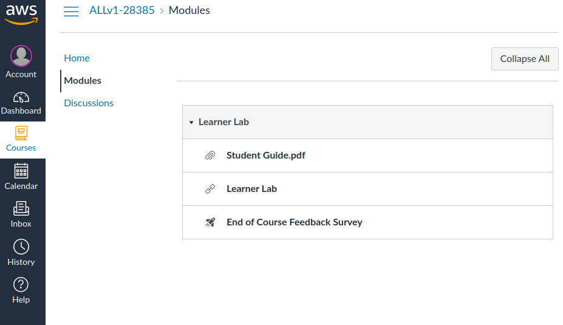
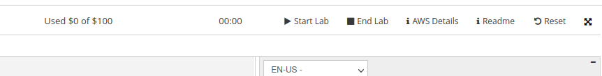
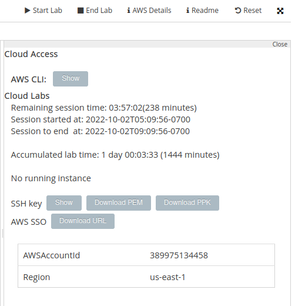
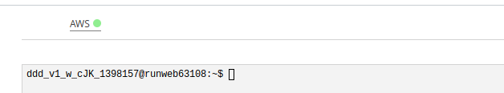
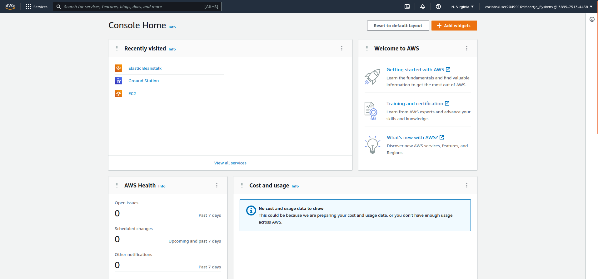
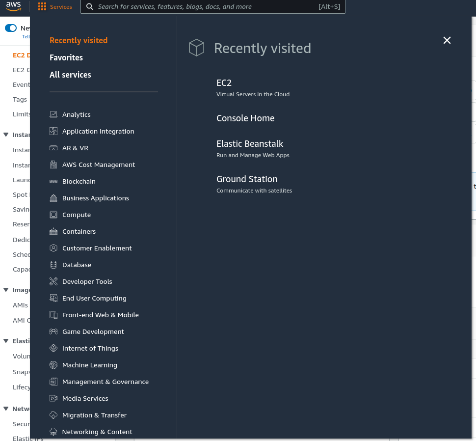
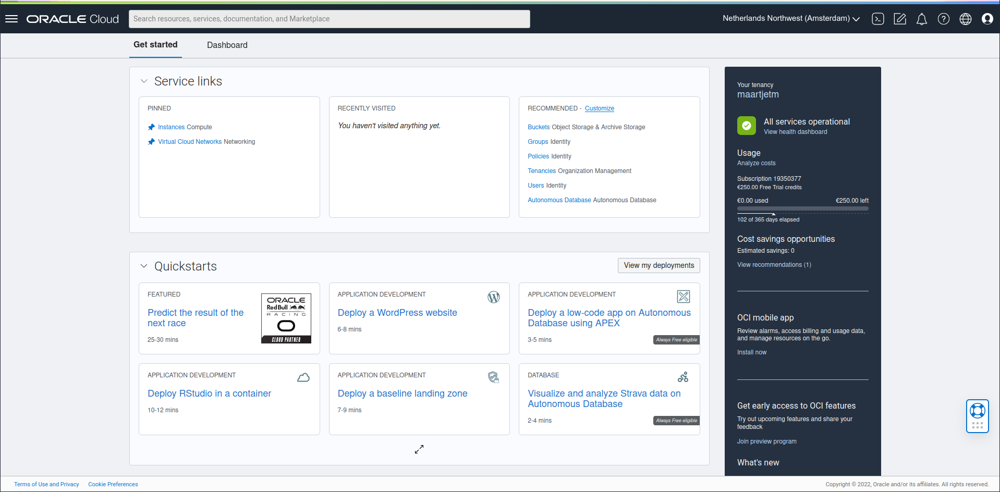
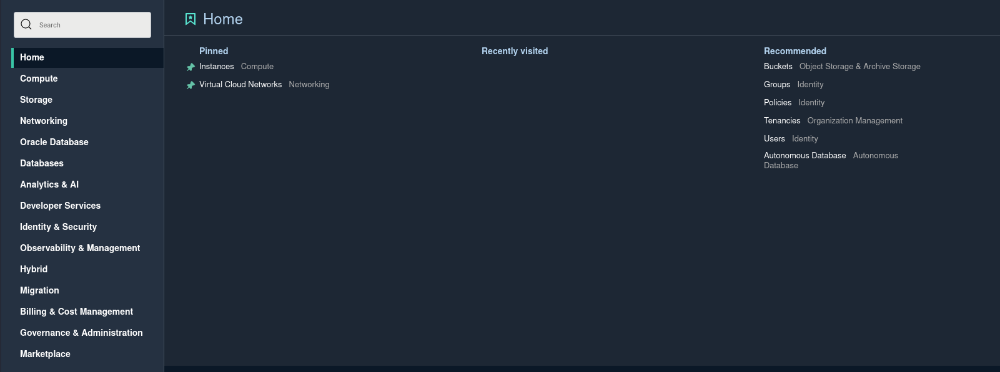
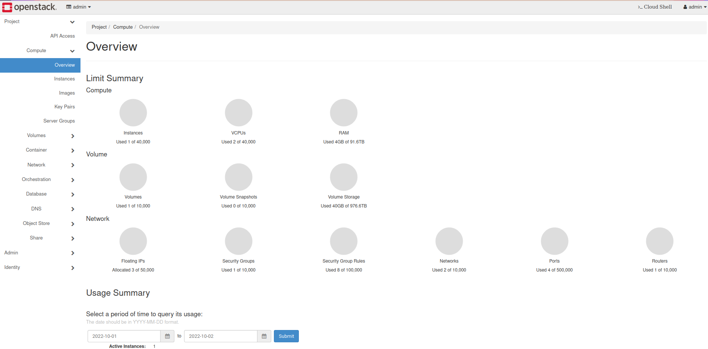

# Cloud Gebruik

Gefeliciteerd, je hebt cloud begrepen. Maar hoe ga je nu aan de slag?

We hebben 3 verschillende manieren om met de cloud te werken:

-   Met een grafische console (webinterface)
-   Met een command line interface (CLI)
-   Met een API, wij zullen deze aanspreken via Terraform

## Console

De console is misschien de meest toegangkelijke interface voor de beginnende gebruiker maar heeft als nadeel dat deze enorm vershild van cloud tot cloud provider. Ook kunnen we hier in weinig automatiseren. Ze is echter wel ideaal voor het verkrijgen van uitleg en een overzicht van de verschillende mogelijkheden en diensten die we gebruiken. We bekijken kort de consoles van de verschillende cloud providers, maar we zullen hier niet dieper op ingaan aangezien een grafische interface makkelijk in gebruik is.

:::: code-group
::: code-group-item AWS

<br/>

We hebben toegang tot AWS via de [AWS Canvas](https://awsacademy.instructure.com/).



Hier vind je een link naar het "Learner Lab".

Je kan dit starten waarna je 4 uur tijd hebt in AWS.



Eenmaal gestart krijg je onde "AWS Details" alle login gegevens, let op deze veranderen elke keer.



Als je op de AWS link klikt kom je in de AWS console.





Onder "Services" vind je alle diensten die je kan gebruiken.



:::

::: code-group-item Azure

```bash
Give me cloud credits and i will tell you
```

:::

::: code-group-item Oracle

<br/>

Je kan de console vinden op [https://cloud.oracle.com/](https://cloud.oracle.com/)

Na het inloggen kom je op het dashboard terecht.



Hier heb je een overzicht van veel gebruikte resources, je krediet en een aantal quick starts.

Het menu bovenaan bied een overzicht van alle services die je kan gebruiken. Je kan je favoriete diensten ook pinnen voor snel toegang.



::: note
Vele diensten zijn always free, je gaat deze aanduiding vaak tegenkomen een complete lijst kan je vinden op [https://docs.oracle.com/en-us/iaas/Content/FreeTier/freetier_topic-Always_Free_Resources.htm](https://docs.oracle.com/en-us/iaas/Content/FreeTier/freetier_topic-Always_Free_Resources.htm)
:::

::: code-group-item Google

```bash
Give me cloud credits and i will tell you
```

:::

::: code-group-item OpenStack

<br/>

In OpenStack hebben we Horizon wat een webinterface is voor OpenStack. Voor onze Openstack omgeving kan je op [cloud.stuvm.be](http://cloud.stuvm.be/) terecht.

Na het inloggen krijg je een overzicht van je gebruikte resources en een menu van mogelijke diensten.



:::

::::

## CLI

:::note
We kunnen deze vaak gebruiken in de console via een "Cloud Shell" of "Cloud Console". Dit is een gratis mini VM speciaal voor het gebruiken van de CLI. Echter werken we liever op onze eigen laptop voor scripting en het bijhouden van geschiedenis.
:::

:::: code-group
::: code-group-item AWS

```bash
curl "https://awscli.amazonaws.com/awscli-exe-linux-x86_64.zip" -o "awscliv2.zip"
unzip awscliv2.zip
sudo ./aws/install
aws --version
```

Nu we een installatie hebben willen we onze credentials toevoegen.

Dit kunnen we via de wizard maar we kunnen ook de credentials toevoegen in een bestand.

```bash
aws configure
```

Ons lab heeft ook al de gebruiker klaar staan, deze kan je vinden in de lab details.

```bash
nano ~/.aws/credentials
```

````
aws_access_key_id=x
aws_secret_access_key=x
aws_session_token=xx
```

We moeten enkel nog de default regio instellen, de lab omgeving laat enkel `us-east-1` toe.

```bash

```bash
aws configure set region us-east-1
```

We kunnen nu de CLI gebruiken om resources aan te maken en te bekijken.

We maken als test even een lege bucket aan.

```bash
aws s3 mb s3://<kies random naam>
aws s3 ls
```

:::

::: code-group-item Azure

```bash
Give me cloud credits and i will tell you
````

:::

::: code-group-item Oracle

```bash
bash -c "$(curl -L https://raw.githubusercontent.com/oracle/oci-cli/master/scripts/install/install.sh)"
oci --version
```

Nu we een installatie hebben willen we onze credentials toevoegen.

```bash
oci setup config
```

Je kan de credentials vinden in de console:

-   [User OCID](https://cloud.oracle.com/identity/users/) - kies je email en kopieer de OCID
-   [Tenancy OCID](https://cloud.oracle.com/tenancy) - kies je tenancy en kopieer de OCID
-   De Region zie je bovenaan in de url bv `?region=eu-amsterdam-1`

De andere opties zijn standaard goed. Dit maakt een RSA Keypair aan en slaat deze op in `~/.oci/oci_api_key_public.pem`.

```bash
cat ~/.oci/oci_api_key_public.pem
```

Kopieer deze key en voeg deze toe aan je user in de console onder "API Keys" kies voor "Add API Key", dan "Paste Public Key" en plak de key in het veld.

Je kan nu de CLI gebruiken:

Vraag de compartments op:

```bash
oci iam compartment list
```

Kopieer nu de ID van ons compartment en gebruik deze in de volgende commando's.

```bash
oci compute instance list -c <compartment OCID>
```

:::

::: code-group-item Google

```bash
Give me cloud credits and i will tell you
```

:::

::: code-group-item OpenStack

```bash
TODO
openstack --version
```

:::

::::

:::warning
Dit hoofdstuk is beperkt gehouden door tijdsgebrek bij lesvoorbereidingen en geen tijdsvoorziening voor curiculumvernieuwingen. Het is de bedoeling dat dit hoofdstuk verder uitgewerkt wordt over gebruik van de CLI als ook het opzetten van essentiele cloud diensten.
:::

