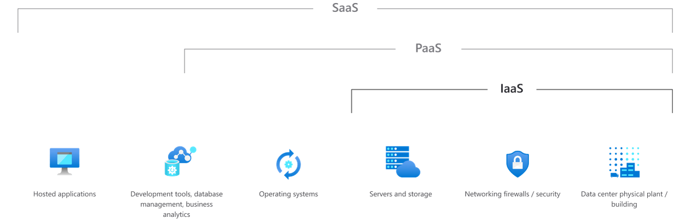
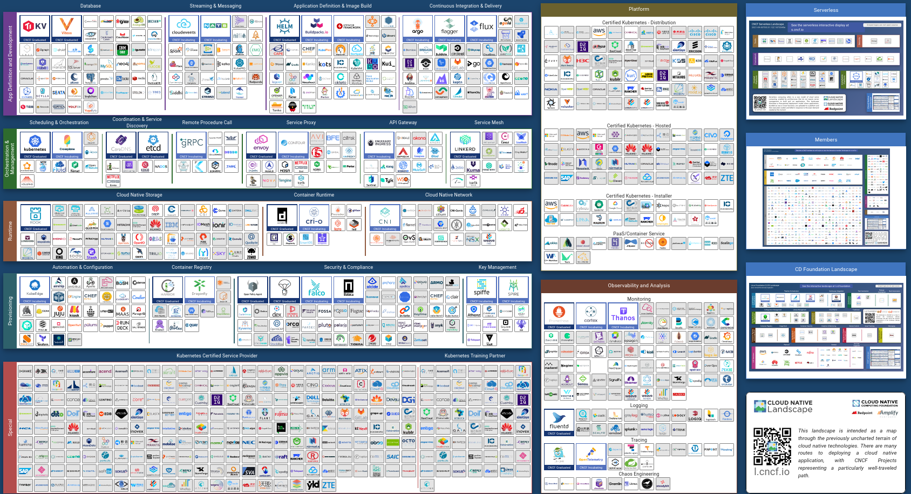

# Envionments

In de DevOps wereld koment we veel verschillende environmets tegen. In dit deel gaan we in op de verschillende types en niveaus van cloud computing.
Bij elk van deze niveaus komen ook tools bij kijken, we zien hier een kort overzicht van welke we waar gebruiken. Ook kijken we naar hoe een typische omgeving eruitziet.

## The levels of cloud

Cloud is een heel groot begrip. De mens in de straat verstaat het als een Google Drive of een Office 365. Wij denken dan misschien eerder aan een Amazon Web Services, of een paar VMs die we hosten. Cloud providers zelf hebben ook een kleine identiteits crisis, Azure gaat naar steeds meer nieuwe marktsegmenten en bij AWS [is het mogelijk een vals product te hypen](https://www.techradar.com/news/everyone-is-talking-about-aws-infinidash-but-it-doesnt-exist).
Voor deze cursus ging ik opzoek naar hoeveel verschillende diensten AWS nu heeft, na vele studies is het antwoord "ergens rond de 200". Het beste antwoord komt misschien uit de onverwachte hoek van [de muziekwereld](https://www.youtube.com/watch?v=BtJAsvJOlhM).

Een cloud provider op je CV zetten als kennis is misschien niet het beste idee, alle diensten kennen is bijna onmogelijk. Maar wij bekijken het op hoog niveau.

Azure bied ons een mooi overzicht wat ons nu wat kan bieden. Hieronder gaan we meer in op details

### Infrastructure as a service

Infrastructure as a service kunnen we als de "laagste" vorm van cloud zien. Laag als in dat onze provider er weinig bovenop doet. IaaS (afgekort) geeft ons een datacenter waar we virtuele of zelfs fysieke servers kunnen huren. Dit vaak zelfs gefactureerd per uur. Hierbij hoort ook een netwerk voorziening enzovoort. Alle configuratie van servers en applicatie is aan de klant overgelaten.

Meeste cloud providers bieden op deze VMs vele voordelen aan zoals automatiche backups, live hypervisor migraties bij problemen als ook makkelijk opschalen van resources.

In deze cursus gaan wij vooral op dit niveau werken omdat de voorkennis van de opleiding hier best op aansluit.

#### Gevaar: lift and shift

Een groot gevaar (maar jammergenoeg ook vaak verkocht als voordeel) is "lift and shift". Dat betekend wanneer een bedrijf wil migreren naar een cloud service en DevOps voor financieel en reputatie voordeel maar hierna letterlijk de huidige systemen van fysieke servers naar VMs verhuisd zonder enige optimalisatie en verbeteringen aan te brengen. Vaak ook niet gebruik makend van de voordelen van cloud.

### Platform as a service

PaaS is de middelvorm van cloud te noemen. Je moet nog zelf je applicatie en configuratie leveren maar alle onderliggende dingen als het besturingsysteem, netwerk en databases worden door de provider gehost. Zo kan een applicatie gefocussed team makkelijk hun app online brengen, vele DevOps teams bouwen dan ook een eigen intern PaaS afgestemd op de noden van een bedrijf.

In dit veld zien we vaak grote cloud providers maar ook "kleinere" die een aanbod bieden, een van de meest bekende en pioniers van PaaS is [Heroku](https://heroku.com) zij bieden een volledig platform aan waar je enkel nog code moet naar toe sturen.

### Software as a service

Dit is het hoogste niveau van cloud. Je kent het ongetwijfeld wel SaaS diensten als Office 365 die alles aanbieden wat je nodig hebt zonder al te veel configuratie of kennis van servers. Voor vele bedrijven heeft dit voordelen dat ze minder techniche kennis in huis moeten hebben.

Voor ons is het soms ook handig, neem nu een hosted MySQL oplossing van een cloud provider die ons een database kan geven zonder dat we deze zelf moeten beheren. Of gebruik maken van een cloud oplossing voor netwerk opslag die onze servers gebruiken.

## The right tool at the right level

We gaan in deze cursus een aantal tools zien, de meeste zijn gespecialiseerd voor een bepaald domein.
De ene gaat voor ons goed werken op applicatie niveau de andere kan onze servers zelf perfect opzetten. Meest tools kunnen ook meer dan enkel dat maar we bekijken ze in de context waar ze het meest gebruikt en krachtichtste in zijn.
Het landschap van tools is eindeloos. De Linux Foundation houd een landkaart van deze bij als "the cloud native landscape" (https://landscape.cncf.io/)

Deze kaar is enorm groot en probeert tools in te delen in specialiteiten. Al deze tools vergelijken zou al een studie op zichzelf zijn.
In de cursus bekijken we er een paar die voor ons relevant zijn.

### Infrastructure

Deze tools zijn de meest recente in ons aanbod en kennen nu een enorme groei. Cloud providers bieden een API aan waarmee we onze servers en diensten kunnen opzetten zonder enige manuele actie. Elke cloud provider had al een semi automatische tool voor hiermee te helpen.
Dit opende mogelijkheden voor tools die ons programatisch servers, netwerk configuratie, managed dienten (zoals SaaS, maar ook bijvoorbeeld databases) enzovoort kunnen opzetten.
Hashicorp was een van de eerste voor deze tools te maken en groot te worden met [Terraform](https://www.terraform.io/). Terrafrom bouwt "de grond" voor onze servers en diensten. Het werkt met verschillende cloud providers en andere tools zoals Ansible samen.
Pulimi is een nieuwere speler met dezelfde visie maar een licht andere uitwerking, zij kozen om niet een eigen configuratie taal te maken maar voor een compatibiliteit met grote programeertalen.

We zien jammergenoeg deze tools niet verder in detail door gebrek aan toegang tot cloud providers.

### System provisioning

Deze tools bestaan al het langste in de DevOps wereld. Zij beginnen ons te helpen vlak na de installatie van een server.
Tools zoals Ansible (zie cursus) kunnen onze installatie van servers, configuratie en soms installatie van applicaties automatiseren.
Ze spelen zich af op het niveau van ons operating system.
Alternatieven zijn [Puppet](https://puppet.com/) en [Chef](https://www.getchef.com/).

### Application deployment

Op dit vlak kan ik ongetwijfeld de belangrijkste niet vergeten: Docker. Docker bouwt op de Linux Container technologie om het deployen van applicaties te vereenvoudigen. Developers kunnen hun eigen Linux omgeving configureren en daarna "inpakken" in een Docker image. Deze image kan daarna op onze servers semi-geisoleerd draaien. Dit lost vele dependancy conflicten op maar vergemakkelijkt ook de flow voor apps te hosten.
Op grotere schaal zien we de Docker technologie gebruikt worden in [Kubernetes](https://kubernetes.io/). Kubernetes gaat onze containers op schaal draaien in een cluster en voegt nog extra abstracties toe zodat ook de meeste cloud services een gezamenlijke configuratie kunnen gebruiken.

We gaan in de cursus verder in op het gebruik en werking van Docker.

## Development, Staging and production

Er zijn drie verschillende omgevingen waar je waarschijnlijk ooit mee te maken zult krijgen.
Deze zijn er niet zonder reden. We moeten kunnen testen en ontwikkelen zonder onze klanten te beinvloeden.
We zetten hiervoor een aantal test omgevingen op. Belangrijk is wel dat deze omgevijngen goed gebouwd zijn anders kunnen onze testen valse resultaten opleveren.

De drie meest gebruiktr omgevingen zijn: Development, Staging, en Production.

### Development

Dit is de omgeving die op je laptop staat. Hier doen we kleine lokale experimenten die een deel van het systeem aanraken.
Niets wat je doet in de ontwikkelomgeving heeft invloed op wat gebruikers op dit moment zien, noch je collega's.
Veel voorbereidend testen zal in deze omgeving gebeuren. Je wilt je code niet vrijgeven voordat je er zeker van bent dat het op zijn minst lokaal werkt. Ga zo grondig mogelijk door je code zodat je de bugs die doorkomen naar de volgende omgeving beperkt.

Sommige bedrijven geven je een Development omgeving in de cloud, vaak als een "persoonlijke" test omgeving om gebruik te kunnen maken van diensten en het aanbieden van meer resources.

### Staging

De staging omgeving is _zo gelijkaardig mogelijk_ aan de productie-omgeving. Doormiddel van onze tools zal dit makkelijk zijn omdat we dezelfde configuratie kunnen gebruiken.

Al het testen van onze core services gebeurt hier. Alle database migraties worden hier getest, net als alle configuratie veranderingen. Wanneer je grote versie-updates moet doen, helpt de stage-omgeving je ook bij het vinden en oplossen van problemen die zich voordoen.
Bij een (grote) aanpassing doen we dit altijd eerst op staging als generale repetitie.

Als je een klant hebt, is dit het moment waarop je ze een demo kunt geven van hoe dingen werken en eruit zien.
Vaak is de omgeving ook gewoon bereikbaar over het internet echter onder een andere (sub)domein.

Gegevens op deze omgeving zijn niet gekoppeld aan echte klanten, maar moeten er best zoveel mogelijk op lijken.
Vaak kan je dit ook zien als de speeltuin van developers zij kunnen daar alles op testen en gebruiken alsof het op productie stond.

### Production

De productie-omgeving is waar gebruikers toegang krijgen tot de definitieve code na alle updates en testen die we op staging deden.
Van alle omgevingen is dit de belangrijkste. Dit is waar je uw geld verdien, dus je kunt hier geen fouten maken.

Daarom moet je eerst de andere twee omgevingen doorlopen met al het testen. Eens je in productie bent, zullen alle bugs of fouten die overblijven door een gebruiker gevonden worden en je kan alleen maar hopen dat het iets kleins is.

Sommige bedrijven houden ervan om roll-outs te doen naar de productie-omgeving. Dat betekent dat ze veranderingen vrijgeven aan een paar gebruikers en ze geleidelijk uitrollen naar iedereen. Niet al uw updates hoeven op hetzelfde moment in de productieomgeving te worden uitgebracht. Facebook en Discord zijn bekende voorbeelden hiervan, zo kan je buurman een nieuwe feature al hebben die jij nog niet hebt. Zo kunnen ze snel bugs vangen voor iedereen het kan zien.

### Chaos engineering

Een recentere trend is die van "chaos engineering". Doormiddel van een iedentieke Staging omgeving kunnen we makkelijk disaster scenarios testen.
Choas Engineering is de benaming van een aantal tools zoals [gremlin](https://www.gremlin.com/chaos-engineering/). Deze tool gaat automatisch verschillende scenarios simuleren als RAM tekort, servers laten uitvallen, netwerk vertraging veroorzaken en andere dingen uit je nachtmerries.

Chaos engineering laat je hierdoor in je veilige staging omgeving je software en configuatie meer veerbaar maken tegen problemen.
