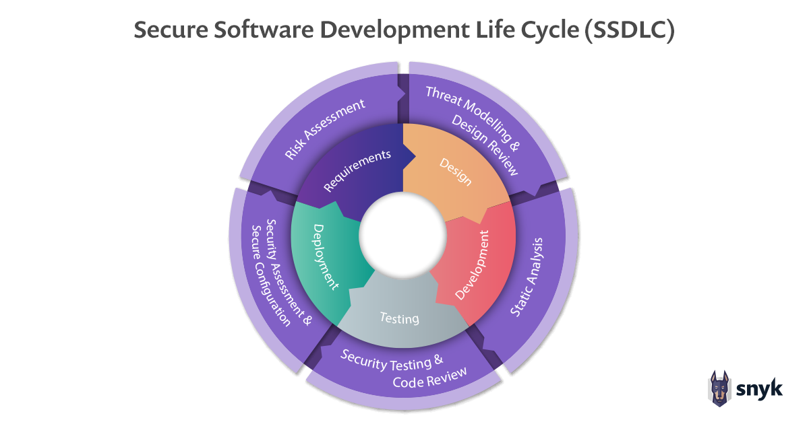

# Security - DevSecOps

We hebben al even kort aangehaald dat na onze DevOps integratie we nu ook security al veel eerder in het development van een product willen betrekken. In dit hoofdstuk gaan we bekijken waar security komt zien bij DevOps als ook typische teamrollen.

## Secure SDLC

Met een Software Development Lifecycle beschrijven we de stappen die gemaakt worden in de ontwikkeling van software.
Hierbij spreken we nu van een uitbreiding van dit model genaamd de Secure SDLC.
Secure SDLC is een verzameling van best practices gericht op het toevoegen van beveiliging aan onze gewone lifecycle. Dit doen we door speciale stappen in elke fase van de SDLC toe te voegen. Een Secure SDLC vereist een mentaliteitsverandering, waarbij je in elke fase van het project ook richt op beveiliging in plaats van alleen op functionaliteit.

Het doel van Secure SDLC is niet om traditionele beveiligingscontroles, zoals pentests, volledig te elimineren, maar eerder om beveiliging op te nemen in de verantwoordelijkheden van het hele tean en hen in staat te stellen om vanaf het begin veilige applicaties te bouwen.

Het begint al bij het opstellen ven requirements waar we hierbij ook een risk assasment gaan opstellen, welk beveilingingsricoco gaan de eisen meebrengen en kunnen we deze vermijden, ook waar moeten we bij de volgende stappen zeker op gaan letten.

Bij het design moeten we alle ontwerpen ook gaan bekijken vanuit een beveiligingsperspectief. En ook meteen proberen te kunnen zoeken naar beveiligingsrisico’s (threat modeling). Als we dit systeem bouwen hoe kan een gebruiker met slechte bedoelingen dit misbruiken?

Bij development moeten we ook de code gaan analyseren met static analysis tools. Deze gaan ons helpen om veel gemaakte fouten in de code te vinden. Een voorbeeld hiervan is het gebruik van de [SonarQube](https://sonarqube.com/) software.

Bij de testing fase kunnen we dan al de eerste testen uitvoeren van de beveiliging. Code review gaat in deze fase ook helpen wanneer mede ontwikkelaars in de code ook al fouten kunnen zien. Een code review van een security expert kan hier ook helpen.

Bij deployment moeten we ook denken aan secure configuratie van onze servers en netwerken. Ook kunnen we een assasment uitvoeren om te bevestigen dat onze assumpties wel kloppen.

### SDLC Best practices

#### Leid uw ontwikkelaars op

Creëren van richtlijnen voor veilig coderen, zorg ervoor dat ontwikkelaars kennis hebben van veel common hacks. Bekijk hier goede en slechte voorbeelden dat ze dezwe fouten niet meer gaan maken

Stek ook duidelijke verwachtingen op van hoe te reagaren bij een ontdekking van een security issue in de productie omgeving, neem dit mee op in on-call zodat er snel gereageerd kan worden.

Kwetsbaarheden die tijdens tests worden ontdekt, moeten eenvoudig kunnen worden aangepakt. Zorg er ook voor dat iedereen die betrokken is mee op de hoogte is, deel je kennis.

### Koppel de implementatie aan andere initiatieven

Voor gevestigde applicaties en teams kan het vaak gemakkelijker zijn om SSDLC-wijzigingen te implementeren als deze gekoppeld zijn aan een andere moderniseringsinspanning, zoals DevOps gaan werken. Zo heb je minder grote veranderingen in je team in een keer.

#### Pak de grote problemen eerst aan

Concentreer op de belangrijkste problemen en de meest bruikbare oplossingen in plaats van elke gevonden kwetsbaarheid aan te pakken. Maak ook steeds een assesment van de mogelijke impact, ken deze een impact en prioriteit toe. Dit gaat vooral bij oudere en grotere applicaties nodig zijn.
Stel ook harde deadlines op voor het oplossen van deze problemen.

##### Responsible Disclosure

Meeste security researchers gaan kwetsbaarheden melden met het principe van responsible disclosure. Hierbij meld de researcher zich rechtstreeks aan de maker van de software met een rapport van de kwetsbaarheid zonder hiervan misbruik te hebben gemaakt.
Zij houden na eerste contact zich ook vaak aan een deadline, eventueel in overleg met de softwarefabrikant. Dit ligt meestal tussen de 90 dagen (Bekend van Google Project Zero) en 180 dagen. Binnenin deze deadline beloven we de kwetsbaarheid op te lossen waarna de researcher hun onderzoek kan publiceren voor het publiek wat zorgt voor een mooi aanzicht in de community net als kennis delen zonder schade aan te richten.
Haal je deze deadline niet mag de onderzoeker vrij publiceren al gaat het dan hier meestal over enkel bevindingen en geen werkende exploit code (alhouwel afhankelijk van de response van de softwarefabrikant wel het geval kan zijn, negeer dus geen onderzoekers).

## OWASP

De [OWASP](https://owasp.org/) (Open Web Application Security Project) is een non-profit organisatie die zich bezighoud met het beveiligingsonderzoek. Het doel van deze organisatie is om de beveiliging van websites te verbeteren door het gebruik te maken van een aantal best practices.

Zo houden ze een top 10 bij van de meest critische beveiligingsrisico’s. En vergelijken de trends over de jaren heen.

Voor elk type attack documenteren zij het principe en verwijzen ze ook door naar de Common Weakness Enumeration (CWE) (niet te verwarren met CVE, wel van dezelfde makers) database die deze in groter detail bijhoudt.
Ze geven ook tips hoe ze vermeden kunnen worden (waar andere databases enkel focussen op de kwetsbaarheid zelf).

## Security Teams

Als we spreken over decicated security teams gaan we deze in verschillende vormen zien terugkomen. We spreken hier van kleuren teams, er zijn er veel verschillenden en er worden vaak combinaties gemaakt. We bekijken even de de meest voorkomende.

### Yellow Team

Yelow team is het team dat de aplicaties onderhoud en host. Dit is ons DevOps team.

### Red Team

Het red team bestaat uit gespecialiseerd personeel dat wordt ingehuurd vanwege hun vaardigheden op het gebied van security.
Het gaat vaak over zogenaamde "ethisch hackers" due zwakke plekken in een organisatie zoeken.
In de testfase houden zij een uitgebreide aanvalsoefeningen tegen al onze security mechanismes.
Zij gedragen zich ook als iemand die buiten de organisatie staaten wil infiltreren.Doormiddel van verschillende technieken als social engineering waarbij een red team een medewerker van een organisatie probeert te verleiden tot het verlenen van toegang tot een beveiligd systeem. Of phishing waar vervalste e-mails naar de werknemers van een organisatie in een poging hen te verleiden om op een frauduleuze link te klikken die hen vraagt om hun logingegevens te geven.

### Blue Team

Een Blue Team is een team verantwoordelijk voor het bedenken en uitvoeren van preventieve mechanismen tegen inbraken.
Ze zijn verantwoordelijk voor de verdediging tegen echte bedreigingen en red teaming.
Bij een geslaagde inbraak door een echte aanvaller of een red team zijn de leden van het blauwe team er om de bij de aanval gebruikte technieken te bestuderen en preventiemechanismen te ontwikkelen die toekomstige aanvallen van hetzelfde type moeten voorkomen.
Ze werken intern in een organisatie aan verbeteringen waarbij een red team als externe werkt.

### Mixed Teams

We kunnen Red en Blue gaan combineren tot een Purple team, deze blijft nog wel vrij gefocussed op security.
Vaak zien we in een DevSecOps organisatie dat we ook ons yellow team gaan mixen met red en blue teams.

## Resources

-   [Snyk over Secure SDLC](https://snyk.io/blog/secure-sdlc/)
