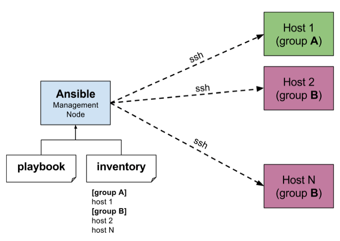

# Ansible


[Ansible](https://www.ansible.com/) is een open-source software provisioning, configuratie management, en applicatie-deployment tool die infrastructuur als code mogelijk maakt.
Het draait op alle Linux systemen (als ook Unix systemen) en Microsoft Windows, en kan deze ook configureren.
Het bevat een eigen declaratieve taal om systeemconfiguratie te beschrijven. Ansible is geschreven in 2013 door Michael DeHaan en in 2015 overgenomen door Red Hat die nu commerciele ondersteuning bied.
Voor ons is Ansible een handige tool omdat het agentless is. Het maakt tijdelijk op afstand verbinding via SSH of Windows Remote Management (waardoor PowerShell op afstand kan worden uitgevoerd) om zijn taken uit te voeren, tegenover sommige alternatieven als Chef of Puppet is voor Ansible op de server geen installatie nodig! Dit laat ons toe sneller servers op te zetten.

> In dit deel focussen we op het gebruik op Linux (meer bepaald Ubuntu). Windows installatie van Ansible is moeilijker.

Ansible gaat ons toelaten om in YAML formaat Linux en Windows servers te configureren. We kunnen bestanden aanmaken, configuratie aanpassen en software installeren. In vergelijking met een script is een paar verschillen:

Ansible laat ons toe meerdere servers tegelijk te configureren en beheren doormiddel van inventories.

Ansible checkt na het verbinden met je server wat al gebeurd is en zorgt dat je server bij elke Ansible-run op to date is met wat in je Ansible configuratie staat. Je kan dus gerust je installatie laten staan Ansible checkt dit steeds voor het uitvoeren. Dit laat je toe snel servers toe te voegen.

## Installatie

Ansible moeten we enkel installeren op de client. Hiervoor raad ik aan een Ubuntu Desktop te installeren.

Installeer Ansible via APT:

```bash
sudo apt update
sudo apt install software-properties-common
sudo add-apt-repository --yes --update ppa:ansible/ansible
sudo apt install ansible
```

## Concepten



Deze concepten komen voor in Ansible. Hiermee bouw je een Ansible setup op:

### Control node

Elke machine waarop Ansible is geïnstalleerd. Je kab Ansible-opdrachten en -playbooks uitvoeren door het `ansible` of `ansible-playbook` commando uit te voeren.
Vaak is dit onze laptop, maar het kan ook een andere server zijn waar heel je team aan kan.

### Managed nodes

Dit zijn de servers die je beheert met Ansible.
Managed nodes worden ook wel eens "hosts" genoemd. Ansible wordt niet geïnstalleerd op managed nodes.

### Inventory

Een lijst vanmanaged nodes. Een inventoryfile wordt ook wel eens een "hostfile" genoemd.
Je inventory kan informatie specificeren zoals IP adressen voor elke managed node. Een inventory kan ook beheemanaged rde nodes organiseren, groepen aanmaken en nesten voor eenvoudiger schalen.

### Modules

De eenheden van code die Ansible uitvoert. Elke module heeft een specifiek gebruik, van het beheren van gebruikers op een specifiek type database tot het beheren van VLAN-interfaces op een specifiek type netwerkapparaat. Je kan een enkele module aanroepen met een taak, of meerdere verschillende modules aanroepen in een playbook. Vele van deze modules worden meegeleverd of zijn te vinden op het internet. Deze modules besperen ons tijd door al expertise te gebruiken van mede-Ansible-gebruikers.

### Task

De eenheden van actie in Ansible. Je kan een enkele taak eenmalig uitvoeren met een ad-hoc commando.

### Playbooks

Geordende lijsten van tasks, opgeslagen zodat je die taken herhaaldelijk in die volgorde kunt uitvoeren. Playbooks kunnen zowel variabelen als taken bevatten.
Playbooks worden geschreven in YAML.

## Getting started

We hebben al Ansible geinstalleerd op onze Ubuntu. We gaan enkele acties uitvoeren als demo van Ansible.
We gaan snel in een cloud provider een VM aanmaken en deze configureren met Ansible.

We zorgen ervoor dat we we een SSH key hebben:

```bash
ssh-keygen # en volg de stappen
cat ~/.ssh/id_rsa.pub
```

Je kan deze key nu ingeven bij het aanmaken van de VM.

### Project opzetten

We maken een map aan waar we ons Ansible project in kunnen zetten. We openen de map hierna in een editor als Visual Studio Code.

Alseerst maken we een file met naam `hosts` (verander de username wel)

```
[servers]
<IP> ansible_user=ubuntu ansible_python_interpreter=/usr/bin/python3
```

Nu maken we een file met naam `ansible.cfg`

```
[defaults]
inventory = hosts
host_key_checking = False
```

Je kan nu zien of Ansible de hosts herkent:

```bash
$ ansible all --list-hosts
  hosts (1):
    141.148.244.47
```

**TIP:** in WSL kan een gedeelde map van Windows gezien worden als "world writable" wat in Ansible een security mechanisme triggered je kan hier rond werken door het expliciet toe te laten in een environment variable:

```bash
export ANSIBLE_CONFIG=$(pwd)/ansible.cfg
```

We pingen (SSH test in dit geval) nu de servers:

```
$ ansible all -m ping
```

Nu maken we een file met naam `main.yml`

```
- hosts: servers # installer dit op all hosts onder "servers:
  tasks:
    - name: Create a directory if it does not exist
      become: yes # become is kort voor become_user root
      file:
        path: /ansible_was_here
        state: directory

    - name: Install SL
      become: yes
      apt:
        name: sl
        state: present
        update_cache: yes
```

We voeren nu de file uit:

```
$ ansible-playbook main.yml
```

We zien nu dat Ansible de map `/ansible_was_here` heeft aangemaakt alsook dat de SL is geïnstalleerd. Als we dit opnieuw draaien bevestigt Ansible dat de map al bestaat en dat de SL al geïnstalleerd is. We kunnen deze verwijderen Ansible terug draaien en onze servers zijn weer inorde!

### Roles

In dit voorbeeld hebben we op al onze servers hetzelfde gezet, nu dit is meestal niet het geval. We spreken vaak van server roles. Dit zijn rollen die een bepaalde server kan aannemen.
We zien hieronder een typische structuur voor zo een rollen:

```
ansible/
├── roles
│   ├── common
│   │   └── tasks
│   ├── web_server
│   │   ├── handlers
│   │   ├── tasks
│   │   │   ├── main.yml
│   │   │   ├── setup_db.yml
│   │   │   └── setup_nginx.yml
│   │   └── templates
│   │       └── nginx_site_config.j2
├── hosts_production
├── hosts_staging
├── mail.yml
```

Onze `main.yaml` zegt dan welke server tags welke roles krijgen

```yaml
- hosts: web_hosts
  roles:
      - common
      - web_server
```

Elke role heeft een structuur:

-   `tasks` zijn onze taken, we starten altijd met de `main.yml`
-   `templates` zijn templates voor files, hierdoor kan je variables gebruiken in configuratie files
-   `handlers` zijn handlers voor de acties, bijvoorbeeld als een configuratie file wordt aangepast de service te herstarten

### Plugins

Absible heeft een groot ecosysteem van plugins, je hebt vele externe maar ook ingebouwde plugins.
De volledige lijst van ingebouwde [kan je op de Ansible site vinden](https://docs.ansible.com/ansible/latest/collections/ansible/builtin/index.html#plugins-in-ansible-builtin).

#### Top Modules

##### APT

```yaml
- name: Install MariaDB
  become: yes
  apt:
      name: mariadb-server
      state: present
      update_cache: yes
```

##### Services

```yaml
- name: Restart apache2
  service:
      name: apache2
      state: restarted
```

##### Copy

```yaml
- name: Write some content in a file /tmp/hello.txt
  copy:
      dest: /tmp/hello.txt
      content: |
          Good Morning!
          Awesome sunshine today.
```

```yaml
- name: Copy a new "ntp.conf file into place, backing up the original if it differs from the copied version
  copy:
      src: /mine/ntp.conf
      dest: /etc/ntp.conf
      owner: root
      group: root
      mode: "0644"
      backup: yes
```

##### File

```yaml
- name: Change file ownership, group and permissions
  file:
      path: /etc/foo.conf
      owner: foo
      group: foo
      mode: "0644"
```

```yaml
- name: Create a directory if it does not exist
  file:
      path: /etc/some_directory
      state: directory
      mode: "0755"
```

##### Lineinfile

```yaml
- name: Add a line to a file
  lineinfile:
      path: /etc/hosts
      line: 192.168.1.99 foo.lab.net foo
```

##### Git

```yaml
- name: Clone a Git repo
  git:
      repo: https://github.com/ansible/ansible-examples.git
      dest: /src/ansible-examples
```

##### Archive

```yaml
- name: Compress directory /path/to/foo/ into /path/to/foo.tgz
  archive:
      path: /path/to/foo
      dest: /path/to/foo.tgz
```

##### Command

```yaml
- name: Change the working directory to somedir/ and run the command as db_owner if /path/to/database does not exist.
  command: /usr/bin/make_database.sh db_user db_name
  become: yes
  become_user: db_owner
  args:
      chdir: somedir/
      creates: /path/to/database
```

## Opdracht

We hebben onze eerste stappen gezet in Ansible, nu is het aan jouw om je eeste Ansible playbooks te schrijven!

We willen een playbook voor het opzetten van een webserver:

-   Installeer apache
-   Installeer PHP
-   Maak een index.php pagina met de inhoud van onderaan

```php
<?php
echo '<h1>Hello Ansible</h1>';
phpinfo();
```

## Ansible voor Cisco IOS

We kunnen Ansible natuurlijk ook voor meer dan enkel voor Linux servers gaan gebruiken. Een mogelijke integratie is de lessen netwerkbeheer met Cisco IOS. De [IOS Collection](https://github.com/ansible-collections/cisco.ios) heeft een uitgebreide lijst van modules voor Cisco apparaten. Ook voor [IOS-XE](https://github.com/maccioni/cisco-ansible/tree/master/IOS-XE) is er een Ansible Collection.

In `requirements.yml` voegen we de volgende toe:

```yaml
---
collections:
    - name: cisco.ios
```

Dan installeren we de plugin:

```
ansible-galaxy collection install -r requirements.yml
```

Alle aparaten waar we op willen werken moeten natuurlijk SSH enabled hebben als ook een IP hebben. We kunnen deze dan ook in een hosts file zetten.

We kunnen hierna deze modules gebruiken om onze router/switch te configureren.

Je kan vele voorbelden vinden in de GitHub repository.

Dit zijn is een klein vorbeeldje:

```yaml
---
- hosts: switches
  vars:
      vlan_id: 998
      vlan_name: Ansible_VLAN

  tasks:
      - name: Ensure Fa2/0/5 is configured for access vlan 20
        cisco.ios.ios_l2_interface:
            name: FastEthernet2/0/5
            mode: access
            access_vlan: { { vlan_id } }
```

Probeer de [Ansible IOS Demo](https://github.com/meyskens/ansible-ios-demo) eens uit! Probeer nu ook twee switches tegelijk te configureren met licht verschillende configuraties.

## Resources

Ga je in je project Ansible gebruiken? Lees dan zeker deze resources!

-   [Ansible Documentation](https://docs.ansible.com/ansible/latest/index.html)
-   [Ansible "registers"](https://www.educba.com/ansible-register/) - laat acties alleen toe als iets veranderd is (bv server herstart)
-   [More complex structures](https://jozo.io/blog/structure-of-ansible-project/)
-   [Example project](https://github.com/meyskens/ansible-example)

