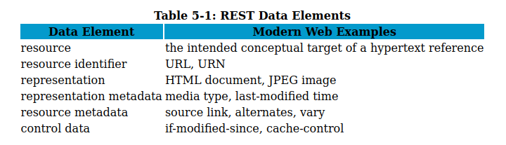
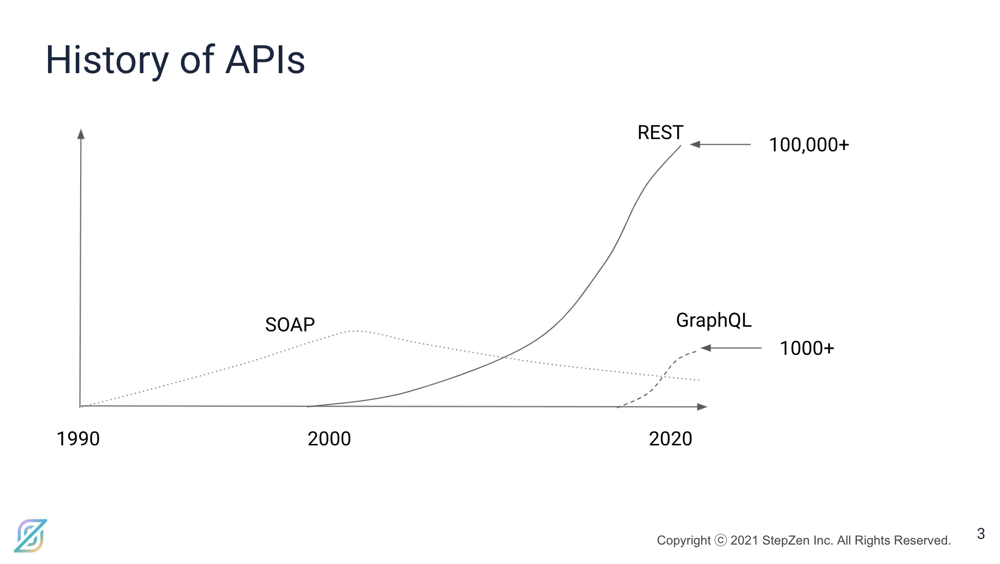
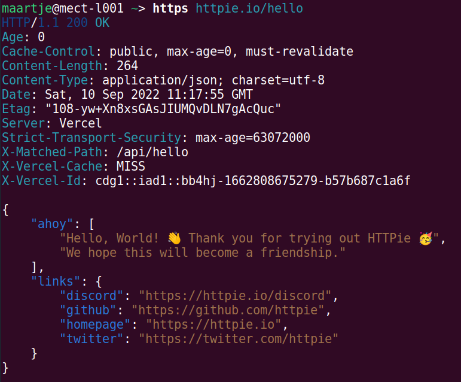
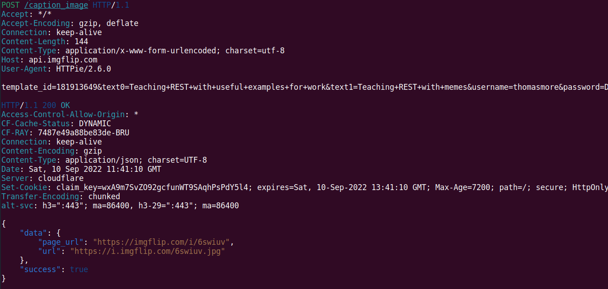
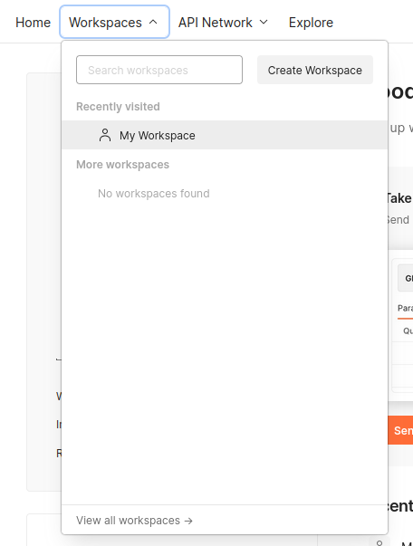
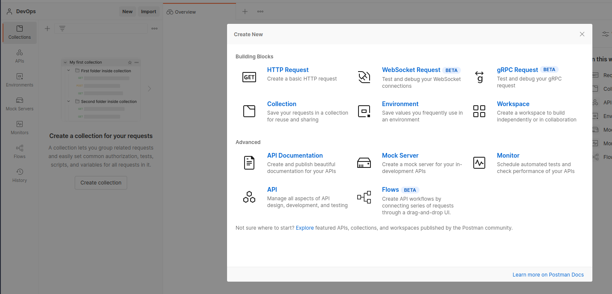
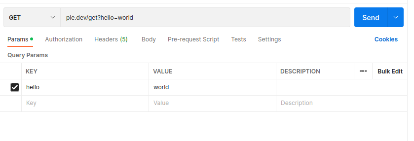
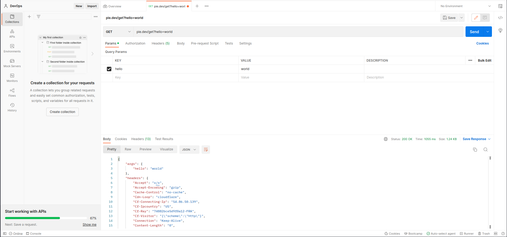
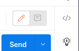
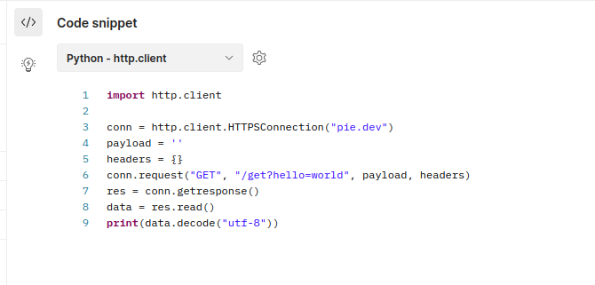

# APIs

Een API of Application Programming Interface is een begrip dat develpers ongetwijfeld wel heel goed kennen. Toch hoort het zeker ook in een opleiding netwerkbeheer thuis!

In dit hoofdstuk kijken we naar APIs, de werking van APIs en gaan we er mee aan de slag. In de hoofdstukken die volgen over monitoring en cloud maken we onderliggend gebruik van APIs om ons werk gedaan te krijgen, maar eerst nemen we een kijkje onder te motorkap naar de API.

## Wat is een API?

Stel je wilt data opvragen als gebruiker... Hoe doe je dat?

Je kan een website bezoeken, een formulier invullen en op een knop klikken. De website zal dan de data ophalen en tonen. Je leest ze eventjes. Je kijkt naar een afbeelding, scrollt erdoor en sluit mooi weer af. Dit is hoe je als mens met data omgaat.
Nu kunnen we dit alles in een command line doen, maar meestal spreken we hier van het gebruik van een grafische interface.

Maar computers onder elkaar? Hoe kunnen zij gegevens uitwisselen? Waarom zouden ze dat doen?
Kijk bijvoorbeeld naar systemen onderling, de lessenrooster moet weten welke vakken je volgt om op te halen waar je en wanneer je moet zijn. De rooster moet dus praten met het systeem dat je studie bijhoudt.
Of we willen in real time informatie uit onze netwerkapparatuur halen om te verwerken en onze firewall automatisch bij te stellen op basis van deze info. Hoe kunnen we dat doen zonder dat er iemand dag en nacht informatie moet ingeven?
Een applicatie die data van een andere applicatie wilt opvragen, heeft geen nood aan “menselijk leesbare” voorstelling van data.
We willen gewoon rechtstreeks aan de data kunnen in een bepaald dataformaat.

Hoe gaat dat in zijn werk?

**Enter the world of APIs!**

API staat voor voor _Application Programmable Interface_.
Een API telt applicaties in staat om data te delen, met andere applicaties.

Deze kunnen intern zijn, bijvoorbeeld de het bovenstaande voorbeeld van de lessenrooster. Data verlaat de organisatie nooit maar gaat wel tussen twee systemen onderling. Die vaak ook onderhouden worden door verschillende teams, en in verschillende databases of zelfs servers staan.

Een API is ook vaak gebruikt voor 3e partijen toegang te geven tot data. Bijvoorbeeld een app die je weerbericht geeft. Die app zal data opvragen bij een weerstation of dienst. Maar ook omgekeerd een chat platform als Slack of Discord heeft ook een API voor berichten te kunnen sturen op hun app.

### Libraries

Als we over APIs spreken dan komen er vaak libraries bij kijken. Een library is simpel gezegt een deel code (meestal van iemand anders) dat een programmeur importeert om te gebruiken in zijn eigen code. Het is een verzameling van functies die je kan gebruiken in je eigen code. Dit maakt het meestal makkelijker op een bepaalde taak uit te voeren. Vele APIs komen vaak ook met een library om te gebruiken.

We kijken even naar een praktisch voorbeeld. [Stripe](https://stripe.com) is een van de grootste betaalplatformen ter wereld. Ze bieden een API aan om betalingen te kunnen verwerken. Hier komt natuurlijk veel bij zien, en het veilig uitvoeren is heel belangrijk.
Ze hebben bijvoorbeeld een library voor Python om te gebruiken in je eigen code: [Stripe Python](https://stripe.com/docs/api/python), dit heeft alles aan boord op met Python te kunnen werken met hun API en zo een betaling te kunnen verwerken.

```python
import stripe

stripe.api_key = ""
token = request.POST['stripeToken']

charge = stripe.Charge.create(
  amount=999,
  currency='eur',
  description='1 uur DevOps training',
  source=token,
)
```

Deze library spreekt onderliggend een REST API aan, maar hoe exact moet de developer dan niet weten. Hoe werkt dit onderliggend? Dat bespreken we in het volgende deel!

### Werking

Hoe werken APIs nu?

Een client applicatie initieert een API call om informatie op te halen. Dit is een **request**.
Deze request wordt naar de [URI (Uniform Resource Identified)](https://en.wikipedia.org/wiki/Uniform_Resource_Identifier). Bijvoorbeeld `https://api.openweathermap.org/data/2.5/weather`, vele gaan over HTTP(S) maar dat moet niet, je hebt ook andere protocollen als gRCP die direct over TCP werken.
Een request gaat ook gegevens bevatten die we aanvragen. In HTTP kunnen deze zitten in de URL zelf, of in de body van de request (bijvoorbeeld in JSON of XML formaat). We kijken hier verder naar in het hoofdstuk van REST APIs.

**Voorbeeld:**

```http
GET https://api.openweathermap.org/data/3.0/onecall?lat=51.16103477649481&lon=4.960894469871616&exclude=current,minutely&appid=1234
Accept: application/json
User-Agent: apple-weather/1.0
```

Deze call maken we naar een extern programma of webserver. Deze zal dan de request verwerken en een **response** terugsturen. Deze response bevat de gevraagde data, of een foutmelding als er iets mis is gegaan. Een antwoord moet op een gestructureerde manier data kunnen sturen. Dit is vaak in het JSON of XML formaat. Dit is een gestructureerde manier om data te kunnen uitwisselen in de vorm van tekst.

**Voorbeeld:**

```json
HTTP/1.1 200 OK
Content-Type: application/json

{
  "lat": 51.16103477649481,
  "lon": 4.960894469871616,
  "timezone": "Europe/Brussels",
  "timezone_offset": 7200,
  "hourly": [
    {
      "dt": "2022-01-01T00:00:00+01:00",
      "temp": 7.7,
      "feels_like": 6.5,
      "pressure": 1018,
      "humidity": 93,
      "dew_point": 6.9,
      "clouds": 100,
      "visibility": 10000,
      "wind_speed": 2.57,
      "wind_deg": 90,
      "weather": [
        {
          "id": 500,
          "main": "Rain",
          "description": "light rain",
          "icon": "10d"
        }
      ],
      "rain": 0.95,
    },
    {
      "dt": "2022-01-02T00:00:00+01:00",
      "temp": 8.7,
      "feels_like": 7.5,
      "pressure": 1019,
      "humidity": 45,
      "dew_point": 6.9,
      "clouds": 100,
      "visibility": 10000,
      "wind_speed": 2.57,
      "wind_deg": 90,
      "weather": [
        {
          "id": 500,
          "main": "Rain",
          "description": "light rain",
          "icon": "10d"
        }
      ],
      "rain": 0.95,
    }
  ]
}
```

Dit is een antwoord in JSON (JavaScript Object Notation) formaat. Je herken de structuur wel uit een programmeertaal, het heeft de gebruikelijke datatypes als een string, integer, array, object, etc.

XML is ook populair echter vaak gezien als verouderd. Het is vooral gefocussed op leesbaarheid. JSON is vaak sneller en compacter.

**Voorbeeld:**

```xml
HTTP/1.1 200 OK
Content-Type: application/xml

<?xml version="1.0" encoding="UTF-8"?>
<response>
  <lat>51.16103477649481</lat>
  <lon>4.960894469871616</lon>
  <timezone>Europe/Brussels</timezone>
  <timezone_offset>7200</timezone_offset>
  <hourly>
    <dt>2022-01-01T00:00:00+01:00</dt>
    <temp>7.7</temp>
    <feels_like>6.5</feels_like>
    <pressure>1018</pressure>
    <humidity>93</humidity>
    <dew_point>6.9</dew_point>
    <clouds>100</clouds>
    <visibility>10000</visibility>
    <wind_speed>2.57</wind_speed>
    <wind_deg>90</wind_deg>
    <weather>
      <id>500</id>
      <main>Rain</main>
      <description>light rain</description>
      <icon>10d</icon>
    </weather>
    <rain>0.95</rain>
  </hourly>
  <hourly>
    <dt>2022-01-02T00:00:00+01:00</dt>
    <temp>8.7</temp>
    <feels_like>7.5</feels_like>
    <pressure>1019</pressure>
    <humidity>45</humidity>
    <dew_point>6.9</dew_point>
    <clouds>100</clouds>
    <visibility>10000</visibility>
    <wind_speed>2.57</wind_speed>
    <wind_deg>90</wind_deg>
    <weather>
      <id>500</id>
      <main>Rain</main>
      <description>light rain</description>
      <icon>10d</icon>
    </weather>
    <rain>0.95</rain>
  </hourly>
</response>
```

Je herkent al minder snel de datatypes in XML maar kan ze wel herleiden, het is meer een structuur van tags (HTML is gebaseerd op XML).

### Praktisch: Type APIs

Er zijn verschillende soorten APIs. Zowel als we kijken naar de technische kant als ook waar ze gebruikt worden.

#### Open APIs

We kijken eerst naar een open API. Een open API is een API die vrij opvraagbaar is via HTTP. Iedereen kan hier data in opvragen. Er is geen authenticatie nodig, er is vaak echter wel een rate limit. Dat is een limiet die je stelt op het aantal requests dat je per tijdseenheid kan doen. Dit is om te voorkomen dat iemand je API overbelast.

Het project [Public APIs](https://github.com/public-apis/public-apis) houd een collectie van Open APIs bij. In de oefeningen zullen we voor gebruiksgemak deze APIs gaan gebruiken.

Enkele voorbeelden:

-   [Google Safe Browsing](https://developers.google.com/safe-browsing/) kan URLs checken op bekend phising of malware
-   [Open Data Belgium](https://data.gov.be/nl) is een collectue van open data/APIS van de Belgische overheid
-   [Open Weather Map](https://openweathermap.org/api) is een open API voor het weer
-   [Open Notify](http://open-notify.org/Open-Notify-API/) is een open API voor de ISS (International Space Station)
-   [Open Brewery DB](https://www.openbrewerydb.org/) is een open API voor brouwerijen
-   [Lorem Picsum](https://picsum.photos/) is een open API voor autheursrechtvrije placeholder images

En er zijn er zo enorm veel. Vele diensten die je elke dag gebruikt hebben ook een API. Denk aan Facebook, Twitter, Instagram, Google, Discord, Spotify, etc.

(Niet te verwarren met de OpenAPI specificatie, een standaard om een API te beschrijven.)

#### Open APIs met API keys

Vele open APIs maken gebruik van zogenaamde API Keys. Deze keys dienen om API calls te kunnen linken aan een gebruiker. Dit kan gebruikt worden om limieten per gebruiker op te leggen maar ook om toegang te geven tot persoonlijke gegevens. Bijvoorbeeld de Discord API kan je toegang geven tot wat een bot account kan zien door middel van een API token. Of een GitHub API token geeft me write access tot mijn eigen repositories.

Deze API keys zie je vaak op twee plaatsen, welke wanneer het geval is hangt af van de maker van de API.

-   In de URL zelf
    -   in een query parameter bv. `?api_key=1234`
    -   in het pad zelf bv. `/api/1234/weather`
-   In de HTTP headers
    -   in een `Authorization` header bv. `Authorization: Bearer 1234`

#### Private APIs

Een private API is een API die niet vrij opvraagbaar is via HTTP. Deze API is enkel beschikbaar voor specifieke business partners van een bedrijf om zo data tussen elkaar uit te wisselen. Deze API is niet publiek bereikbaar.
Deze kunnen bijvoorbeeld deel zijn van een contract voor het gebruiken van specifieke software zodat er gecomuniceerd kan worden met reeds bestaande software.

Een voorbeeld kan zijn de lessenrooster software die de studenten gegevens uit een bestaand ERP systeem kan halen via een API. Deze API wil je zeker niet beschikbaar stellen voor iedereen of zelfs voor personeel.

::: note
Vele apps of sites gebruiken APIs die niet per defenitie publiek zijn maar wel gebruikt worden door het publiek. Deze zijn vrij makkelijk te achterhalen door de requests te bekijken die de app of site doet. Hiermee kan je deze reverse engineeren en gebruiken voor eigen doelen, dit is niet strikt illegaal. Het wordt heel vaak gedaan zo heb je [iRail](https://github.com/iRail) die de NMBS site data gebruikt voor een betere route planner en API. Ook kleinere libraries steunen op dit principe: [go-recyle-belgium](https://github.com/meyskens/go-recycle-belgium) of [het weekmenu van TM Geel](https://github.com/WarreKiekens/WeekMenu) of vraag maar eens Maartje om te tonen hoe zij betaald op de campus...
:::

#### Internal APIs/Verborgen APIs

APIs zijn ook vaak intern, waar je ze zelfs niet verwacht. Ze zijn vaak verborgen voor de gebruiker en niet merkbaar. Als je bijvoorbeeld wil comminuceren tussen twee systeemprocessen op een computser is er spraken van een API. In Windows heb je bijvoorveeld verschillende vormen van [interprocess communication](https://docs.microsoft.com/en-us/windows/win32/ipc/interprocess-communications). Dit is per definitie een API.

Op Linux hebben we nog een mooier voorbeeld. Docker is een vrij recente technologie. Onderliggend bestaat Docker uit verschillende componenten. De meest voornaamste zijn `docker` de CLI tool en `dockerd` het achterliggende proces dat de containers beheert (latere versies containerd erbij). Deze twee communiceren met elkaar via een HTTP JSON API over een [Unix Socket](https://en.wikipedia.org/wiki/Unix_domain_socket).

De CLI tool stuurt dus enkel HTTP requests uit voor het beheren van containers. De API is ook uitgebreid [gedocumenteerd](hhttps://docs.docker.com/engine/api/v1.24/). Deze API is ook wat Docker Compose en Kubernetes mogelijk maakte!

### Technisch: Type APIs

We hebben nu besproken waar we APIs tegenkomen. Maar hoe ze werken is ook heel wat variatie in. We focussen ons hier vooral op API verkeer dat over het internet gaat. We gaan hier niet in op het verkeer tussen twee processen op dezelfde computer.

#### SOAP API

SOAP of Simple Object Access Protocol is al een vrij oude vorm van API comminucatie en dateert al van 1998. We vinden deze nog weinig terug buiten in legacy systemen. SOAP maakt deel uit van XML-RPC (Remote Procedure Call) en is een protocol om berichten uit te wisselen en acties uit te voeren via XML. Het maakt gebruik van HTTP als transport protocol. Het SOAP protocol heeft een vrij vastgelegde vorm.

**Voorbeeld**

```xml
POST /api HTTP/1.1

<?xml version="1.0"?>
<soap:Envelope
    xmlns:soap="http://schemas.xmlsoap.org/soap/envelope/"
    xmlns:xsi="http://www.w3.org/2001/XMLSchema-instance"
    xmlns:xsd="http://www.w3.org/2001/XMLSchema">
    <soap:Body>
        <GetStockPrice xmlns="http://www.stockquote.com">
            <StockName>Hashicorp</StockName>
        </GetStockPrice>
    </soap:Body>
</soap:Envelope>

200 OK
Content-Type: text/xml; charset=utf-8

<?xml version="1.0"?>
<soap:Envelope
    xmlns:soap="http://schemas.xmlsoap.org/soap/envelope/"
    xmlns:xsi="http://www.w3.org/2001/XMLSchema-instance"
    xmlns:xsd="http://www.w3.org/2001/XMLSchema">
    <soap:Body>
        <GetStockPriceResponse xmlns="http://www.stockquote.com">
            <GetStockPriceResult>100</GetStockPriceResult>
        </GetStockPriceResponse>
    </soap:Body>
</soap:Envelope>
```

Een lichter alternatief voor XML-RPC is [JSON-RPC](https://www.jsonrpc.org/index.html). Maar kent minder populariteit.

#### GraphQL API

[GraphQL](https://graphql.org/) is eem vrij recente vorm die onstaan is binnen Facebook rond 2012 en gepubliceerd in 2015. GraphQL is uniek in dat het de gebruiker van de API het output formaat kan laten kiezen in plaats van dat het is vastgelegd door de server. Dit heeft als voordeel dat enkel de benodigde data wordt teruggestuurd en dus effecienter werkt tegenover een REST API waarbij je vaak de hele datastructuur terugkrijgt. We zien deze API dus vaak terugkomen bij APIs die een focus hebben op data opvragen en niet op functionaliteit.

**Voorbeeld**

```graphql
query {
    user(id: 4) {
        name
        company {
            name
        }
    }
}
```

```json
{
    "data": {
        "user": {
            "name": "Mark Zuckerberg",
            "company": {
                "name": "Facebook"
            }
        }
    }
}
```

(GraphQL is ondanks zijn naam geen query language voor een Graph database zoals Neo4j)

#### gRPC API

gRPC is een Remote Procedure Call API die werkt over HTTP/2. Ze is ontwikkeld door Google en is nu een open source project. gRPC maakt gebruik van Protocol Buffers, een binary data formaat. Het is een effecienter alternatief voor XML en JSON, maar minder gebruiksvriendelijk voor mensen.
We zien gRPC vooral terugkomen bij bedrijven die veel microservices gebruiken door de efficiëntie en de mogelijkheid om de API code te genereren in verschillende talen. Zo gebruikt bijvoorbeeld [etcd](https://etcd.io/) gRPC om te communiceren tussen de verschillende servers in een cluster om de database te synchroniseren.

Ook zien we recente toevoegingen in [Cisco IOS](https://github.com/CiscoDevNet/grpc-getting-started) en [Juniper Junos OS](https://community.juniper.net/browse/blogs/blogviewer?blogkey=e37a2402-d6e2-4e6a-8884-01638414ee3e) voor het "streamen" van data en configuratie.

**Voorbeeld van protobuf**

```protobuf
syntax = "proto3";

package helloworld;

service Greeter {
  rpc SayHello (HelloRequest) returns (HelloReply) {}
}

message HelloRequest {
  string name = 1;
}

message HelloReply {
  string message = 1;
}
```

Je herkent hier een library in, protobuf wordt gebruikt voor het automatisch genereeren van code in verschillende talen. De code die gegenereerd wordt kan je dan gebruiken om de API aan te spreken of aan te bieden.

#### Representational State Transfer (REST) API

De term representational state transfer werd eerst gebruikt in de doctoraat studie van Roy Fielding in 2000. Het diende om weer te geven hoe een goed ontworpen webapplicatie zich moet gedragen. Het heeft een aantal componenten die gegeven moeten worden om een goede API te hebben. Een applicatie moet ook navigeerbaar zijn op basis van URLs.



REST echter is een architectuur **stijl** voor het ontwerpen van APIs. REST is een verzameling van principes die de basis vormen voor het ontwerpen van een API. Het is dus niet zo dat een API die REST gebruikt ook daadwerkelijk puur REST is. Het is eerder een verzameling van principes die je kan gebruiken om een API te ontwerpen.

Een API die zich aan deze principes houd noemen we wel eens een RESTful API.
We focussen ons verder op een web applicatie.

Een REST API call heeft nodig:

-   een URL
-   een HTTP methode
-   een media type
-   een request body (optioneel)

Vooral de HTTP methode heeft in een goede REST API een enorm belangrijke functie, deze bepaalt namelijk wat de API doet. De HTTP methode is een van de 4 HTTP methodes die we kennen:

-   `GET` - om data op te vragen van een bepaalde resource bv `GET /users/1` geeft de data van de user met id 1 terug
-   `POST` - om data te versturen naar de server bv `POST /users` maakt een nieuwe user met de data in de request body
-   `PUT` - om data aan te maken / te updaten van een bepaalde resource bv `PUT /users/1` update de user met id 1 met de data in de request body
-   `PATCH` - om data aan te passen van een bepaalde resource, maar enkel de meegegeven data wordt aangepast, de overige blijft onaangeraakt bv `PATCH /users/1`
-   `DELETE` - om data te verwijderen van een bepaalde resource bv `DELETE /users/1` verwijdert de user met id 1
-   `OPTIONS` - om de beschikbare methodes te weten te komen voor een bepaalde resource bv `OPTIONS /users/1` geeft de beschikbare methodes terug (in de praktijk wordt dit meestal niet gebruikt)

**Voorbeeld**

```http
GET /users/1 HTTP/1.1
Accept: application/json

HTTP/1.1 200 OK
Content-Type: application/json

{
    "id": 1,
    "name": "John Doe",
    "email": "john.doe@thomasmore.be`
}
```

```http
POST /users HTTP/1.1
Content-Type: application/json

{
    "name": "Stijn Coenen",
    "email": "ceo@thomasmore.be"
}

HTTP/1.1 201 Created
Content-Type: application/json

{
    "id": 2,
    "name": "Stijn Coenen",
    "email": "ceo@thomasmore.be",
    "campus": "Lier"
}
```

## Praktijk: RTFM

We gaan nu in de praktijk een aantal REST APIs aanspreken. Maar REST is een framework... Dit betekend dat de makers van de APIs veel vrijheid kennen voor het ontwerpen van de API. We moeten dus enorm goed de documentatie lezen om een API correct te kunnen gebruiken. Sommige APIs die in je leven tegenkomt zullen waarschijnlijk ook overtredingen tegenover REST maken als een schrijf actie met een GET of een POST call zonder body.

### OpenAPI

OpenAPI is een open standaard voor het beschrijven van REST APIs. OpenAPI gebruikt YAML voor het beschrijven van de data en de mogelijke API calls zoals protobuf dat ook doet. En kan zo gebruikt worden om code te genereren. Maar OpenAPI is niet strict exact. Je ziet OpenAPI heel vaak terugkomen, zo kan je de specs krijgen van een API door de URL van de API te voorzien van `/openapi.json` of `/openapi.yaml` of de documentatie te bekijken (bv [AWS](https://docs.aws.amazon.com/apigateway/latest/developerguide/api-as-s3-proxy-export-swagger-with-extensions.html)). OpenAPI wordt ook gebruikt om documentatie te genereren met tools als [Swagger](https://swagger.io/), zie bijvoorbeeld [de API van de franse Cloud provide OVH](https://api.ovh.com/console/).

(je kan al gaan raden waar we verder in de cursus APIs gaan gebruiken)

## REST


Uit recent marktondezoek van [StepZen, Inc.](https://stepzen.com/blog/leverage-your-rest-ecosystem-with-graphql/) blijkt dat REST nog altijd de meest gebruikte API is.
Het is een eenvoudig protocol dat gebruik maakt van HTTP en de HTTP structuur om data uit te wisselen. Het is daarom makkelijk te implementerten, gebruiken en schalen!

Om deze redenen bekijken we in deze cursus in de praktijk enkel REST APIs.

Een API aanspreken doen we in meeste gevallen in een programmeertaal. Maar voor deze lessen gaan we ze verkennen in enkele handige ontwikkeltools.

### HTTP(ie)

We beginnen met een CLI tool. [HTTPie](https://github.com/httpie/httpie) (uitgesproeken aitch-tee-tee-pie (Englels)) noemt zichzelf de "human-friendly CLI HTTP client for the API era". Het is een CLI tool die je kan gebruiken om HTTP requests te versturen en de response te bekijken. Het is een alternatief voor `curl` en `wget` maar heeft de focus op leesbaarheid voor de eindgebruiker. Het is dus minder handig om te gebruiken in scripts.

Op een Ubuntu/Debian systeem kunnen we het installeren via `apt`:

```bash
sudo apt update
sudo apt install httpie
```

We hebben nu twee commando's om HTTP requests te versturen: `http` en `https`. De laatste is een alias die `https://` als prefix toevoegt aan de URL.

We testen de tool uit:

```bash
https httpie.io/hello
```



(tip vergelijk de output met `curl https://httpie.io/hello`)

We merken dat de output van HTTPie veel leesbaarder is dan die van `curl`. Dit komt omdat HTTPie de response in JSON formateert. Het toont ook standaard kleuren voor de verschillende onderdelen van de response en geeft de response code samen met HTTP headers.

HTTPie is gemaakt voor het gebruik van APIs makkelijker te maken en heeft een makkelijke syntax voor het sturen van verschillende HTTP verbs, headers en request body (zelfs JSON encoded!). We kunnen hiermee dus makkelijk een API gaan verkennen vanuit de command line.

We kunnen de verbs `GET`, `POST`, `PUT`, `PATCH` en `DELETE` gebruiken door deze als prefix te gebruiken:

```bash
http GET pie.dev/get
http PUT pie.dev/put
http DELETE pie.dev/delete
http POST pie.dev/delete # dit faalt, pie.dev gaat enkel antwoorden als het juiste verb gebruikt wordt
```

Je kan ook de request bekijken door de optie `-v` te gebruiken, wil je echter de API call enkel bekijken zonder de server echt te contacteren kan je ``--offline` gebruiken.

```bash
http POST pie.dev/post hello=world -v
http DELETE kuloket.be/grades/tm/snb/devops --offline
```

Je ziet hierboven al `hello=world` wat is dat nu? HTTPie heeft een syntax voor het sturen van HTTP Headers en een HTTP Request Body.

-   `key:value` wordt een HTTP Header, je herkent ze aan de dubbele punt,
-   `key=value` wordt een HTTP Request Body, je herkent ze aan de gelijkheidsteken.

De header gebruiken we meestal voor meta data zoals de `Content-Type` of `Authorization` headers om aan te geven wat we sturen of een token mee te sturen voor authenticatie.

De request body gebruiken we om data mee te sturen zoals een JSON object of een HTTP/HTML form data. Dit gaat dan meestal over het object dat we willen aanmaken of aanpassen.

Een praktisch voorbeeld in HTTPie:

```bash
$ http POST pie.dev/post hello=world Authorization:1234 -v
POST /post HTTP/1.1
Accept: application/json, */*;q=0.5
Accept-Encoding: gzip, deflate
Connection: keep-alive
Content-Length: 18
Content-Type: application/json
Host: pie.dev
User-Agent: HTTPie/2.2.0
Authorization: 1234

{
    "hello": "world"
}
```

We merken hier dat onze `hello=world` in de request body als JSON terecht komt en dat de `Authorization` header wordt toegevoegd.

Standaard stuurt HTTPie de request body als JSON. Met de optie `-f` passen we dit aan naar HTTP Form data, een primitievere data vorm die geproduceerd wordt door HTML forms.

Een praktisch voorbeeld is de API van [imgflip](https://imgflip.com/api). Deze API aanvaard enkel HTTP Form data.

```bash
http POST https://api.imgflip.com/caption_image template_id=181913649 text0="Teaching REST with useful examples for work" text1="Teaching REST with memes" username=thomasmore password=<vraag dit aan je docent> -v -f
```

:::note
Deze API is niet het beste voorbeeld doordat deze expliciet een username en password vraagt. Dit is niet de beste manier om een API te beveiligen. Je kan beter een token gebruiken megt een eventuele eenmalige login call om deze te krijgen. Maar in REST land komen we vaak imperfecties tegen, dat maakt elke API uniek.
:::



We merken hier dat de body een lange string is:

```
template_id=181913649&text0=Teaching+REST+with+useful+examples+for+work&text1=Teaching+REST+with+memes&username=thomasmore&password=
```

Deze manier van objecten noteren komen we vaak tegen in GET requests, Hier staat deze echter in de URL (een GET request met een body is niet toegelaten).

```
https://duckduckgo.com/?q=devops+cursus+thomas+more&t=ha&va=j&ia=web
```

Probeer ook eens een paar API calls uit met imgflip, je kan de template_id vinden op de [website van imgflip](https://imgflip.com/popular_meme_ids).

### Postman

Postman is een open source tool ontwoerpen voor het testen van API calls makkelijke te maken, ondertussen is het uitgegroeid tot een groot bedrijf die op plaats 28 staat in de top 100 opkomende cloud bedrijven volgens [Forbes](https://www.forbes.com/lists/cloud100/).

Postman is gratis te gebruiken met account op [https://www.postman.com/](https://www.postman.com/), liever een Desktop App? Download dan [Postman Desktop](https://www.postman.com/downloads/) (Linux. macOS, Windows).

Eenmaal aangemeld in Postman kan je een nieuwe workspace aanmaken om in te experimenteren.



Eenmaal in de eigen workspace kan je een nieuwe request aanmaken, kies hier als optie "HTTP Request".



Hoe ziet een API request eruit in Postman? Je herkent dat er verschillende knoppen zijn voor de HTTP verbs, een URL veld en ook tabs voor GET parameters, Headers en Request Body. Enkele standaard headers zijn al voor je ingevuld.



Je kan nu met de `send` knop de request versturen en de response bekijken.



Als je exact hebt wat je nodig hebt heeft Postman een export knop om meteen code te genereren voor de meest gebruikte programmeertalen en HTTP libraries.



We nemen bijvoorbeeld de Python code die Postman voor ons genereert.



Deze code kan je kopieren en gebruiken in je eigen applicatie!

Een ander groot voordeel aan Postman is dat de community al veel API Calls heeft gedeeld. Je kan deze importeren in je workspace en zo snel aan de slag gaan.
Een voorveeld is [Cisco Devnet](https://www.postman.com/ciscodevnet?tab=collections) die een hele collectie heeft gedeeld van API calls naar hun producten.

## Oefeningen

### icanhazdadjoke API

De [icanhazdadjoke API](https://icanhazdadjoke.com/api) is een API die je een oneindige hoeveelheid dad jokes geeft in een REST interface.

Bekijk de documentatie op [https://icanhazdadjoke.com/api](https://icanhazdadjoke.com/api)

Voer de volgende opdrachten uit in Postman of HTTPie:

-   Haal een willekeurige dad joke op in JSON formaat
-   Geef aan dat de applicatie waar we deze gebruiken `DevOps/2.1 (github.com/meyskens/devops-graduaten)` is
-   Haal de joke op met ID `FBskq4MRnrc`
-   Haal de jokes op met het woord `hipster`

### Rick & Morty API

De Rick & Morty API is een REST API die informatie over de [serie Rick & Morty](https://www.adultswim.com/videos/rick-and-morty) bevat. Je kan hier informatie opvragen over de personages, afleveringen en locaties. Deze API bied een REST en een GraphQL interface aan, wij gaan enkel de REST API gebruiken.

Bekijk eerst de documentatie op [https://rickandmortyapi.com/documentation](https://rickandmortyapi.com/documentation).

Beantwoord nu de volgende vragen in Postman of HTTPie:

-   Zoek alle menselijke characters
-   Zoek de naam van de eerste aflevering waar Birdperson in
    voorkomt
-   Zoek alle vrouwelijke characters. Hoeveel zijn dit er?
-   Zoek alle dead Morty characters

### Uitdaging

Ken je Python nog? Top! Je hebt nu een mogelijkheid om dad jokes op te halen. Met [de pirate translations API](https://funtranslations.com/api/pirate) kan je tekst vertalen naar pirate speak. Maak een Python script dat een dad joke ophaalt en deze vertaalt naar pirate speak (of andere leuke vertalingen). (inspired by [LaylaCodesIt](https://www.youtube.com/watch?v=7NIHJuQQ2j0))

**Dank aan Davy Cavens voor de basis te leggen voor dit hoofdstuk. Dank aan Brent Pulmans en Michiel Verboven voor de inspiratie via het vak API Development. Dank aan Bart Portier voor eindeloze dad jokes...**

