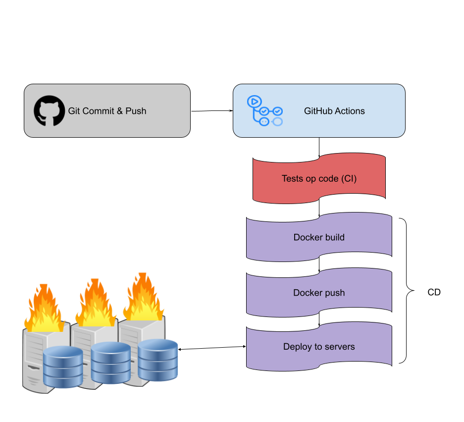
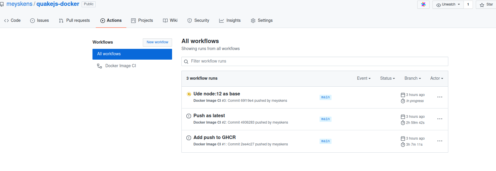
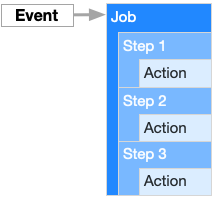
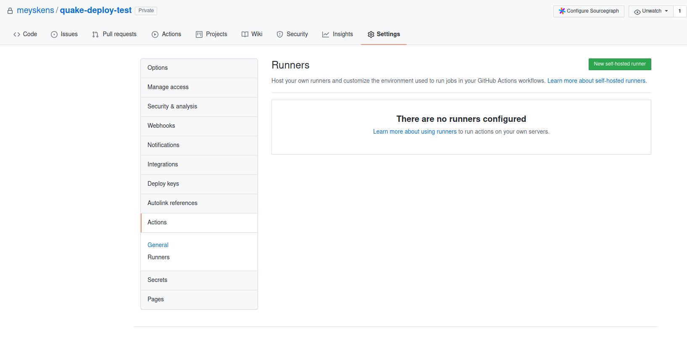
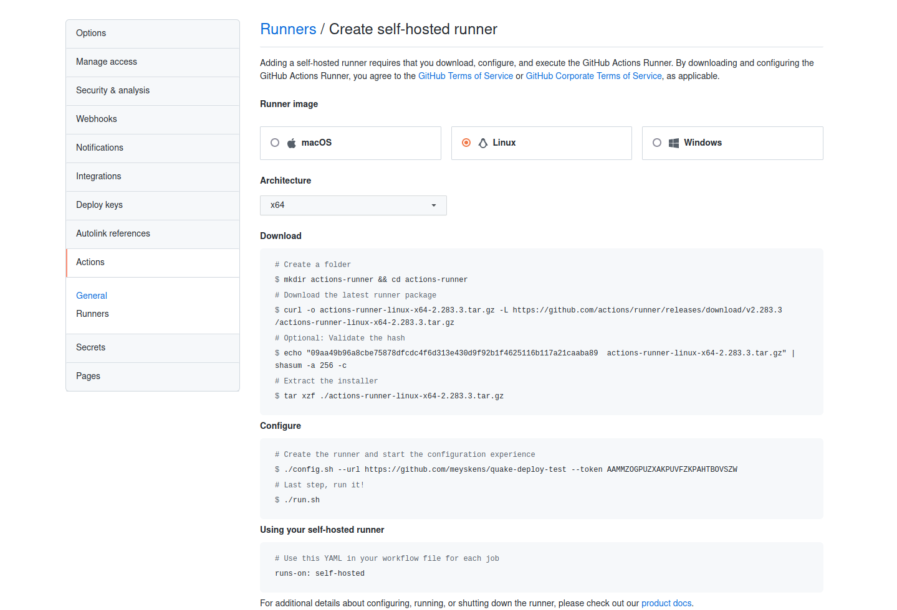
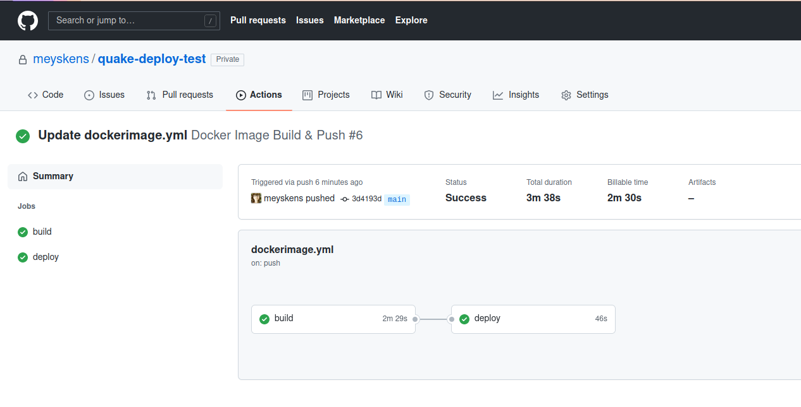

# Deployment Pipeline

We hebben in de introductie van dit vak al heel vaak gesproken van deployments. Onze developers willen zo snel mogelijk code shippen naar production. Dit proces verliep vroeger manueel, iets wat we tegenwoordig niet meer kunnen permiteren!

Dit deel van onze DevOps automatisatie noemen we de "pipeline", het voorbereiden en shippen van onze code. In een typische omgeving draait dit misschien tot 100 keer per dag.

## CI/CD

Dit process vatten we vaak samen als een "Continuous Integration/Continuous Deployment" (CI/CD) process (alhoewel dit ook een heel cultuur framwork meebrengt).

Laten we heel eventjes down to earth gaan, in essentie is dit eigenlijk "scripten draaien bij Git commits". We gaan via een CI/CD tool scripts uitvoeren om de kwaliteit van de code te garanderen en deze te laten shippen naar de production.

### CI

Continuous Integration (CI) is een techniek die gebruik maakt van een CI/CD tool om de code te valideren en te testen. Dit is niet het vakgebied voor onze opleiding, maar we gaan hier verschillend automatische testen uitvoeren op de code om te kunnen bevestigen dat alles werkt.

### CD

Continous Deployment (CD) zorgt ervoor dat onze code naar de production kan gestuurd worden. Afhankelijk van de ongeving kan dit bij een push naar de "main" branch, of een apparte "production" branch en soms ook bij het taggen van een release versie. Wij gaan het in onze voorbeelden houden op het eerste.

In het CD deel van onze pipeline gaan we de code bouwen en naar onze servers sturen. We kunnen dat bijvoorbeeld met Docker, we maken een container image en pushen die naar Docker Hub of een andere registry. Waarna we een commando naar onze server sturen om deze image binnen te halen.


## Tools

Een populair voorbeeld van dit soort on-premise tools is Jenkins, een open-source systeem. Jenkins kent al enkele levensjaren, gepaard met een slechte reputatie in de security wereld (tip: Jenkins is DE manier een netwerk binnen te geraken!) verliest Jenkins momenteel snel populariteit die gaat naar modernere en vaak cloud based oplossingen.

Met de opkomst van Cloud zijn er veel SaaS oplossingen verschenen. Deze diensten doen in essentie nog steeds hetzelfde, maar gebruiken tijdelijke VM's in de Cloud om de acties in uit te voeren. Voorbeelden hiervan zijn CircleCI, Bamboo, TravisCI, Azure DevOps,... . Git hosting providers hebben ook vaak een eigen systeem zoals GitHub Actions en GitLab Runners.

De meeste van deze Cloud diensten hebben ook een on-premise versie. Of een hybride versie waar de configuratie en logs in de cloud draaien maar de eigenlijke commando's op je eigen server.

Voor deze cursus zullen we GitHub Actions gebruiken, de Cloud-gebaseerde DevOps pipeline dienst van GitHub. Deze dienst is gratis en onbeperkt voor publieke repositories op GitHub en gratis tot 3000 build minuten voor private repositories.
We gaan ook kijken naar de hybride versie met "self-hosted runners" dat het volledig gratis is, en we kunnen dit ook achter onze eigen firewall draaien!

## GitHub Actions

GitHub Actions is de CI/CD tool die in GitHub ingebouwd zit. Deze dienst wint enorm snel aan populariteit en is makkelijk te gebruiken.
We gaan GitHub Actions hier gebruiken om een Docker project te bouwen en te pushen. De onderstaande voorbeelden zijn van [QuackeJS-Docker](https://github.com/meyskens/quakejs-docker/) een in browser versie van Quake III met een multiplayer server.

### Workflows

In de actions tab op GitHub zien we verschillende "workflows". Een workflow is een CI/CD actie die uitgevoerd kan worden. Dit kan bij een push, pull request of zelfs elke x aantal uren.



Al deze acties staan gedefinieerd in de map `.github/workflows` in je repository. We bekijken hier een simpele workflow die onze server gaat deployen bij een push naar de main branch.

Een workflow file is een [YAML](../yaml) bestand waarin we een job gaan beschrijven.



Onderstaande actions file is een workflow voor het bouwen en pushen van een Docker image naar de GHCR registry, de Docker Registry van GitHub.

```yaml
name: Docker Image Build & Push

on:
    push:
        branches: [main]

jobs:
    build:
        runs-on: ubuntu-latest
        steps:
            - uses: actions/checkout@v2
            - name: Log in to registry
              run: echo ${{ secrets.GHCR_TOKEN }} | docker login ghcr.io -u $GITHUB_ACTOR --password-stdin
            - name: Build the Docker image
              run: docker build -t ghcr.io/meyskens/quakejs-docker:$GITHUB_SHA .
            - name: Push the image to the registry
              run: docker push ghcr.io/meyskens/quakejs-docker:$GITHUB_SHA
            - name: Push the image to the registry as latest
              run: |
                  docker tag ghcr.io/meyskens/quakejs-docker:$GITHUB_SHA ghcr.io/meyskens/quakejs-docker:latest
                  docker push ghcr.io/meyskens/quakejs-docker:latest
```

We zien 3 hoofdonderdelen:

-   `name` is de naam van de workflow
-   `on` is de trigger waarop de workflow moet draaien
-   `jobs` is de lijst met taken en scripts die in de workflow moeten draaien

#### On

We kijken even naar `on` in detail:

```yaml
on:
    push:
        branches: [main]
```

Dit gaat ervoor zorgen dat onze workflow alleen gaat triggeren als we een push naar de main branch doen.
Er zijn ook andere opties, zoals `pull_request` deze zien we vaker in het `CI` gedeelte waar we code kunnen gaan testen voor we ze mergen naar de main branch.
Nog een optie is `cron` dit geeft een cron job mee die het toelaat op regelmatige basis de workflow te draaien.

```yaml
on:
    cron: "0 0 * * *"
```

#### Jobs

Een workflow kan meerdere Jobs hebben. Een Job is een stap in de workflow die uitgevoerd kan worden. Deze job heeft een naam, in dit geval `build`. In een volgend voorbeeld gaan we de stap `deploy` toevoegen.
Een job heeft een `runs-on` property die aangeeft welke platform de job moet draaien. In dit geval `ubuntu-latest`. Er zijn [ook andere mogelijkheden](https://docs.github.com/en/actions/learn-github-actions/workflow-syntax-for-github-actions#jobsjob_idruns-on) zoals `windows-latest` of `macos-latest`.
We kunnen ook een eigen platform opzetten op een self-hosted runner.

Het belangrijkste deel van een job is `steps`, waar we de stappen van de job kunnen definieren. We kijken even naar 2 in detail:

```yaml
steps:
    - uses: actions/checkout@v2
    - name: Build the Docker image
      run: docker build -t ghcr.io/meyskens/quakejs-docker:$GITHUB_SHA .
```

De eerste `uses: actions/checkout@v2` gebruikt `uses`, dit laat ons toe om een bepaalde actie die al voorgeprogrameerd is te gebruiken. In dit geval `actions/checkout` versie 2. Dit is een standaard actie van GitHub zelf die onze repository download. Je kan deze vinden in de [Marketplace](https://github.com/marketplace?type=actions). Een leuk feitje is dat deze onderliggend Docker gebruiken.

De tweede stap start met `name: Build the Docker image`, dit geeft de stap een naam die zegt aan de gebruiker wat die doet.
In dezelfde stap staat `run`. Wat dit doet is een shell commando te runnen. In dit geval `docker build -t ghcr.io/meyskens/quakejs-docker:$GITHUB_SHA .`.
Zo kunnen we makkelijk shell scripts uitvoeren voor alles wat we nodig hebben.

#### Environment Variables

Je hebt het misschien al opgemerkt ook onze environment variabelen komen terug bij het schrijven van workflows. We kunnen deze specifiek meegeven, maar er zijn ook [ingebouwde variablen](https://docs.github.com/en/actions/learn-github-actions/environment-variables) die GitHub Actions meegeeft.

We hebben een paar interessante:

-   `GITHUB_SHA` is de SHA van de commit, deze is altijd uniek en handig voor een versie toe te kennen aan een Docker image
-   `GITHUB_ACTOR` is de naam van de gebruiker die de actie uitvoert
-   `GITHUB_REPOSITORY` is de naam van de repository
-   `GITHUB_REF` is de branch of tag die gepushed is

#### Secrets

Heel vaak moeten we ergens kunnen inloggen, of een server aanspreken of misschien proprietery code downloaden. We willen niet dat onze wachtwoorden en access tokens zomaar voor het rapen liggen in de code of de logs van de workflow. Secrets bieden hiervoor een antwoord.
Je kan secrets instellen op de settings pagina van je repository. Je kan ze daarna opvragen met

```
${{ secrets.<naam van secret> }}
```

in je workflow file.
Moest je de value (per ongeluk) laten printen in je logs dan zal GitHub Actions deze vervangen door sterretjes.

In dit voorbeeld gebruiken we een `GHCR_TOKEN` secret. We gebruiken deze secret om in te loggen op de GHCR registry.

```yaml
- name: Log in to registry
  run: echo ${{ secrets.GHCR_TOKEN }} | docker login ghcr.io -u $GITHUB_ACTOR --password-stdin
```

> Secrets werken alleen in jouw repository waar je ook toestemming geeft om de secrets te gebruiken! Zo kan ook bij open source code attacks via CI/CD vermeden worden. Let ook op met het goedkeuren van een PR met wijzigingen aan code van de CI ;-)

### Self-hosted Runners

Buiten de GitHub Actions runners in de cloud kan je deze ook zelf hosten. Dit heeft een aantal voordelen, zo heb je hierbij geen limiet op aantal minuten dan de build kan draaien. We kunnen ook builds achter onze firewall draaien of op een eigen server, zo kunnen we een deployment makkelijk uitvoeren.

We kunnen deze makkelijk aan een repository toevoegen via de settings pagina van de repository.


Als we op "New self-hosted runner" klikken krijgen we al meteen alle instructies om een runner te maken!


Als je de stappen blijft volgen krijgen we een setup configuratie script.
We laten hier alles default alleen voegen we het label `deploy` toe.

```
# Runner Registration

Enter the name of the runner group to add this runner to: [press Enter for Default]

Enter the name of runner: [press Enter for deploy-test]

This runner will have the following labels: 'self-hosted', 'Linux', 'X64'
Enter any additional labels (ex. label-1,label-2): [press Enter to skip] deploy

√ Runner successfully added
√ Runner connection is good

# Runner settings

Enter name of work folder: [press Enter for _work]

√ Settings Saved.

```

Nu staat alles op GitHub stelt `./run.sh` voor de runner om te draaien. Echter wij gaan dit als een service installeren:

```bash
sudo ./svc.sh install
sudo ./svc.sh start
```

Nu draait onze runner! Om deze te gebruiken kunnen we onze gemaakte tag in de workflow zetten met `runs-on` aan te passen. We doen dit in het voorbeeld hieronder waar we onze container gaan deployen.

## Deploy voorbeeld

In dit deel gaan met behulp van onze CI/CD pipeline onze container bouwen en deployen. Dit met Git, Docker en Docker Compose. Een beetje de kers op de taart van deze cursus.

We baseren ons op een kopie van [QuakeJS Docker](https://github.com/meyskens/quakejs-docker/).

Eerst zetten we onze server op.

We maken de map `/opt/quake` aan op onze server waar onze self-hosted runner draait.

```bash
sudo mkdir -p /opt/quake
sudo chown -R $USER:$USER /opt/quake
```

Hierin plaatsen we een `docker-compose.yaml` file.

> Deze file heeft fouten inzich waardoor de deployment draait maar geen externe poorten heeft, dit om aan te tonen dat onze deploy de nieuwere versie gaat gebruiken.

```yaml
version: "3.9"
services:
    quakejs:
        image: ghcr.io/meyskens/quakejs-docker:latest
```

We starten nu alles op:

```bash
docker compose up -d
```

We gaan onze repo kopieren naar een eigen repo, we willen niet onze publieke repo gebruiken voor deze demo:

```bash
git clone git@github.com:meyskens/quakejs-docker.git
cd quakejs-docker
git remote remove origin

# eigen repo instellen
git remote add origin <new repo>
git push -u origin main
```

Nu passen we de workflow aan:

1. we veranderen de ghcr.io repo naam naar de naam van onze repository (doe je dit zelf vergeet ook meyskens niet aan te passen!)
2. we voegen de deploy stap toe op onze self-hosted runner

```yaml
name: Docker Image Build & Push

on:
    push:
        branches: [main]

jobs:
    build:
        runs-on: ubuntu-latest
        steps:
            - uses: actions/checkout@v2
            - name: Log in to registry
              run: echo ${{ secrets.GITHUB_TOKEN }} | docker login ghcr.io -u $GITHUB_ACTOR --password-stdin
            - name: Build the Docker image
              run: docker build -t ghcr.io/meyskens/quake-deploy-test:$GITHUB_SHA .
            - name: Push the image to the registry
              run: docker push ghcr.io/meyskens/quake-deploy-test:$GITHUB_SHA
            - name: Push the image to the registry as latest
              run: |
                  docker tag ghcr.io/meyskens/quake-deploy-test:$GITHUB_SHA ghcr.io/meyskens/quake-deploy-test:latest
                  docker push ghcr.io/meyskens/quake-deploy-test:latest
    deploy:
        runs-on: deploy
        needs: build
        steps:
            - uses: actions/checkout@v2
            - name: Log in to registry
              run: echo ${{ secrets.GITHUB_TOKEN }} | docker login ghcr.io -u $GITHUB_ACTOR --password-stdin
            - name: Pull the image from the registry
              run: docker pull ghcr.io/meyskens/quake-deploy-test:$GITHUB_SHA
            - name: Change docker-compose to use this image
              run: |
                  sed -i "s/image:.*/image: ghcr.io\/meyskens\/quake-deploy-test:$GITHUB_SHA/" docker-compose.yaml
            - name: Copy the docker-compose file to the deployment directory
              run: cp docker-compose.yaml /opt/quake/docker-compose.yaml
            - name: restart the deployment
              run: |
                  cd /opt/quake
                  docker compose up -d
```

> NOTE: `GITHUB_TOKEN` is een built in secret met een token voor GitHub, deze heeft de rechten van de maker van de commit.

Onze deploy stap hier gaat:

1. De repo binnenhalen
1. Ingloggen op GHCR
1. Docker compose aanpassen met de huidige image met een beetje regex + sed magie
1. De docker-compose file in onze deploy map zetten
1. CDen naar onze deployment map en alles updaten met `docker-compose up -d`

Met `runs-on: deploy` laten we deze stap op onze eigen server met tag `deploy` uitvoeren. De image zelf bouwen deden we op de cloud servers van GitHub.
We zetten ook `needs: build` anders gaat GitHub deze stappen parallel uitvoeren.

Als we dit committen en pushen gaat GitHub aan de slag:



Als GitHub klaar is met de stappen, staat alles op groen en is de deploy klaar!

We bekijken of het gelukt is:

```bash
maartje@deploy-test:/opt/quake$ cat docker-compose.yaml

version: "3.9"
services:
  quakejs:
    image: ghcr.io/meyskens/quake-deploy-test:3d4193d5bb794fd7b9e812c9f93f41980b35b886
    ports:
      - "80:80"
      - "27960:27960"
    environment:
      HTTP_PORT: 80


maartje@deploy-test:/opt/quake$ docker ps
CONTAINER ID   IMAGE                                                                         COMMAND            CREATED          STATUS         PORTS                                                                              NAMES
bffca3f763d6   ghcr.io/meyskens/quake-deploy-test:3d4193d5bb794fd7b9e812c9f93f41980b35b886   "/entrypoint.sh"   24 seconds ago   Up 7 seconds   0.0.0.0:80->80/tcp, :::80->80/tcp, 0.0.0.0:27960->27960/tcp, :::27960->27960/tcp   quake-quakejs-1
```

We zien dat de docker-compose.yaml onze SHA heeft van onze laatste versie! Als ook dat alles draait en up to date is. QuakeJS is nu online!

## References

-   [GitHub actions documentation](https://docs.github.com/en/actions)

_Dit hoofdstuk is geen makkelijke om een geisoleerde oefening rond te maken. Het is wel een belangrijke stap in het project._
