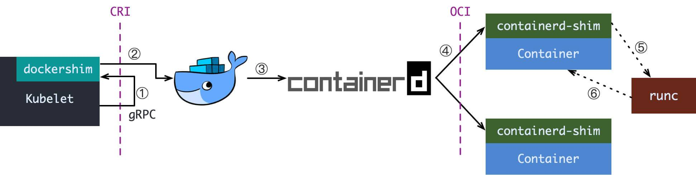
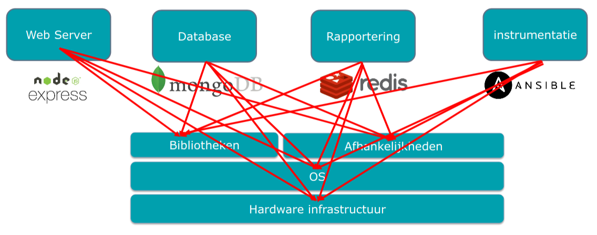
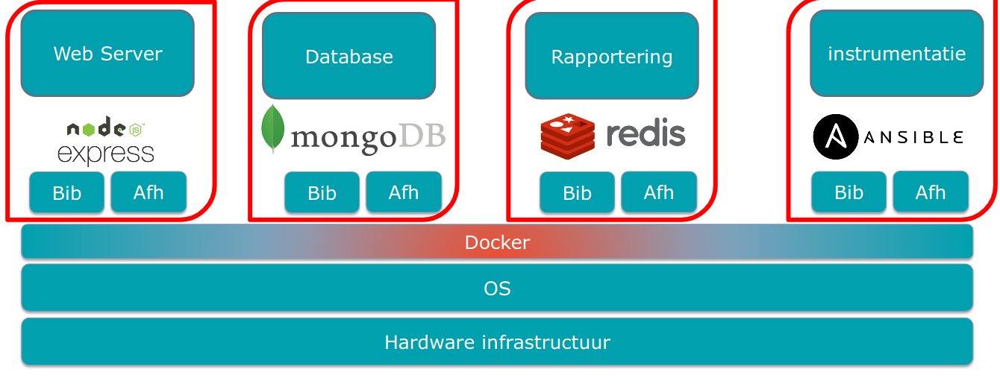
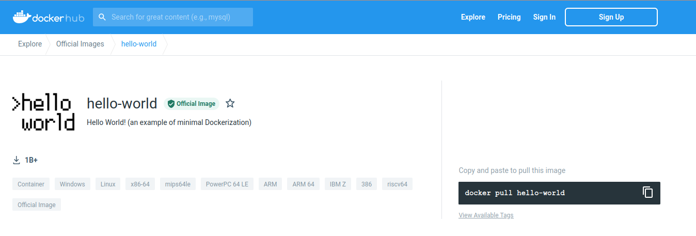
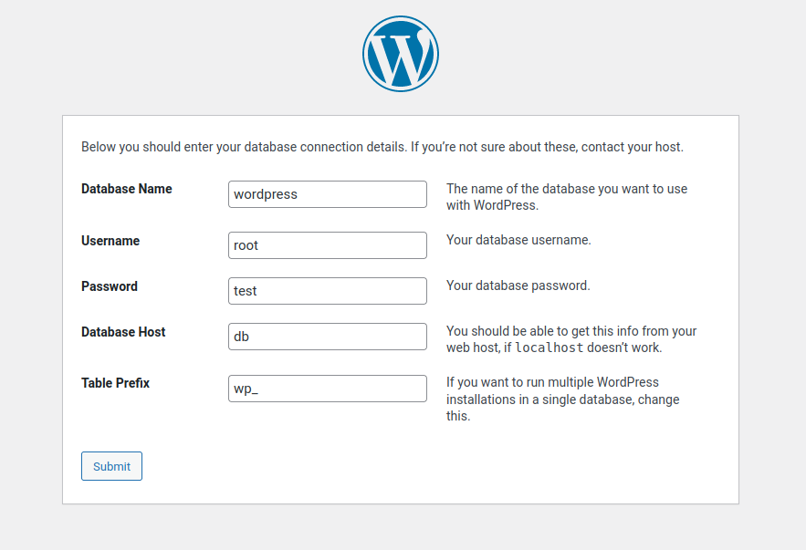

# Docker

> Docker is een computerprogramma om het bestandssysteem van de computer te virtualiseren.

Dit is wat gebeurd als je een introductie van Wikipedia wil kopiëren. Laten we daar even niet naar kijken.


Docker is vaak omschreven als een PaaS tool. Het gaat voor ons een platform bieden waar we onze apps kunnnen op draaien. Dat is een ruw idee van wat Docker is.
Docker draait processen in een geisoleerde container op ons Linux systeem. Het maakt gebruik van Linux "cgroups" en "namespaces". Hierdoor kunnen we een hele Linux omgeving (of een deel ervan) gebruiken per applicatie.+


Dit diagram van Aqua Security geeft het goed weer waar Docker zich bevind door het te vergelijken met een VM. Docker wordt vaak **foutief** een lightweight VM genoemd. Dit is echter een correcte term aangezien er geen hardware gevirtualiseerd wordt.

Docker deelt de Linux kernel onder de verschillende containers waar een VM enkel hardware deelt. De isolatie tussen 2 containers is dus minder dan tussen 2 VMs.
Dit heeft een aantal voordelen:

-   Docker containers starten instantly, geen boot time
-   Docker containers zijn licht, ze hebben geen kernel
-   Docker containers zijn resource minder intensief ze gebruiken alleen de nodige delen van het OS
-   Docker containers kunnen we makkelijker hergebruiken door een kleine footprint (geen diskimage!)
-   Docker images zijn stateless

Let wel op dat dit ook impact heeft op security, de isolatie tussen 2 containers is niet perfect!

## Historiek

Containers zijn niet nieuw! Terwijl velen de uitvinding bij Docker leggen en sommige dan weer een heruitvinding door Docker een foute term noemen zijn containers al een heel tijdje bekend. Docker daarintegen veranderde hoe we ze behandelden, door ze niet meer als mini-server te zien maar als een bouwblokje van een groter geheel.

Containers kennen hun origine in het jaar 1999 maar niet in de Linux wereld. Jails waren een feature in FreeBSD (Unix based) om een server te kunnen opsplitsen in "virtuele machines" die de FreeBSD kernel deelden om zo overhead te vermijden. Eerste ideeen over dit idee komen al uit 1982 van `chroot`, maar deze isolatie was minimaal en beperkte zich tot het bestandssysteem.

(Hardware Virtualisatie bestond experimenteel sinds de jaren 60 maar had een grote perfomance impact tot Intel en AMD hardware support inbouwde in 2005)

Containers deden hun intrede in 2005 met de zogenaamde "VPS" een Virtual Private Server. De VPS bood een goedkope oplossing voor het hosten van servers, waar je vroeger een hele server moest huren kon je nu een deel huren. Vandaag zien we dat dit de standaard is geworden met cloud.
tegenwoordig zijn dit meestal VMs maar in 2005 was dit nog niet optimaal. OpenVZ (Virtuozzo als commercieel product) was nog een fork van de Linux kernel om dit mogelijk te maken. Later in recentere Linux versies kwam LXC met native support voor containers.

Containers echter werden behandeld als VMs, ze hadden zware images en werden individueel onderhouden alsof ze fysieke servers waren. Elke Container had een eigen netwerk stack, IP en zelfs een naam.

Docker kort door de bocht genomen zag een Linux Container niet als een huisdier (= server met naam en zorgen) maar als een individuale service. Als een geisoleerd process op een server. Hierin zat voor Docker in 2013 de doorbraak. Containers losten problemen op rond dependancy management en het shippen van applicaties. Containers waren nu van kortere levensduur, snel gemaakt en container images konden programatisch gemaakt worden.

De technologie die het mogelijk maakte was er al, het concept van Docker pas geboren.

### Docker, Moby, Docker inc.

Docker in deze cursus spreken we over de technologie Docker, meerbepaald te tool `docker`.
Docker is gestart als open source project van Docker Inc. Ondertussen is het echter in beheer van de community onder de naam [Moby](https://www.mobyproject.org/). We gerbuiken echter nog de tool van Docker Inc. dat een afgewerkte tool is waar Moby de basis en onderliggende technologie is.

Docker is nog overal te zien in de DevOps wereld. Docker Inc. bestaat nog wel in een lichtere vorm... Het bedrijf kende een vroeg en enorm success maar heeft het product niet kunnen commercialiseren. Ze faalden erin de Enterprise markt te overtuigen met hun eigen product Docker Swarm, Kubernetes (open source vanuit Google) heeft de plek van Swarm in de markt helemaal ingepalmt. Kubernetes maakt gebruik dan de Docker technologie.
Het bedrijf is een tijd geledan dan ook zwaar moeten besparen en is deels verkocht en deels herstart als het bedrijf dat Docker Hub en Docker Desktop onderhoud. (Verwacht een mooie Netflix documentaire hierover in een vijftal jaar)

### Docker "is deprecated"

"Kubernetes removes support for Docker" was een spraakmaakende headline een tijdje geleden. Tot grote paniek die eigenlijk misplaatst was.
Hierboven beschreven we al dat Docker zelf nog maar een packaging is van Moby. Onderliggend gebruikt Moby containerd een open open standaard voor containers op Linux. Kubnernetes gebruikte tot nu toe Docker als tussenlaag, nu gebruikt het containerd direct.


Alle images en principes blijven nog wel exact dezelfde! Onze lessen Docker zijn future proof :)

## Installatie

Docker bied vele installatie mogelijkheden aan afhankelijk van de versie van de Linux distributie. Maar ook een enorm handig script:

```bash
wget -O docker.sh https://get.docker.com/
bash docker.sh
```

Docker is standaard enkel door `root` aanroepbaar. We kunnen dit ook door je user laten doen door:

```bash
sudo usermod -aG docker <your user here>
```

Herstart hierna je terminal of SSH sessie.

### Special case: Windows

Docker bestaat ook voor Windows! Er zijn een paar verschillen.

Allereerst kan je Windows containers of Linux containers draaien, afhankelijk van de modus. Windows containers draaien Windows server met PowerShell maar zijn niet compatibel met Linux containers en ook niet echt populair (sorry Microsoft). Dit is mogelijk met Docker Desktop.

Je kan ook Linux containers op Windows draaien. Deze draaien dan in een VM op je systeem. Dit is dan in WSL2. De oudere maar niet meer ondersteunde Docker Toolbox maakt gebruik van VirtualBox. WSL2 geeft vaak problemen naast VirtualBox. Daarom bespreken we in deze cursus vooral van Docker binnenin onze Linux VM.

### Waarom containers?

Laten we het eerst vanuit het perspectief van de developers zien.
Developers kunnen mee werken aan de environment waar hun applicatie draait. Ze kunnen libraries installeren, versies kiezen enzovoort. Ze kunnen ook op hun eigen laptop testen met dezelfde setup als in de cloud.
Het shippen van een versie is zo simpel als `docker push`.

Voor het beheer versimpelt het als eerste het draaien van servers, de meeste configuratie en packages zijn al meegeleverd in een Docker image.
Ook verbeterd het problemen zoals verschillende versies van dependancies. Twee versies van MySQL of PHP nodig? Geen enkel probleem meer met Docker!


Verschillende services hebben verschillende libraries nodig, deze worden allemaal gedeeld op het systeem en conflicten ontstaan.


Binnenin Docker containers heeft elke service een mini Linux distributie geoptimaliseerd door de makers van de applicatie!

Beeld je in dat we een Linux setup maken. We hebben tot nu toe alles zelf opgezet en geconfigureerd.
We hebben vanuit een blok klei dat onze Linux server was een beeld gemaakt.
Docker is anders, Docker bied ons lego blokjes. Elk blokje op zichzelf is perfect gemaakt. We hebben nu een boel blokjes die we samen 1 geheel laten vormen zonder de blokjes zelf te veranderen. We kunnen blokjes van andere gebruiken of ons eigen grote blokje maken uit kleine blokjes.

## Running containers

Nadat we Docker hebben geinstaleerd gaan we onze eerste container draaien!

```bash
docker run hello-world
```

Waar komt Hello World nu vandaan?


Dit is een official Docker image, dat betekend dat Docker het goed heeft gekeurd. Voor vele images als MySQL, Apache of Nginx en Linux distros als Ububntu, Fedora en Alpine Linux betekend het dat de originele developers instaan voor het onderhoud van deze images.

Wat is er gebeurd?

1. Docker haalde de image binnen
2. Docker maakte een container aan
3. Docker startte de container
4. Het programma was helemaal klaar, de container stopte

We kunnen nu naar onze container gaan zien

```bash
$ docker ps -a
CONTAINER ID        IMAGE                             COMMAND                  CREATED             STATUS                    PORTS                    NAMES
1780e5b2abb1        hello-world                       "/hello"                 2 seconds ago       Exited (0) 1 second ago                            awesome_greider
```

We zien dat onze container een ID en Naam kreeg, welk commando gebruikt was en wanneer het aangemaakt is en welke status het heeft.
De naam is een automatisch gegenereerde naam, er zijn vele mogelijkheden behalve [boring_wozniak](https://github.com/moby/moby/blob/c90254c7464cac5c56e7ab9e6b1857c119d5d263/pkg/namesgenerator/names-generator.go#L844).

### Docker run

Docker run is een simpel commando om een container aan te maken en te starten.
Het commando ziet er zo uit:

```bash
docker run <opties> <naam image> [optioneel commando]
```

-   De image naam is verplicht, deze komt van je eigen images of Docker Hub (of andere). Een `:` duid een versie aan bv. `ubuntu:20.04` standaard is dit `latest`.
-   Het optioneel commando overschrijft het standaard commando dat in de image staat

Er zijn ook echter vele handige opties:

-   `-it` (eigenlijk `-i -t`) start de container in de interactive modus
-   `-d` start de container in de achtergrond
-   `-p` maakt een port mapping tussen je container en je host. Zo kan je poorten openzetten.
-   `-v` maakt een volume mapping tussen je container en je host. Zo kan je een map delen tussen host en container.
-   `-e` maakt een environment variabele aan.
-   `--name` stelt een naam in voor de container.
-   `--rm` verwijderd de container na het stoppen.

Laten we dit even testen

```bash
docker run -d -p 80:80 --rm --name wordpress-test wordpress
```

```bash
$ docker ps
CONTAINER ID        IMAGE                             COMMAND                  CREATED             STATUS              PORTS                    NAMES
5fc981c651eb        wordpress                         "docker-entrypoint.s…"   2 minutes ago       Up About a minute   0.0.0.0:80->80/tcp       wordpress-test
```

Als we nu `localhost` open zien we... inderdaad een wordpress installatie! Veel kunnen we nog niet doen we hebben namelijk nog geen database.

```bash
docker stop wordpress-test
```

Dit stopt onze container, doordat we `--rm` deden is nu ook de container verwijderd.

### Enviroment variables

Voor configuratie werken vele containers met "enviroment variables". Deze ken je waarschijnlijk al, je stelt ze in voor scripts met `export`.
Containers krijgen standaard geen environment variabele, van je systeem mee. Je kan ze zelf wel instellen met `-e`.

Bijvoobeeld:

```bash
docker run -d -p 3306:3306 --name db -e MYSQL_ROOT_PASSWORD=super-secure-pass mariadb
```

Meeste images hebben wel een paar variablen zoals deze, je kan ze altijd terugvinden op de [Docker Hub](https://hub.docker.com/) pagina. Bijvooreeld die van [MariaDB](https://hub.docker.com/_/mariadb).

### Volumes

Volumes laten je een map delen tussen je host (je VM dus) en je container. Dit doen we meestal voor een paar redenen. De belangrijkste is data opslag van een applicatie.
We willen dat we onze containers altijd kunnen verwijderen, bijvoorbeeld om onze image te updaten. Maar we willen onze database niet kwijt.
Bij databases is dit dus enorm belangrijk!

We bekijken MariaDB als voorbeeld:

```bash
docker run -d -p 3306:3306 --name db -e MYSQL_ROOT_PASSWORD=super-secure-pass -v /my/own/datadir:/var/lib/mysql mariadb
```

De documentatie verteld ons dat `/var/lib/mysql` onze data bevat. Met `-v /my/own/datadir:/var/lib/mysql` zeggen we Docker dat `/my/own/datadir` op onze host `/var/lib/mysql` moet worden binnen de container.

Een tweede redenen kan zijn om de container toegang te geven op bestanden op je host systeem, bijvoorbeeld een web server die aan je `/var/www` moet kunnen geraken.

### Ports

Containers draaien met een eigen intern netwerk. We kunnen dit snel even bekijken:

We starten een container op in een interactieve sessie, we kiezen voor de `alpine` image.

```bash
$ docker run --rm -it alpine
/ $ ifconfig
eth0      Link encap:Ethernet  HWaddr 02:42:AC:11:00:05
          inet addr:172.17.0.5  Bcast:172.17.255.255  Mask:255.255.0.0
          UP BROADCAST RUNNING MULTICAST  MTU:1500  Metric:1
          RX packets:2 errors:0 dropped:0 overruns:0 frame:0
          TX packets:0 errors:0 dropped:0 overruns:0 carrier:0
          collisions:0 txqueuelen:0
          RX bytes:220 (220.0 B)  TX bytes:0 (0.0 B)

lo        Link encap:Local Loopback
          inet addr:127.0.0.1  Mask:255.0.0.0
          UP LOOPBACK RUNNING  MTU:65536  Metric:1
          RX packets:0 errors:0 dropped:0 overruns:0 frame:0
          TX packets:0 errors:0 dropped:0 overruns:0 carrier:0
          collisions:0 txqueuelen:1000
          RX bytes:0 (0.0 B)  TX bytes:0 (0.0 B)

/ $ exit
```

Docker geeft een intern IP mee aan alle containers. Hiermee kunnen containers onderling comminuceren en naar het internet gaan.
Als we een server instellen staat de poort standaard gesloten naar de buitenwereld (security!).

Als we een web server willen starten zetten we deze open met `-p`.

Bijvoorbeeld:

```bash
docker run -d -p 80:80 -p 443:443 nginx
```

Dit start de Nginx server met poort 80 en 443 open. Je kan poorten ook net als volumes aanpassen, bijvoorbeeld:

```bash
docker run -d -p 8080:80 nginx
```

Hier wordt poort 80 doorgestuurd naar poort 80 binnenin de container.

### Networks

Nu hebben we gewerkt met containers op zichzelf. Maar om optimaal te kunnen werken moeten we containers laten samenwerken. Met onze lego vergelijking hebben we nu al het blokje bekenen, nu gaan we ze samenvoegen.

We kunnen een intern netwerk binnen docker opzetten met `docker network`.
In dit voorbeeld gaan we onze MariaDB container aan onze Wordpress container hangen.

```bash
docker network create wp
```

Dit maakt een nieuw netwerk aan met naam `wp`. Je kan het bekijken met `docker network ls`.

```bash
docker run --rm -p 80:80 --name wp --net=wp -d wordpress
docker run --rm --name db -e MARIADB_DATABASE=wordpress -e MARIADB_ROOT_PASSWORD=test --net=wp -d mariadb
```

Dit maakt een intern `wp` netwerk aan, waar we WordPress en MariaDB starten.
WordPress krijgt poort 80 op onze server. MariaDB blijft intern.

Als we nu `localhost` in onze browser openen krijgen we een WordPress installer.



Vul nu de velden in en klik op `Install WordPress`. Onze database hostname is `db`, Docker linkt automatich de DNS naam `db` aan de container met die naam binnen hetzelfde netwerk!

(Wie zich de cursus Linux server herinnert merkt dat we een stuk of 50 commandos bespaart hebben met Docker!)

### Debugging

Containers zijn leuk als ze werken natuurlijk... Maar laten we ook eens bekijken wat te doen bij problemen?

#### Entering containers

We kunnen gewoon een container "binnengaan" via `docker exec`.

Bijvoorbeeld:

```bash
docker exec -it <naam> sh

# of met bash (niet in alle images aanwezig!)
docker exec -it <naam> bash
```

Hierdoor krijgen we een interactieve shell binnenin onze container! Zo kunnen we opzoek gaan naar onze fouten.

#### Logs

Docker heeft ook een eigen log systeem, vergelijkbaar met dat van systemd.

We kunnen het opvragen met:

```bash
docker logs <naam>
```

### Docker Inspect

Tot slot kunnen we ook alle configuratie van een container opvragen.

Dit kan je doen met:

```bash
docker inspect <naam>
```

Dit geeft een lijst met alle configuratie opties die gebruikt zijn, ook een hele deel interne. So don't be intimidated!

## Images

### Eigen vs van een ander

### Kies de juiste basis

### Layers

#### RUN

#### COPY & ADD

#### CMD && ENTRYPOINT

#### ENV

### Pushing images

## Docker Compose

## Commando's cheat sheet

```

```
