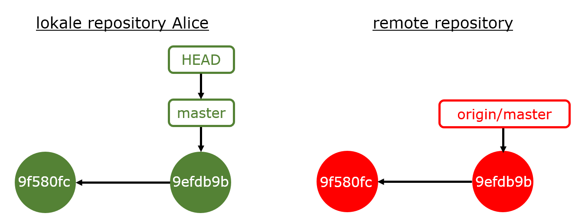
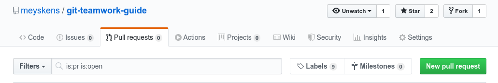
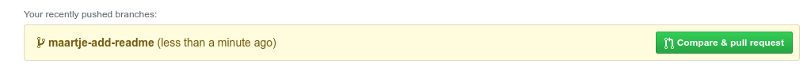
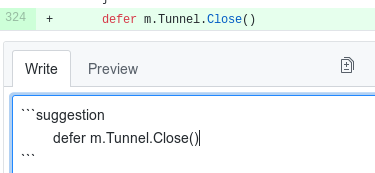
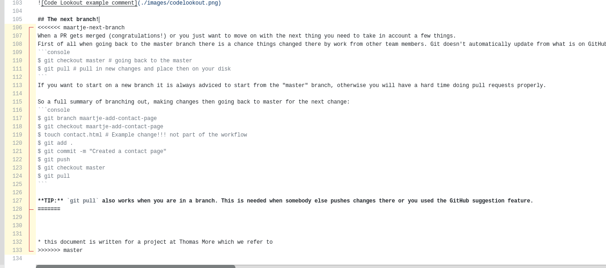
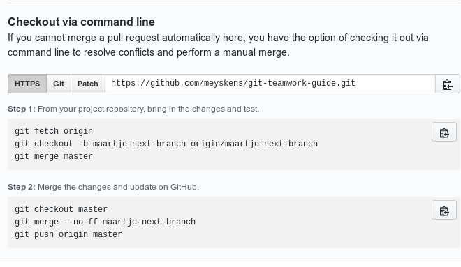

# Een inleiding tot Git(Hub)


## Inleiding

Versiebeheer met Git is vandaag de dag een stukje onontbeerlijke kennis in DevOps.
We schrijven meer en meer zelf stukjes confguratie, scripten en hele stukken code om onze servers te configureren en automatiseren.
Uit de software wereld leren we al langer dat goed versie beheer een must is, in kader van DevOps leren we daardoor dus ook Git.

In een zoektocht naar tutorials en ander zelfstudiemateriaal bots je
echter vrij snel op specifieke terminologie, tientallen commando's met
talloze opties, verschillende workflows, ... Resultaat: je ziet de bomen
niet meer door het bos.

Starten met Git zal in het begin dus wellicht moeilijk lijken, maar
hopelijk helpt deze inleidende cursus je snel op weg. Ik verwijs hierbij
ook graag naar een (waarheidsgetrouwe) quote van Meghan Nelson[^1]:

> "The more you use git, the more comfortable you'll ... git with it!"

Git leer je niet in een dag, maar als je de stappen zet goed nakijkt wat je doet en op tijd hulp vraagt dan komt het zeker inorde!

In deze cursus behandelen we enkel de basis van Git.\
Na een korte introductie in versiebeheer en Git(Hub) worden de nodige
begrippen en commando's geïntroduceerd aan de hand van een educatief,
concreet mini-webprojectje met 2 personen. We beperken ons hierbij
tot de zogenoemde basic[^2] of centralized workflow[^3] (met enkel een
master/main branch). Deze workflow is geschikt voor beginners en/of kleine
teams, en vereist slechts een gedeeltelijke kennis van de Git-materie.\
Moeilijkere workflows worden verder kort behandeld, maar hopelijk liggen deze na het verwerken van de
basiskennis in deze cursus beter/sneller binnen je bereik.\
We eindigen met een aantal referenties en een cheat sheet met de meest
gangbare commando's in onze basic workflow.

> De term main en master branch kom je nog vaak door elkaar tegen. De term "master" in 2021 nog gebruiken is not done, maar je komt hem vaak nog tegen in materie (als ook oudere screenshots in deze cursus). Houd zeker in het achterhoofd dat dit enkel een naamswijziging is zonder techniche veranderingen.

Deze cursustekst komt origineel uit _Webdesign met HTML5_ en is licht aangepast aan de cursus DevOps.

Er wordt veelvuldig gebruik gemaakt van
(vernederlandste) Engelse terminologie en we gebruiken de symbolen\

voor een opmerking en

voor een tip.

Veel lees- en Git-plezier!

Dank aan Ann Hannes, Jan Janssen en Patrick Verhaert voor hun grote bijdrage aan dit deel van de cursus!

## Versiebeheer: wat, waarom en hoe?

### Versiebeheer: wat?

Met versiebeheer bedoelen we elk systeem dat alle wijzigingen aan een
verzameling van computerbestanden bewaart, zodat:

-   meerdere gebruikers gelijktijdig wijzigingen kunnen aanbrengen aan deze bestanden (zelfs aan het zelfde bestand);
-   wijzigingen kunnen worden vergeleken, samengevoegd en hersteld/teruggedraaid.

Versiebeheer wordt het vaakst gebruikt in het kader van
softwareontwikkeling in teamverband.

### Versiebeheer: waarom?

Veronderstel dat je met een aantal programmeurs samen aan een project
wil werken. Je kan zelf een soort versiebeheersysteem opzetten door de
programmabestanden in de cloud (bijv. op Dropbox) op te slaan. Zo'n
'amateuristisch' systeem heeft echter zijn beperkingen:

-   Gelijktijdig met verschillende programmeurs aan hetzelfde bestand werken is moeilijk, aangezien de verschillende versies achteraf manueel moeten worden samengevoegd.

-   Om alle wijzigingen aan alle bestanden bij te kunnen bijhouden,
    verval je al snel in bestandsnamen als _keuzeformulier-v3.php_ en
    _indexFinalVersion.html_, of neem je talloze kopieën van alle
    bestanden in folders met namen als _Geteste versie (few bugs left)_
    of _Versie 2018 03 20 (bijna klaar)._ Bovendien is het nagenoeg
    onmogelijk om op deze manier bij te houden wie wat wanneer heeft
    aangepast.

Met een specifiek daarvoor ontworpen versiebeheersysteem (VCS = Version
Control System) zijn deze problemen van de baan. Enkele belangrijke
voordelen van zo'n VCS-systeem (bij het samen schrijven aan
softwareprojecten) op een rij:

-   duidelijk overzicht van alle gemaakte wijzigingen (wie, wat,
    wanneer)

-   vorige, specifieke versies van bestanden zijn steeds beschikbaar

-   waarschuwing bij conflicten, bijvoorbeeld bij het wijzigen van
    hetzelfde gedeelte van een bestand door verschillende gebruikers

-   geen onnodige storage: enkel de gewijzigde bestanden worden
    meermaals bewaard, samen met een historiek van wijzigingen

-   soort automatische back-up (bij gebruik van een cloud dienst als GitHub of GitLab)

## Git versus GitHub

### Git


Git is een open source[^4], gedistribueerd
versiebeheersysteem (of softwarebroncode-managementsysteem) ontwikkeld
door Linus Torvalds in 2005 voor het beheren van de Linux-kernel.

#### Software

Om met Git te kunnen werken op je pc, heb je software nodig. Je hebt
daarbij de keuze uit GUI tools (zoals Sourcetree, GitHub Desktop, Tower,
...) of je kan werken met een CLI (Command Line Interface). In deze
cursus verkiezen wij het laatste omdat via de CLI alle mogelijkheden ter
beschikking zijn (in tegenstelling tot in de grafische omgevingen).
Bovendien leidt deze werkwijze tot een beter begrip van de
Git-filosofie/technologie, waardoor het in principe eenvoudig zou moeten
zijn om - indien gewenst - over te schakelen op een GUI-client naar
voorkeur.

#### Ubuntu

Gebruikers van Linux hebben altijd een beetje geluk bij Git. Zij hebben namelijk al een bash shell op hun systeem.

```bash
sudo apt-get update
sudo apt-get install git
```

En je bent klaar!

#### Windows


Git kan je downloaden via
<https://git-scm.com/downloads>. In deze download bevindt zich de Git
Bash (CLI), shell-integratie en 2 grafische tools.

Installeer met de standaard instellingen.


 Git bash geeft je een bash shell op je windows systeem, deze shell is vaak voor onze DevOps tools makkelijker dan CMD of PowerShell!

### GitHub


GitHub is een website/hosting service voor
software, gebouwd rond het Git-versiebeheersysteem.

Er worden verschillende extra features aangeboden zoals wiki's, social
coding, project & team management, ...

Alternatieven voor GitHub die gelijkaardige services bieden zijn
Assembla, Bitbucket, Codebase, GitLab, ...

#### GitHub-account

Maak een GitHub-account aan op <https://github.com>. Vergeet niet om je
mailadres te bevestigen (je ontvangt hiervoor een link via mail) om
gebruik te kunnen maken van alle mogelijkheden!


Gebruik je Thomas More mailadres en vraag
een upgrade van je account via <https://education.github.com/>. Naast een Pro GitHub account krijg je ook nog vele voordelen op andere websites.

## Git: basic workflow

De basis van Git (terminologie, commando's, het concept branches) is
eigenlijk niet zo moeilijk om te doorgronden, als je je de moeite
getroost om deze sectie[^5] in detail door te nemen.

### Basisterminologie en commando's

Alles begint met een **remote repository** (meestal afgekort tot
**repo**). Dit kan je vergelijken met een folder met daarin
alle projectbestanden en de ganse historiek van wijzigingen (van deze
bestanden). In deze cursustekst hosten we deze remote repo op GitHub.

Veronderstel dat er 2 programmeurs zijn die aan een project werken, nl.
Alice en Bob[^6]. Zij starten met het downloaden van een kopie van de
remote projectrepository op hun pc. Dit proces wordt ook wel het clonen
van de remote repo genoemd en wordt uitgevoerd met het Git-commando
**clone**. Het resultaat is een kopie van de projectbestanden (ook de
**working tree** genoemd), alsook een _.git_ subfolder die de
**lokale repository** (de historiek van alle bestanden) bevat. Deze map is niet bedoeld om gelezen te worden door mensen.
Het Git commando gaat achterliggend hier alles regelen voor ons. Verwijder deze map ook niet want dit breekt je Git!

Veronderstel vervolgens dat Alice wijzigingen aanbrengt aan het
projectbestand _stijl.css_[^7]. Zij doet dit in haar (lokale) working
tree.


Om dit gewijzigd bestand toe te voegen aan de lokale repository zijn er
2 acties nodig:

-   Allereerst moet het gewijzigde bestand _stijl.css_ worden toegevoegd
    aan de zogenaamde **staging area** of index.
    Dit gebeurt via het Git-commando **add**.

-   Vervolgens wordt het bestand verplaatst van de staging area naar de
    lokale repo via het Git-commando **commit** en worden de wijzigingen
    lokaal bevestigd.

Je vraagt je misschien af wat het nut is van de staging area/index en de
extra tussenstap die moet gebeuren. In de staging area worden alle
bestanden bewaard die met een volgende commit moeten worden toegevoegd
aan de lokale repo. Op die manier kunnen we in 1 commit een aantal (bij
elkaar horende) wijzigingen tegelijkertijd doorvoeren.

De volgende actie die Alice onderneemt is het uploaden van de gecommitte
wijzigingen in haar lokale repo naar de remote repository. Dit gebeurt
met het Git-commando **push**.\
Op dit moment zijn de lokale repo van Alice en de remote repo
gesynchroniseerd en opnieuw aan elkaar gelijk.

Ondertussen heeft Bob het bestand _index.html_ gewijzigd (in zijn
working tree). Ook hij bevestigt deze wijzigingen door deze toe te
voegen aan zijn lokale repository via de Git-commando's **add** en
**commit**.

Nu wil ook Bob zijn lokale repo uploaden naar/synchroniseren met de
remote repo. Als hij dit echter probeert (met het Git-commando
**push**), resulteert dit in een foutmelding. Git merkt immers op dat de
remote repo wijzigingen bevat (van Alice) die zich nog niet in de lokale
repo van Bob bevinden.

Bob moet op dit moment eerst deze verschillen (tussen de remote en zijn
lokale repo) downloaden. Dit kan hij doen met het Git-commando **pull**.

Nu zijn de lokale repo van Bob en de remote repo opnieuw aan elkaar
gelijk en kan Bob zijn wijzigingen aan _index.html_ pushen.

### De basiscommando's in meer detail

In deze sectie baseren we ons in grote mate op het hierboven uitgewerkte scenario om de basiscommando's van Git in detail te
illustreren.

We leggen daarbij ook uit hoe bestanden (en de wijzigingen ervan) worden
bewaard in Git. Deze kennis is belangrijk om Git ten volle te kunnen
begrijpen en gebruiken.

### Instellen van je identiteit (en default editor)

Vooraleer je met Git begint te werken, stel je best je identiteit (naam
en email) in, zodat duidelijk is wie welke wijzigingen heeft
aangebracht. Je gebruikt daarvoor de commando's\

```bash
git config --global user.name "Your Full Name"
git config --globaluser.email "email"
```


Tijdens de installatie is ook een editor gekozen die we later
kunnen/zullen gebruiken (bij het ingeven van commentaar bij commits of
bij het terugdraaien van commits). De default optie is de VIM-editor, maar desgewenst kan je ook opteren voor een alternatief. Zo
kan je de klassieke Kladblok/Notepad-applicatie instellen als editor op Windows of `nano` op Linux.

Windows:

```bash
git config --global core.editor notepad
```

Linux

```bash
git config --global core.editor nano
```


### Opzetten van een startrepository (lokaal en remote)

In deze sectie wijken we een beetje af van het scenario uit de vorige sectie,
waar we ervan uitgingen dat er al een remote repository bestond. Deze
(remote repo) moet echter ooit door iemand aangemaakt worden, en deze
stap illustreren we hieronder.


Je kan op verschillende manieren een
remote repository aanmaken, waarbij het verschil zit in welke volgorde
en hoe (via Git Bash of via GitHub) je de verschillende stappen
uitvoert. De door ons gekozen volgorde lijkt ons het eenvoudigst voor
beginners.

#### Opzetten van een lokale repository

We vertrekken van een heel eenvoudig project _project_itf_git_ dat
Alice heeft aangemaakt op haar computer, en waarvan zij een remote
versie op Git(Hub) wil plaatsen om samen met Bob aan te werken. De
folderinhoud van haar project is als volgt:


De folder _css_ bevat het bestand _stijl.css_ en de folder _.idea_ bevat
allerlei configuratiebestanden van de voor dit project door Alice
gebruikte IDE (Integrated Development Environment) Webstorm.

Het is niet de bedoeling dat deze laatste folder (_.idea_) wordt
opgenomen in de repository. Deze bestanden bevatten immers geen code en
zijn enkel van toepassing voor Alice. Zij maakt daarom een tekstbestand
_**.gitignore**_ aan in de root van haar project. In dit
bestand geeft ze met een speciale syntax[^8] aan welke bestanden ze niet
wenst op te nemen in de repository. Als Alice enkel de _.idea_-folder
niet wenst op te nemen, ziet dit bestand er dus zo uit:


Je kan dit _.gitignore_-bestand later ook
nog toevoegen/veranderen, maar je moet dan wel enkele bijkomende
commando's uitvoeren om bestanden die reeds in de repository zijn
opgenomen (en die je vanaf dan wenst uit te sluiten) te verwijderen[^9].
Het is dus ideaal als je op voorhand weet/goed nadenkt over welke
bestanden je niet wenst op te nemen in de repo[^10].

Naast een _.gitignore_-bestand kan je ook best een
_**README.md**_-bestand aanmaken in de root van je
project[^11]. Dit [markdown](https://guides.github.com/features/mastering-markdown/)-bestand heeft opnieuw een specifieke
syntax[^12] en wordt door GitHub gebruikt op de startpagina van de
remote repository. Voorlopig specifieert Alice enkel een titel (\#) en 1
verduidelijkende paragraaf:


Na het toevoegen van deze 2 bestanden, is Alice klaar om van haar
project een lokale repository te maken. Zij navigeert in Windows
Verkenner naar de folder waar het project zich bevindt, klikt rechts op
de folder en kiest voor _Git Bash Here_:


Een (minder handig) alternatief is om Git
Bash gewoon te openen en in de bash te navigeren naar de juiste map. (Op Linux hebben we die handige knop jammergenoeg niet)

Het eerste wat Alice doet, is het initialiseren van deze folder als een
(lege) Git-repository door middel van het commando **git init**. Dit
commando initialiseert de _.git_ subfolder en maakt een lokale
**branch** aan met de naam _master._ In feite is deze
master-branch gewoon een pointer die steeds naar de laatste commit
verwijst (zie verder).


Daarna worden via het commando **git add .** alle bestanden
(uitgezonderd deze die zijn uitgesloten via _.gitignore_) uit deze map
toegevoegd aan de staging area, zodat ze klaar staan om op te worden
genomen in de volgende (in dit geval de eerste) commit. De wildcard .
duidt op de volledige folder, inclusief subfolders en bestanden die
beginnen met .


Het is mogelijk dat je hierbij
waarschuwingen krijgt over LF en CRLF, maar die mag je negeren[^13].

Ten slotte moet Alice alle bestanden uit de staging area nog committen
(opnemen in de lokale repository). Dit doet ze met het commando **git
commit -m \"comment\"**, waarbij ze ook nuttig en betekenisvol
commentaar kan voorzien.


Je mag je comment zowel tussen dubbele
quotes (\"\") als enkele quotes (\'\') plaatsen.\
Als Alice het commando **git commit** intypt (zonder de optie -m mee te
geven), wordt de default editor geopend om je commentaar in te geven.

We zoomen even in op wat er achter de schermen is gebeurd, waarbij we
voor de eenvoud de bestanden _.gitignore_ en _README.md_ negeren en dus
(even) veronderstellen dat ons project slechts uit 2 bestanden bestaat,
nl. _stijl.css_ en _index.html._ Git bewaart voor elke commit

-   een uniek identificatienummer (\~ een SHA checksum van alle
    bestanden in de commit)

-   pointers (of verwijzingen) naar snapshots (ook wel
    **blob**s genoemd) van de specifieke bestanden in de
    commit. Ook voor deze pointers/verwijzingen worden unieke SHA
    checksums (van de specifieke bestanden) gebruikt.

Grafisch kan dit als volgt worden voorgesteld:


We zullen verder zien dat een Git-repository eigenlijk niet meer is dan
zo'n reeks van commits die worden bewaard zoals hierboven beschreven.
Een branch is een pointer die verwijst naar het einde van die reeks. De
default branch wordt - zoals eerder aangehaald - meestal _main_
genoemd.

Elke keer je een commit doet, zal deze main-branch worden aangepast
(en schuift hij verder door naar de meeste recente commit).

Verder is er nog de pointer **HEAD**, die verwijst naar de
lokale branch waar je je momenteel bevindt. Deze pointer wordt
belangrijker als je met meerdere branches wil gaan werken. In deze
cursus werken we met 1 branch en wijst HEAD gewoon naar (dezelfde commit
als) _main_.

#### Opzetten van een remote repository

Alice wil van haar lokale repo een remote kopie maken op GitHub.
Daarvoor meldt ze zich aan op GitHub en maakt ze een nieuwe (lege)
remote repository aan met naam _project_itf_git_. Ze heeft reeds een
_.gitignore_- en _README_-bestand, dus ze maakt de overeenkomstige,
juiste keuzes:

­­­­


Met het commando

```bash
git remote add <remote-name> <remote-url>
```

geeft Alice de net aangemaakte remote repo op GitHub een naam die ze kan
gebruiken in Git Bash.


Als \<remote-name\> wordt bijna altijd _origin_ gebruikt. Welke
\<remote-url\> je moet gebruiken, wordt gesuggereerd op GitHub:


Ten slotte pusht Alice haar lokale repository naar GitHub via

```bash
git push -u <remote-name> <branch-name>
```

De \<remote-name\> is bijna altijd
_origin_ (zie hierboven), de \<branch-name\> is de naam van de lokale
branch (_main_). Er wordt nu een gelijknamige main-branch aangemaakt
in de remote repo. De optie -u zorgt voor een koppeling tussen de lokale
en remote repo (zodat we in de toekomst enkel **git push** moeten
gebruiken als commando).

> TIP: gebruik altijd `git push` indien je dit bovenstaande moet uitvoeren geeft dit commando je letterlijk het juiste commando om te copy pasten!

Het is mogelijk dat tijdens het pushen je GitHub-credentials worden
gevraagd.


De remote repo is nu gelijk aan de lokale repo van Alice, zoals grafisch
geïllustreerd in de figuur hieronder:


Als Alice met **git status** opvraagt in welke status de bestanden (in
haar lokale repo) zich bevinden, wordt dit bevestigd: _On branch main_
en _Your branch is up to date with 'origin/main'._


Als allerlaatste actie nodigt Alice Bob uit om met haar samen te werken
aan deze remote repository via de GitHub-tab _Settings,_ keuze
_Collaborators_. Ze zoekt hierbij op de GitHub-gebruikersnaam van Bob.


Collaborators toevoegen via GitHub

Bob ontvangt een mail waarin hij de uitnodiging tot samenwerken moet
bevestigen.

### Clonen van een remote repository

Bob wil nu de remote repo (die Alice net heeft gemaakt) clonen in een
lokale repository. Hij gebruikt daarvoor het commando

```bash
git clone <remote-url>
```

De \<remote-url\> heeft Bob van Alice gekregen of kan
hij opzoeken via haar GitHub-account:


De lokale repository (kopie van de remote repository) komt in een
automatisch aangemaakte folder met dezelfde naam als de remote repo (in
dit geval _project_itf_git_).


Met het commando

```
git clone <remote-url> <local folder>
```

kan je zelf een lokale folder \<local folder\> opgeven waarin de clone moet terechtkomen. Ook deze folder
wordt automatisch aangemaakt.


Navigeer eerst naar de juiste folder
vooraleer je het **clone**-commando uitvoert.

Nu is ook de lokale repository van Bob gelijk aan de remote repository
(en de lokale repo van Alice):


### Wijzigen van bestand(en) in lokale en remote repository

#### Stagen en committen van lokaal gewijzigd bestand (Alice)

Het commando **git status** gaf ook de boodschap _nothing
to commit, working tree clean_ weer. Dit betekent dat Alice nog geen
bestanden heeft gewijzigd (sinds het aanmaken van de repository).

Veronderstel nu dat Alice enkele wijzigingen aanbrengt aan het
_stijl.css_ bestand. Als ze vervolgens opnieuw de status controleert
(via **git status**), kan ze aflezen dat _stijl.css modified_ is maar
dat dit bestand zich in haar working tree en nog niet in de staging area
bevindt (_Changes not staged for commit:_).


Vooraleer Alice dit bestand toevoegt aan de staging area, kan zij
(indien gewenst) de verschillen tussen de versie in de lokale repo en de
versie in de working tree bekijken via het commando **git diff**: in het
rood (en voorafgegaan door -) wordt de verwijderde tekst/code aangegeven
(hier niet van toepassing), in het groen (en voorafgegaan door +) wordt
aangegeven wat er is bij getypt.


Met het commando `git diff` worden de
verschillen van alle (hier slechts 1) gewijzigde bestanden getoond. Met
`git diff <file>` kan je de verschillen van een specifiek bestand
opvragen. Je kan bij lange uitvoer met \<spatiebalk\> naar de volgende
pagina, en met \<q\> kan je het bekijken van de verschillen beëindigen.


Gebruik het `git diff`-commando op
geregelde basis ter controle, telkens voor je gewijzigde bestanden gaat
stagen (toevoegen aan de staging area).

De wijzigingen zijn ok, dus nu voegt Alice dit bestand toe aan de
staging area met het commando `git add <file>`. Als daarna de status
opnieuw wordt opgevraagd, lezen we opnieuw af dat _stijl.css modified_
is én dat dit bestand zich in Alice's staging area bevindt (_Changes to
be committed:_).


Het `git add`-commando kent vele
varianten door verschillende opties te gebruiken:

-   `git add --all` voegt alle nieuwe/gewijzigde bestanden toe aan de staging area

-   `git add css/\*.css voegt alle nieuwe/gewijzigde CSS-bestanden in de map _css_ toe aan de staging area, Git ondersteund bash globbing.


Ook op dit moment kan je (desgewenst) nog
nakijken wat de verschillen zijn tussen (de bestanden in) de lokale repo
en de staging area. Je gebruikt hiervoor de commando's

```bash
git diff --staged
# of
git diff --staged <file>
```

Het is nu tijd om dit gewijzigd stijlbestand te committen (op te nemen
in de lokale repo van Alice). Alice doet dit met het commando

```bash
git commit -m "comment"
```


Er bestaan richtlijnen om goede
commit-commentaren/boodschappen te schrijven[^14]. Kies alvast voor
betekenisvol commentaar, geschreven in een gebiedende wijs.


Als je online op zoek gaat naar informatie
over Git, zal je wellicht ook het commando\

```bash
git commit -a -m "comment"
```

tegen komen. Dit commando slaat de
staging area over en voegt de gewijzigde bestanden vanuit je working
tree rechtstreeks toe aan de lokale repo. Nieuwe bestanden worden echter
niet toegevoegd, en bovendien is het moeilijk om op deze manier je
commits georganiseerd (gewijzigde bestanden die bij elkaar horen vormen
1 commit) te houden. We raden dan ook aan om dit verkorte commando **niet**
te gebruiken!

We zoomen opnieuw even in op wat er nu precies gebeurt in de lokale repo
van Alice.\
Git berekent voor deze nieuwe commit opnieuw een unieke SHA checksum,
en linkt deze commit met de initiële commit (via een pointer/verwijzing
naar de vorige commit). De HEAD en main pointer schuiven op naar
rechts en verwijzen nu naar de laatste commit.


Opnieuw worden ook SHA-pointers naar snapshots/blobs van de specifieke
bestanden in de nieuwe commit bewaard.\
Het bestand _index.html_ is niet gewijzigd, en aldus verandert de
pointer naar de overeenkomstige blob dan ook niet.\
Het bestand _stijl.css_ is wel gewijzigd. Daarom wordt er via een
pointer verwezen naar een nieuw snapshot/blob van dit bestand.

Vaak worden de repositories compacter voorgesteld waar we de (huidige toestand van de) lokale repo van Alice en de remote
repo weergeven.


#### Pushen van lokale repo naar remote repo (Alice)

We merken dat de lokale repo van Alice 1 commit voor ligt op de remote
repo. Dit wordt bevestigd door de commando\'s `git status` (_Your
branch is ahead of 'origin/main' by 1 commit_.) of `git log`
(waarover later nog meer).


Alice kan nu haar wijzigingen pushen naar de remote repo d.m.v. het
commando `git push`.


Op dit moment zijn de lokale repo van Alice en de remote repo opnieuw
synchroon, wat bevestigd wordt door de uitvoer van de commando\'s `git status` en `git log`.




## Appendix: Cheat sheet voor basic workflow

```bash
# Aanmaken van lokale start repo

# _README.md_ en _.gitignore_ bestand aanmaken

git init

git add .

git commit -m "startbestanden"

# Pushen van lokale start repo naar remote repo

# remote repo aanmaken op GitHub*

git remote add origin https://github.com/...

git push -u origin main

# Clonen van remote repo

# Bash openen in gewenste folder

git clone https://github.com/...

# Gewijzigde bestanden stagen en committen

git add <file(s)>

git commit -m "comment"

# Lokale commits uploaden naar remote repo

git push


#Verschillen weergeven tussen versie in lokale repo en versie in working tree

git diff of git diff <file>

# Verschillen weergeven tussen versie in lokale repo en versie in staging area

git diff --staged*
# of
git diff --staged <file>

# Status (van working tree en staging area) weergeven

git status
```

## Git: teamwork workflow

Je hebt nu al geleerd hoe je GitHub en Git kunt gebruiken om versiebeheer op je projecten te doen.
In deze tutorial gaan we een stap verder en gebruiken we Git om in teamverband aan dezelfde codebase te werken.

### Werken met "branches"

Nadat je het project hebt gecloned op je computer kunnen we beginnen te werken aan code veranderingen. We doen dit in branches.
Branches, ook wel feature branches genoemd, maken een kopie van de hoofdcode die zich op de "main" branch bevindt.
Het is een slechte gewoonte om direct naar de "main" branch te pushen als je in teams werkt. Een uitzondering op deze regel is de eerste commit.

In een branch kun je zoals gebruikelijk één of meer commits maken, deze geven de wijzigingen weer om een bepaald deel van de code toe te voegen.
Om een nieuwe branch te maken kun je het volgende doen met Git

```console
$ git branch <branch naam>
```

De branchnaam moet het deel bevatten dat je van plan bent toe te voegen, en ook meestal je naam, zodat je geen conflicten met je teamgenoten hebt.
Een naam zou bijvoorbeeld `maartje-add-contact-page` kunnen zijn, merk op dat branchnamen geen spaties mogen bevatten!

Takken maken doe je met `git branch`. Na het aanmaken van de branch moet je overschakelen naar het gebruik van die branch.
Dit kan gedaan worden met `git checkout`.

```console
$ git checkout [branch naam]
```

**Dit commando zal de bestanden op je harde schijf aanpassen aan de bestanden in de branch.** Het is dus normaal dat je nieuwere bestanden nog niet ziet. Het maakt een eigen kopie zodat je tijdens je werk niet "gestoord" wordt door wijzwgingen op de main branch.

Je kunt nu zoals gewoonlijk werken en `git add` en `git commit` gebruiken om je wijzigingen vast te leggen.
Je kunt `git push` gebruiken als je op een branch zit om de branch naar GitHub te pushen

Een volledige workflow zou bijvoorbeeld zijn

```bash
git branch maartje-add-contact-page
git checkout maartje-add-contact-page

touch contact.html # voorbeeld verandering!!! geen onderdeel van de workflow

git add .
git commit -m "Een contactpagina gemaakt"
git push --set-upstream origin maartje-add-contact-page # eerste keer nodig, gebruik gewoon `git push` voor latere wijzigingen in de branch
```

### Pull Requests

Pull requests, ook wel Merge Requests genoemd in andere Git oplossingen, zijn verzoeken die gedaan worden om code van een bepaalde branch samen te voegen in de "main" branch van het repository. Je kunt dit doen nadat je voor de eerste keer "git push" gedaan hebt, door naar de repository op Github te gaan en naar "Pull Requests" te gaan, hier kun je klikken op "New Pull Request".



Soms zal GitHub je ook automatisch de nieuwe branch voorstellen.



Bij het maken van een Pull Request kun je 2 branches vergelijken, de "basis" branch is degene waar we de code naar toe willen verplaatsen. In ons geval zal dit altijd de main branch zijn. De "vergelijk" branch zal de branch zijn waar we onze wijzigingen in hebben aangebracht.
Merk op dat je een branch _kunt_ pushen zonder dat er wijzigingen zijn gemaakt, maar je kunt hier geen pull-request voor aanmaken.
PR-scherm](./images/prscreen.png)
Nadat deze juist zijn ingesteld zal GitHub je de wijzigingen laten zien en kun je op "Create Pull Request" klikken.

Je wordt nu naar een scherm gestuurd waar je een titel en een beschrijving kunt toevoegen, als je in Git werkt zul je vaak pull requests maken voor andermans projecten. Daarom is het altijd een goed gebruik om een bruikbare titel en beschrijving toe te voegen van wat je wilt veranderen en waarom. Als dit gedaan is, vergeet dan niet om weer op "Create" te klikken.

### Code Review

Code review is een proces dat je overal ziet, van kleine startups tot grote ondernemingen. Hoe je dit goed doet is ook een veel besproken onderwerp. Toen we op [Twitter](https://twitter.com/MaartjeME/status/1208048751631327237) vroegen naar code review tips hadden veel programmeurs hier verschillende meningen over.
Code review in een notendop is het proces tussen het voorstellen van een codewijziging (in een PR) en het moment dat deze wordt samengevoegd in de master branch, en wordt uitgerold naar productie.
Dit proces zorgt ervoor dat de code verbetert omdat meer mensen er naar kunnen kijken en wijzigingen kunnen voorstellen. Bugs worden sneller opgemerkt, de code zal er beter en samenhangender uitzien en het kan je inzicht geven in hoe je code nog verder verbeterd kan worden.

Code reviews zijn een kans om te leren voor de indiener van het PR maar ook een kans om je werk te prijzen voor de reviewer. Belangrijk om in gedachten te houden is om vriendelijk te zijn voor elkaar, om reviews niet persoonlijk op te vatten en om te beginnen met uit te leggen waarom. Een code review is inherent teamwerk, waarbij verschillende ideeën en suggesties aan bod komen. Soms kan het de moeite waard zijn om een discussie offline te voeren (d.w.z. face to face) om enkele opmerkingen te bespreken. Het doel is hier niet om gelijk te krijgen over iets maar om te verbeteren als een team.

#### The 10 Commandments of Navigating Code Reviews

[The 10 Commandments of Navigating Code Reviews](https://techbeacon.com/app-dev-testing/10-commandments-navigating-code-reviews) is een werk van [Angie Jones](https://angiejones.tech).
Hierin bespreekt ze 10 regels om te volgen bij het doen van code review.

```
I. Thou Shalt Not Take It Personally
II. Thou Shalt Not Marry the Code
III. Thou Shalt Consider All Feedback
IV. Thou Shalt Articulate Your Rationale
V. Thou Shalt Be Willing to Compromise
VI. Thou Shalt Contribute to Others’ Code Reviews
VII. Thou Shalt Treat Submitters How Thou Wants to Be Treated
VIII. Thou Shalt Not Be Intimidated by the Number of Comments
IX. Thou Shalt Not Repeat the Same Mistakes
X. Thou Shalt Embrace the Nits
```

#### Code Review in de praktijk

Bij het openen van een Pull Request in GitHub kun je naar "Files Changed" gaan, hier kun je alle wijzigingen in een PR zien. Als je met de muis over een regelnummer gaat zie je een plus icoontje, als je daar op klikt opent zich een box om een commentaar toe te voegen.

[Het vakje met een commentaar gemaakt](./images/coderev1.png)

Hier kunt u kiezen voor "Add single comment" of "Start Review" in de meeste gevallen wilt u de tweede. Dit start een nieuwe review en bewaart de commentaren, maar zal ze pas publiceren als je alle bestanden hebt gereviewd. Zo kan je ze allemaal in één keer publiceren en degene die je niet nodig hebt verwijderen (bijvoorbeeld als je snapt waarom een bepaald ding er staat na het lezen van een ander bestand).
Bovenaan zie je nu een knop "Finish Review". Hiermee kun je een laatste commentaar toevoegen, je zou hier kunnen denken aan het "wees aardig" gedeelte. Dan "approve" of "request changes", als alles in orde is keur je het PR goed, anders vraag je om enkele wijzigingen aan te brengen, nadat deze zijn uitgevoerd kan de indiener van het PR je beoordeling opnieuw aanvragen. Merk op dat je je eigen PR\'s niet kunt goedkeuren.

[review box](./images/coderev2.png)

Na het plaatsen van een beoordeling ziet u de status in het PR. Onder "Reviewers" aan de rechterkant kunt u ook een verzoek indienen voor een re-review van een eerdere reviewer of een nieuw persoon om je code te reviewen.

[code review in PR](./images/coderev3.png)

**TIP:** Wanneer u een commentaar schrijft kunt u op de "Suggestie" knop in de werkbalk drukken. Hiermee kun je een snelle codewijziging van één regel suggereren die met één klik kan worden toegepast.



#### Het leven na code review

Als je veranderingen in je code moet maken na een code review, dan kun je dit gewoon op je Git branch doen! Maak gewoon nog een commit en je zult de wijzigingen in het PR zien verschijnen, je zult ook merken dat GitHub opmerkingen markeert op gewijzigde regels, zodat je beter kunt zien welke opmerkingen aangepakt zijn.
**Voordat je het PR in master samenvoegt, moet ten minste één persoon je code gereviewd (en goedgekeurd) hebben.** De enige uitzondering hierop is als je team uit één persoon bestaat.

### De volgende branch!

Wanneer een PR wordt gemerged (gefeliciteerd!) of je wilt gewoon verder gaan met het volgende ding, moet je met een paar dingen rekening houden.
Ten eerste, als je terug gaat naar de main branch is er een kans dat er dingen veranderd zijn door werk van andere teamleden. Git werkt niet automatisch bij van wat er op GitHub staat, maar je kunt dit doen:

```console
$ git checkout main # terug gaan naar de master
$ git pull # haal nieuwe veranderingen binnen en plaats ze op je schijf
```

Als je op een nieuwe branch wilt beginnen, is het altijd aan te raden om vanaf de "main" branch te beginnen, anders zul je het moeilijk krijgen om pull requests goed te doen.

Dus een volledige samenvatting van branchen, wijzigingen maken en dan teruggaan naar master voor de volgende wijziging:

```console
$ git branch maartje-add-contact-page
$ git checkout maartje-add-contact-page
$ touch contact.html # voorbeeld verandering!!! geen deel van de workflow
$ git add .
$ git commit -m "Een contactpagina gemaakt"
$ git push
$ git checkout main
$ git pull
$ git branch maartje-fix-home
$ git checkout maartje-fix-home
```

**TIP:** `git pull` werkt ook als je in een branch zit. Dit is nodig als iemand anders daar wijzigingen pusht of als je de GitHub suggestie functie hebt gebruikt.

### Merge Conflicts

Merge conflicts gebeuren als Git er niet uit komt hoe 2 wijzigingen samen te voegen die in hetzelfde bestand gemaakt zijn.
Als dit gebeurt zal GitHub een fout aangeven op de PR pagina.

[Fout samenvoegconflict](./images/merge1.png)

Er zijn twee manieren om deze op te lossen, de eerste is een webinterface die GitHub aanbiedt, dit is de makkelijkste manier maar werkt misschien niet op andere Git platforms of als een samenvoeg conflict complex is. De andere manier om samenvoegconflicten op te lossen is via de commandoregel. Hier zijn een paar commando\'s voor nodig.

#### Web interface

In de PR view op GitHub druk je op "Resolve Conflicts" dit zal je naar een pagina sturen waar je een of meer bestanden hebt met een of meer conflicten.
Ga in elk bestand dat je ziet en zoek naar een rood aangegeven deel van het bestand.



Je zult de standaard Git opmaak voor samenvoeg conflicten zien:

```
<<<<<<<<<< [branch naam]
    code toegevoegd in de branch

==========
    code op de main
>>>>>>>>>> main
```

Nu moet je ervoor zorgen dat je alle toegevoegde regels verwijdert en dat je uiteindelijk het bestand krijgt dat je wilt hebben. Als je dit allemaal hebt opgelost klik je op "Mark as resolved" op het bestand, als alle bestanden een groen vinkje hebben kun je het opslaan.

Je wordt nu teruggestuurd naar het PR scherm waar je nu zonder problemen kunt samenvoegen.

#### Command Line

Je kunt hetzelfde proces voor samenvoeg verzoeken doen met de Git commandoregel interface. Als je hier hulp bij nodig hebt, kun je op "command line instructions" klikken op een PR en GitHub zal je helpen!


Eerst zorg je ervoor dat je alle wijzigingen van GitHub hebt:

```console
$ git fetch # download de laatste GitHub data maar overschrijf geen bestanden
```

Zorg er vervolgens voor dat je op de branch zit waar je in werkt

```console
$ git checkout -b name-branch origin/name-branch
```

Dan voeg je de wijzigingen van de master samen in de branch

```
$ git merge master
```

Nu zul je een foutmelding zien met een conflict en een bestandsnaam.
Ga in dat bestand en je zult de standaard Git opmaak zien voor samenvoeg conflicten:

```
<<<<<<<<<< [Branch Naam]
    code toegevoegd in de branch

==========
    code op de main
>>>>>>>>>> main
```

Nu moet je ervoor zorgen dat je alle toegevoegde regels verwijdert en eindigt met het bestand dat je uiteindelijk wilt verkrijgen. Sla het bestand dan op de schijf op

Dan moeten we de veranderingen vastleggen

```console
$ git add .
$ git commit # merk op dat er geen -m is omdat we de standaard boodschap willen behouden
```

Je zult een tekst editor zien openen, verander hier niets en sluit de editor. Dit zal de standaard samenvoeg commit boodschap behouden.

Je kunt nu de wijzigingen naar GitHub pushen met `git push`.
(De laatste instructies die GitHub je geeft is om een handmatige pull request samenvoeging te doen).

## Referenties

Er is heel veel te vinden over Git op het internet. Hieronder een
(kleine) greep uit een aantal links die ik regelmatig consulteer(de).
Verder raad ik je aan om gericht te Googlen naar specifieke
vragen/problemen, en hierbij steeds onze specifieke workflow (met
slechts 1 main branch) in het achterhoofd te houden.

_**E-books**_

-   [Pro Git](https://git-scm.com/book/en/v2)

-   [Git Notes for Professionals](http://goalkicker.com/GitBook)

_**Tutorials**_

-   [Learn Version Control with Git](https://www.git-tower.com/learn/git/videos)

-   [Git Beginner\'s Guide for Dummies(<https://backlog.com/git-tutorial)

_**Naslagwerken**_

-   [Git Reference](https://git-scm.com/docs)

-   [GitHub help](https://help.github.com)

_**Cheat sheets & best practices**_

-   [GitHub Cheat Sheet](https://services.github.com/on-demand/downloads/github-git-cheat-sheet.pdf)

-   [Interactive Git Cheatsheet](http://ndpsoftware.com/git-cheatsheet.html)

-   [Version Control Best Practices](https://www.git-tower.com/blog/version-control-best-practices)

[^1]: <https://product.hubspot.com/blog/git-and-github-tutorial-for-beginners>
[^2]: <https://buddy.works/blog/5-types-of-git-workflows>
[^3]: <https://www.atlassian.com/git/tutorials/comparing-workflows#centralized-workflow>
[^4]: <https://github.com/git/git/>
[^5]: Gebaseerd op <https://www.youtube.com/watch?v=8KCQe9Pm1kg>
[^6]:

    <https://en.wikipedia.org/wiki/Alice_and_Bob>\
    Je kan de Git Bash van Alice in het vervolg herkennen aan de groene
    rand (en aan de gebruikersnaam\@pc-naam _TM+u0019428\@8XKYF72_); de
    Git Bash van Bob krijgt een blauwe rand (en heeft als
    gebruikersnaam\@pc-naam _Jean\@JEAN-MED10_).

[^7]:

    Omwille van de focus (op het Git-verhaal) en de eenvoud kiezen we
    in deze cursustekst voor een project zonder Sass.

[^8]: <https://git-scm.com/docs/gitignore>
[^9]: <https://www.git-tower.com/learn/git/faq/ignore-tracked-files-in-git>
[^10]:

    Voor _Uitdaging 3_ vertrek je van de startbestanden op
    <https://github.com/pverhaert/1ITF_Sass_BS4_project>. Het bijhorende
    _.gitignore_-bestand is klaar voor gebruik en sluit verschillende
    folders _(.idea_, _node_modules_, _public_html/css_,
    _public_html/js_) uit voor versiebeheer.

[^11]:

    In Webstorm kies je bij het aanmaken van het _README.md_-bestand
    voor _Markdown_ als _File Type Association_, en installeer/enable je
    eventueel ook de _Markdown support_-plugin.

[^12]: <https://daringfireball.net/projects/markdown/syntax>
[^13]: <https://stackoverflow.com/questions/1967370/%20git-replacing-lf-with-crlf>
[^14]: <https://chris.beams.io/posts/git-commit/>
[^15]:

    Wat je niet op GitHub kan zien, is hoe de browseruitvoer van het
    project er uit ziet per/na elke commit. Hiervoor kan je terecht op
    <http://jkwadraat.sinners.be/git/>.

[^16]:

    Het resultaat van deze actie is niet opgenomen in de (lokale repo
    van Bob en de) remote repo en wordt hier enkel beschreven ter
    illustratie.

[^17]: <https://www.atlassian.com/git/tutorials/comparing-workflows#centralized-workflow>
[^18]: <https://www.slant.co/topics/1324/~diff-tools-for-git>
[^19]: <https://blog.github.com/2015-06-08-how-to-undo-almost-anything-with-git/>
[^20]:

    Bij het aanmaken van een nieuwe pagina in Webstorm verschijnt er
    de vraag _Add File to Git_? Je antwoordt hier best _No_ op (en vinkt
    _Remember, don't ask again_ aan) om conflicten/verwarring tussen Git
    Bash en de geïntegreerde Git-mogelijkheden van Webstorm te
    vermijden.

[^21]: <https://git-scm.com/docs/git-revert>
