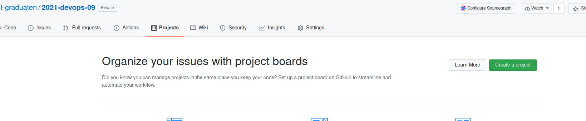
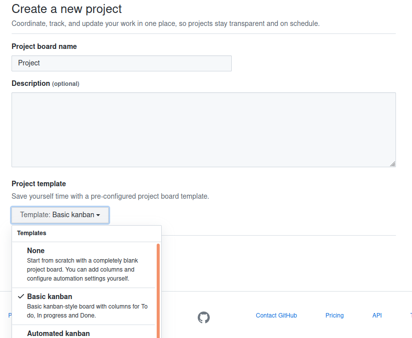
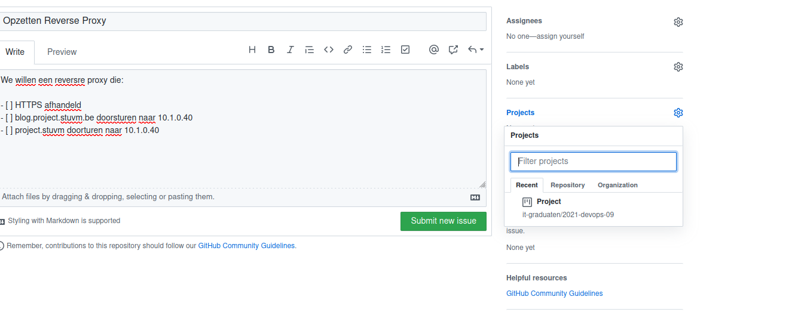
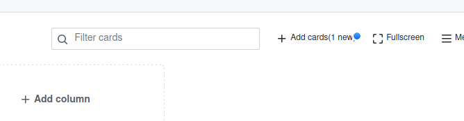
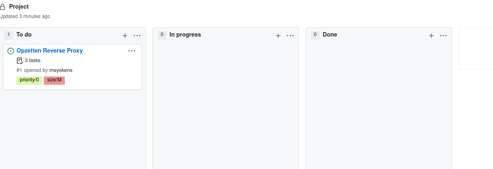
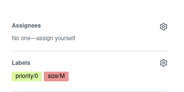
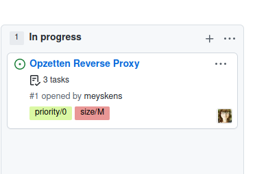

# GitHub Projects

We gaan ons project volgens de SCRUM methodes organiseren. Hiervoor hebben we een plek nodig voor een Kanban board te onderhouden als ook te comminuceren en te documenteren. GitHub heeft "Projects" waar we een digitaal Kanban board kunnen gaan opzetten. Voor alle taken maken we GitHub issues aan deze kunnen we op dit bord gaan beheren.

## Maak een bord aan

Op onze GitHub repo zien we bovenaan "projects". We openen dit tabblad en hier zien we al onze borden, we hebben er nog geen dus we gaan er een aanmaken.



We geven het bord een naam, eventueel een beschrijving en we gaan voor de template "Basic Kanban". Dit zet al een paar colommen voor ons klaar.



We hebben nu een leeg bord, hier gaan we straks mee aan de slag om taken toe te voegen

## Tickets maken

We gaan nu een ticket maken waar we een korte user story of ee algemene taak gaan beschrijven. Dit doen we onder "issues, ook hier krijg je weer een lijst van alle issues en we kunnen er nieuwe gaan maken.



We geven elk ticket/issue hier een titel en een beschrijving, dit beschrijft zeker wat en waarom we iets gaan bouwen.
Individuele taken schrijven we met checkboxed in markdown. Je kan dat met de volgende syntax:

```markdown
-   [ ] dit is een taak
```

Degene die dit ticketje gaat afhandelen kan deze afvinken, deze lijst beschrijft dus wanneer dit deel "done" is. Vergeet dus geen taken, je hebt liefst er wat te veel detail in dan geen taken!

Rechts zien we een aantal opties, de belangrijkste is het project. Dit is waar we ons bord moeten aanduiden dat het ticket ook mee op het bord komt.
We hebben ook labels, hiermee kan je labels toekennen voor "size" en "priority". Jammergenoeg geeft GitHub deze niet standaard mee maar we moeten deze dus gaan aanmaken.
Hier een suggestie voor labels, je mag altijd een eigen systeem maken.

```
size/XS
size/S
size/M
size/L
size/XL
priority/low
priority/medium
priority/high
```

## Tickets op bord

Als je issue aangemaakt is krijg je bij je bord een kein bolletje dat er nog tickets zijn die niet op je bord staan, als je hierop klikt kan je het slepen naar de juiste plaats op je bord.





## Assignment

Als je aan een taak begint te werken moet je dit assignen aan jezelf, dan staat je avatar op het item en weten je teamgenoten op elk moment waarmee je bezig bent. Je kan dit doen in het issue zelf bij "assignment" je kan jezelf assignen alsook andere team leden. Ben je klaar? Vergeet dan niet je naam weg te halen!



Op het bord ga je nu dit zien:
Zo heb je altijd een overzicht op prioriteit, grotes, wie wat doet, taken nog te doen enz.


