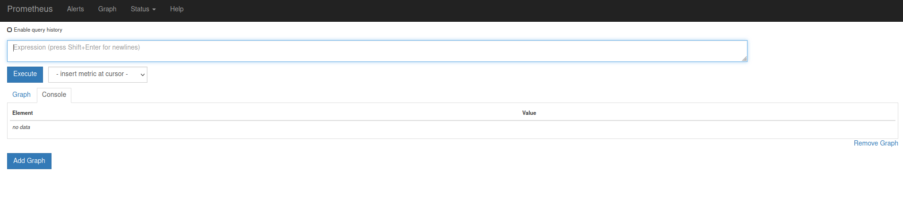
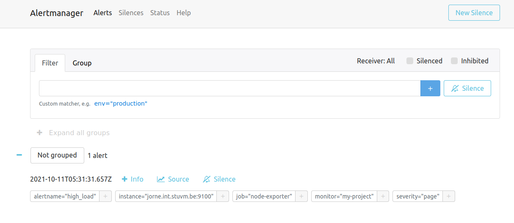
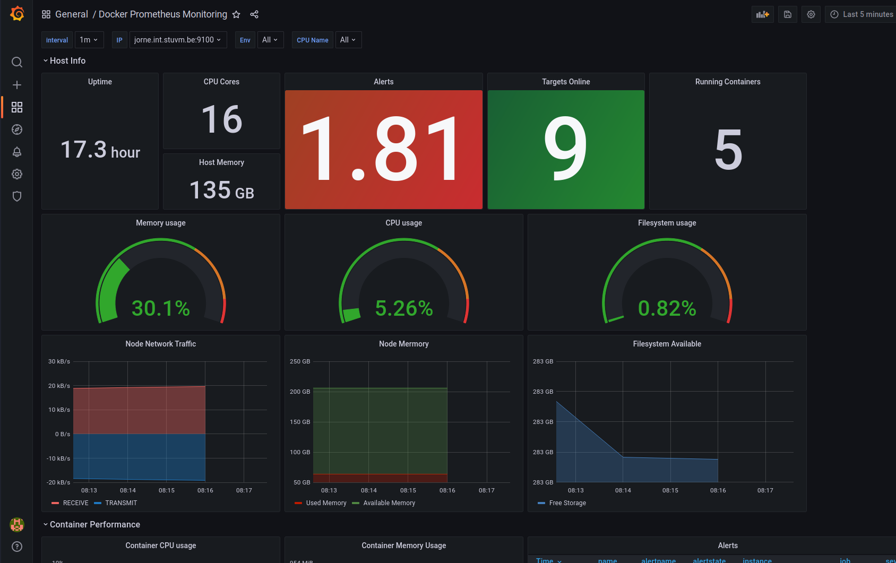
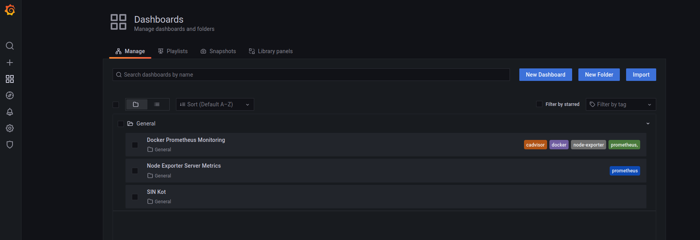
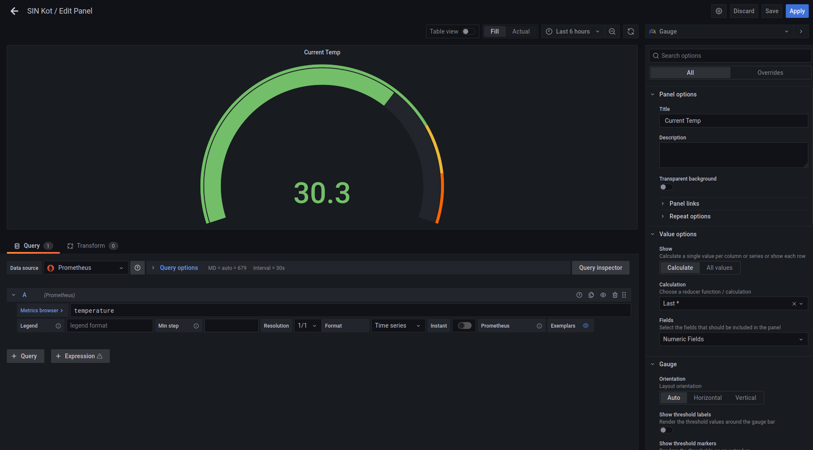
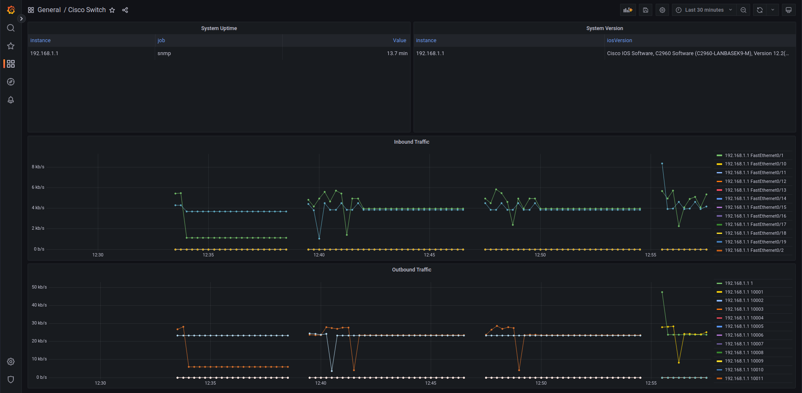

# Grafana and Prometheus

Prometheus is in 2012 ontwikkeld door Soundcloud om hun problemen met eerdere monitoring systemen te oplossen.
Het systeem was geinspireerd op het interne monitoring systeem van Google (Borgmon). Het is uniek door met een polling systeem te werken waarbij de monitoring op een gegeven interval statische data verzameld van verschillende systemen in plaats van dat de systemen het zelf sturen. Hierdoor is Prometheus makkelijke om uit te breiden en redundant te maken.
Prometheus won vooral door adoptie van de Kubernetes wereld een enorm groot aandeel.

Grafana is een grafische interface voor monitoring, waarmee de data van Prometheus kan worden weergegeven.
Grafana zelf bied een deel van de functionaliteit van Prometheus ook aan, maar is vooral gebruikt om data uit Prometheus te virtualiseren.

Prometheus hanteerd een micro service structuur. Prometheus zelf staat in voor het verzamelen en opslagen van de data.
Alertmanager, zoals de naam zegt, staat in voor het uitsturen van alerts.

Data kan Prometheus van bijna elk mogelijk systeem verzamelen. In vele applicaties kan je een "metrics endpoint" hebben die Prometheus om de zoveel seconden scraped. Deze metrics worden door de developer bepaald.

Voor Linux servers hebben we `node_exporter`, dit stelt statistieken over de CPU, RAM, etc. beschikbaar.


## Setup met Docker Compose

:::note
We gebruiken in deze setup Docker en Docker Compose. Voor een herhaling van Docker verwijs ik graag naar de [cursus Linux Server](https://linux.maartje.dev/docker/docker/)
:::

Voor deze setup maken we gebruik van het project [vegasbrianc/prometheus](https://github.com/meyskens/prometheus) op GitHub (we gebruiken een fork die is aangepast voor de toevoeging van SNMP).
Dit geeft ons een basis om mee te starten met Grafana, Prometheus.

We clonen het project naar een map:

```bash
git clone https://github.com/meyskens/prometheus.git
cd prometheus
```

In dit project vinden we verschillende configuratie bestanden terug.
het belangrijkste voor ons is `docker-compose.yml`.

### Configuratie

Hier vinden we de congiguratie terug van Prometheus, Node Exporter, Alert Manager en Grafana. De configuratie voor "Push Gateway" staat in commentaar, wij gebruiken dit in onze setup niet.

We zien mappen voor de verschillende componenten.
We starten met Grafana, in `config.monitoring` zien we een aantal environment variables.
We passen best al het wachtwoord aan

```
GF_SECURITY_ADMIN_PASSWORD=<something more secure>
```

De volgende stap is Prometheus, we bekijken `prometheus.yml`.
Het belangrijkste voor ons hier is de `scrape_configs:` configuratie. Dit bevat waar Prometheus de data van de verschillende systemen gaat halen.

We kijken naar de configuratie van `node_exporter`, deze gaat op servers informatie ophalen over de CPU, RAM, etc.

```yaml
- job_name: "node-exporter"

  # Override the global default and scrape targets from this job every 5 seconds.
  scrape_interval: 15s

  # Auto Discorver using DNS
  # dns_sd_configs:
  #   - names:
  #       - "tasks.node-exporter"
  #     type: "A"
  #     port: 9100

  static_configs:
      - targets: ["node-exporter:8080"]
```

We zien hier dat we deze elke 15 minuten ophalen, we kunnen ofwel via DNS servers gaan zoeken en info opvragen maar ook statisch met een lijst in YAML.
Vanaf dat we meerdere servers hebben, moeten we de targets voor de servers ook opgeven hierbij.

We kunnen ook targets opgeven die geen node_exporters zijn. Zo heeft het team van [SIN](https://sinners.be) op hun temperatuur sensor van het server lokaal ook een Prometheus exporter gezet waardoor we samen met onze server en applicatie statistiek de

```yaml
- job_name: "sinkot"

  # Override the global default and scrape targets from this job every 5 seconds.
  scrape_interval: 5s

  metrics_path: /sinkot.php

  static_configs:
      - targets: ["sinmonitor.sinners.be:80"]
```

In de map `prometheus` vinden we ook nog `alert.rules`, hierin staan regels wanneer een alert moet uitgestuurd worden.
We laten deze voorlopig zo maar het is het wel eens waard te bekijken.

```yaml
groups:
    - name: example
      rules:
          # Alert for any instance that is unreachable for >2 minutes.
          - alert: service_down
            expr: up == 0
            for: 2m
            labels:
                severity: page
            annotations:
                summary: "Instance {{ $labels.instance }} down"
                description: "{{ $labels.instance }} of job {{ $labels.job }} has been down for more than 2 minutes."
          # Alert for any instances with load higher than 0.5 for >2 minutes.
          - alert: high_load
            expr: node_load1 > 0.5
            for: 2m
            labels:
                severity: page
            annotations:
                summary: "Instance {{ $labels.instance }} under high load"
                description: "{{ $labels.instance }} of job {{ $labels.job }} is under high load."
```

We zien hier 2, een voor als een endpoint down gaat en we dus al 2 minuten geen data hebben. Ook nog een gelijkaardige voor load (merk echter dat een load van 0.5 op een multicore Linux systeem vrij weinig is).

De eigenlijke configuratie van Alertmanger zelf staat in de map `alertmanager`.
Belangrijk hier is de `receivers`, dit is waar Alertmanager alerts naar moet naar sturen. Er zijn vele opties van chat diensten als Slack, of email of gespecialiseerde alerts services als PagerDuty.

```yaml
route:
    receiver: "slack"

receivers:
    - name: "slack"
#       slack_configs:
#           - send_resolved: true
#             username: '<username>'
#             channel: '#<channel-name>'
#             api_url: '<incomming-webhook-url>'
```

### Starten

Nu we alles juist hebben ingesteld starten we alles op met `docker compose`

```bash
docker compose up -d
```

### Extra node_exporters

Wanneer we meerdere servers hebben moeten we ook meerdere node_exporters hebben, eentje op elke server. Hiervoor hebben we ook een docker-compose.yaml voor!

```yaml
version: "3.7"
services:
    node-exporter:
        image: prom/node-exporter
        volumes:
            - /proc:/host/proc:ro
            - /sys:/host/sys:ro
            - /:/rootfs:ro
        command:
            - "--path.procfs=/host/proc"
            - "--path.sysfs=/host/sys"
            - --collector.filesystem.ignored-mount-points
            - "^/(sys|proc|dev|host|etc|rootfs/var/lib/docker/containers|rootfs/var/lib/docker/overlay2|rootfs/run/docker/netns|rootfs/var/lib/docker/aufs)($$|/)"
        ports:
            - 9100:9100
        restart: always
```

We kunnen dit ook met Ansible gaan configureren:

```yaml
- hosts: all
  tasks:
      - name: Download Docker Installer
        get_url:
            url: https://get.docker.com
            dest: /tmp/docker.sh
            mode: 0755
      - name: "Ensure docker is installed"
        become: yes
        command:
            cmd: "bash /tmp/docker.sh"
            creates: /usr/bin/docker
      - name: Make directory for node_exporter
        become: yes
        file:
            path: /opt/docker/node-exporter
            state: directory
            mode: 0755
      - name: Add docker-compose.yaml
        become: yes
        copy:
            dest: /opt/docker/node-exporter/docker-compose.yaml
            content: |
                version: "3.7"
                services:
                    node-exporter:
                      image: prom/node-exporter
                      volumes:
                          - /proc:/host/proc:ro
                          - /sys:/host/sys:ro
                          - /:/rootfs:ro
                      command:
                          - "--path.procfs=/host/proc"
                          - "--path.sysfs=/host/sys"
                          - --collector.filesystem.ignored-mount-points
                          - "^/(sys|proc|dev|host|etc|rootfs/var/lib/docker/containers|rootfs/var/lib/docker/overlay2|rootfs/run/docker/netns|rootfs/var/lib/docker/aufs)($$|/)"
                      ports:
                          - 9100:9100
                      restart: always
      - name: "Start node-exporter"
        become: yes
        command: "docker compose up -d"
        args:
            chdir: /opt/docker/node-exporter
```

Nadat deze online staat kan je ze gewoon bij in de lijst van node_exporters zetten:

```yaml
- job_name: "node-exporter"

  # Override the global default and scrape targets from this job every 5 seconds.
  scrape_interval: 15s

  # Auto Discorver using DNS
  # dns_sd_configs:
  #   - names:
  #       - "tasks.node-exporter"
  #     type: "A"
  #     port: 9100

  static_configs:
      - targets: ["node-exporter:8080", "<server2>:9100", "<server3>:9100"]
```

### Components

We hebben nu alle componenten van onze monitoring stack gestart.
Laten we nu eens kijken naar wat de belangrijkste voor ons doen

#### Prometheus

Op poort `9090` vinden we Prometheus terug. We krijgen hier al een basic UI terug waar we queries kunnen uitvoeren.
Even bekangrijk is dat we ook kunnen kijken naar alerts, en ook onder Status zijn belangrijke dingen te zien zoals de status van alle endpoints. Een must tijdens het debuggen van problemen!


#### Alertmanager

Op poort `9093` vinden we hetzelfde voor Alertmanager. We zien hier eventuele getriggerde alerts.


Belangrijkste functie is hier de "silence" deze zet tijdelijk een bepaalde alert uit. Dit is bijvoorbeeld handig tijdens planned maintenance.
In dagelijks gebruik wel opletten dat je een alert die constant silenced is misschien beter herbekijkt.

#### Grafana

Op poort `3000` vinden we Grafana terug. Grafana is al opgezet om met Prometheus te verbinden. Ook hebben we al een dashboard als demonstratie meegekregen.

Grafana is onze enige service voorzien van authenticicatie en is dus degene die we op het publieke internet kunnen bereikbaar maken.



We kunnen zelf dasboards maken, of bestaande gebruiken. Ook kunnen we in de explore tab gaan kijken naar verschillende metrics.
We bekijken dit in verder detail later in de cursus.

## PromQL

Prometheus kunnen we querieren met een eigen taal PromQL. Deze taal is vrij uniek in zijn opzet maar wel enorm krachtig omdat hij gespecialiseerd is op het domein van monitoring.

Elke query start met de naam van de metric die we willen krijgen. Zo kan je bijvoorbeeld `temperature` hebben van een omgeving of `node_load1` voor een server.

Alle metrics van `node_load1` opvragen doe je zo:

```promql
node_load1
```

Dit geeft je een lijst met alle waarden van de metric, van alle instanties.

Wil je enkel een reeks cijfers van de laatste 5 seconden, of minuten? Dat kan je specifieren met `[]`
Bijvoorbeeld:

```promql
node_load1[5s]
```

(let op dit werkt niet wanneer je in grafiek weergave bent)

Je kan ook filteren op label, so kan je bijvoorbeeld zorgen dat je enkel gegevens van een bepaalde server krijgt. Labels filteren doen we met `{}`

Hier vragen we enkel de load op van de server `anke.int.stuvm.be`

```promql
node_load1{instance="anke.int.stuvm.be:9100"}
```

Je kan ook filteren met Regex. Dit doen we met `=~` of `!~` om negatief te matchen.

```promql
node_load1{instance=~"bart.int.stuvm.be:9100|caroline.int.stuvm.be:9100"}

node_cpu_seconds_total{cpu!="0",mode=~"user|system"}
```

Je kan ook logische operatoren (`or`, `and`, `unless`) gebruiken om meerdere queries te combineren.

```promql
up{job="prometheus"} or up{job="sinmonitor.sinners.be:80"}
```

Er zijn ook handige functies die je kunt gebruiken.

`delta()` geeft het verschil over de afgelopen tijdspanne, zo geeft deze query de toe of afname van he RAM gebruik over het afgelopen uur.

```promql
delta(node_memory_Active_bytes[1h])
```

`sum()` gaat dan weer alle data optellen, weten hoeveel harde schijf je hele netwerk heeft?

```promql
sum(node_filesystem_size_bytes)
```

### Tip: PromQL cheat sheet

Bekijk ook zeker eens de [Prometheus cheat sheet](https://promlabs.com/promql-cheat-sheet/) tijdens je project!

## Grafana

Grafana gaat onze go to worden bij problemen. Hier kunnen we snel al onze dashboarden opvragen van onze monitoring.

We kunnen onder Dashboards>Manage kijken naar al onze eigen dashboards als ook dashboards importeren.


Voor onze eigen metrics (zie voorbeeld van SIN) moeten we waarschijnlijk zelf aan de slag.
Voor bijvoorbeeld onze `node_exporter` kunnen we gerust gaan rondwinkelen!
Op de site van Grafana zijn er al vele dashboards gedeeld die we kunnen importeren.
[Zoek bijvoorbeeld eens naar node_exporter](https://grafana.com/grafana/dashboards/?search=node_exporter&orderBy=downloads&direction=desc)
Met de ID nummer kunnen we Grafana al het werk voor ons laten doen.

We kunnen dashboard panelen bijmaken en bewerken naar eigen smaak. Er zijn verschillende widgets die je kunt gebruiken. Gaande van een grafiek, tot meter. Er zijn vele opties zoals een uitgebreide legende of minima in te stellen.



Goed weergeven van data is een vak op zichzelf (cursus statistiek nodig?). We gaan er in deze cursus niet verder op in.
Bij het project zul je waarschijnlijk de kans krijgen je uit te leven!

## SNMP Exporter

Wanneer we naar netwerkapparatuur kijken, zoals switches, routers, firewalls, ... dan zien we dat deze meestal SNMP (v1, v2 of v3) gaan ondersteunen!
Ook deze informatie kunnen we gaan scrapen met Prometheus. We kunnen dus ook onze externe apparaten gaan integreren. Net als de node-exporter moeten we dit gaan opzetten op een server, deze gaat dan als proxy dienen on SNMP devices te bevragen voor informatie.

SNMP of Simple Network Management Protocol werkt met een numerieke MiB datastructuur, je kan een specifieke ID opvragen en data krijgen alsook deze recursief gaan opvragen. Prometheus daartegen heeft een platte namenstructuur. We moeren deze dus gaan omzetten dit doen we in de configuratie van de SNMP Exporter.

We kunnen 1 of meerdere profielen opgeven voor een specifiek apparaat te querien, je kan met tools deze files genereren of ze ophalen voor specifieke devices.
In onderstaand voorbeeld bekijken we deze voor een Cisco Switch met IOS:

```yaml
ciscosw:
    version: 2
    auth:
        community: public
    walk:
        - 1.3.6.1.4.1.9.9.13.1.4.1
        - 1.3.6.1.2.1.1.3
        - 1.3.6.1.2.1.2.2.1.4
        - 1.3.6.1.2.1.2
        - 1.3.6.1.2.1.31.1
        - 1.3.6.1.2.1.31.1.1.1
    metrics:
        - name: ciscoEnvMonFanState
          oid: 1.3.6.1.4.1.9.9.13.1.4.1.3.1057
          type: gauge

        - name: sysUpTime
          oid: 1.3.6.1.2.1.1.3
          type: gauge

    [...]

```

We zien dus dat we `1.3.6.1.2.1.1.3` gaan vertalen naar de meer gebruiksvriendelijke `sysUpTime`. Deze gaan we dan ook gebruiken in onze Prometheus queries an Grafana dashboards.

In onze `prometheus.yaml` configuratie gaan de de scrape configuratie opzetten:

```yaml
- job_name: "snmp"
  static_configs:
      - targets: ["192.168.1.1"]
  metrics_path: /snmp
  params:
      module: [ciscosw]
  relabel_configs:
      - source_labels: [__address__]
        target_label: __param_target
      - source_labels: [__param_target]
        target_label: instance
      - source_labels: []
        target_label: __address__
        replacement: snmp-exporter:9116
```

We gaan in target de IPs zetten van onze devices die we willen queryen, onder `module` zeggen we welke vertalingsmodule we gaan gebruiken in ons voorbeeld dus `ciscosw`. `target_label: __address__ replacement: snmp-exporter:9116` is speciaal hier, we kunnen onze switch niet direct aanspreken via prometheus, met deze lijn zeggen we eigenlijk dat de `snmp-exporter:9116` API over HTTP moeten aanspreken die hierna dan voor ons de SNMP query gaat uitvoeren en gaat vertalen.
Als je naar je IP op poort 9116 gaat zal je ook merken dat een simpele website je de queries al laat uitproberen.

### Praktijk

We hebben in onze `docker-compose.yml` file al een SNMP configuratie in commentaar staan, deze gaat gebruikt worden in de lessen Enterprise networking on Cisco apparatuur te gaan uitlezen met behulp van SNMPv2.



