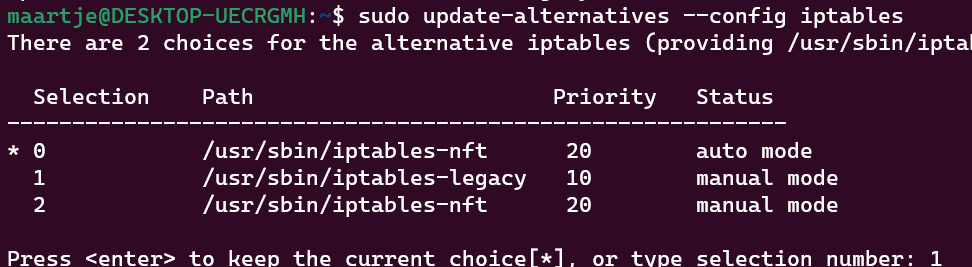
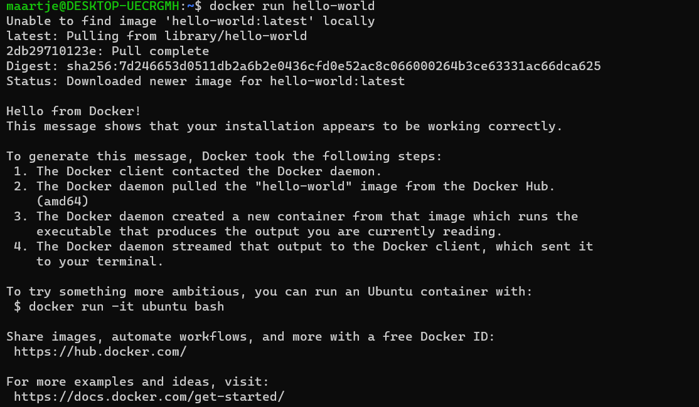
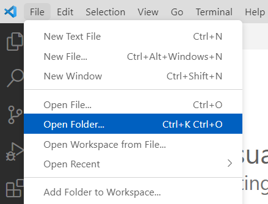
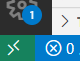
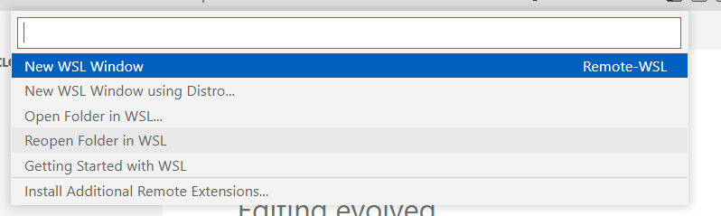
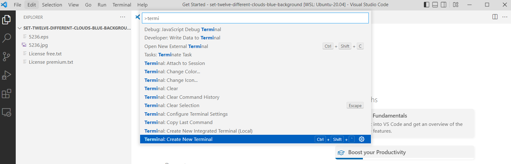

# Laptop Setup

In deze cursus gaan we veel code schrijven en tools gebruiken voor het beheren van systemen. De beste ervaring is wanneer we dit op onze eigen laptop kunnen doen. We hebben dus een aantal tool nodig om te starten met deze cursus.

## Windows Subsystem for Linux (WSL)

:::note
Vele tools die we gaan gebruiken zijn ontworpen voor gebruik op Unix/Linux systemen. Ben je een Linux of Mac gebruiker dan mag je deze stappen overslagen.
:::

In vorige cursussen werkten we met een Linux Systeem in een VM, dit bracht perfecte isolatie mee van het systeem. Wij willen echter Linux gebruiken als een plaats voor ons dagelijks werk, hier gaat isolatie van netwerk en bestandssysteem niet optimaal zijn.
Daarom verkiezen we hier WSL, het Windows Subsystem for Linux. Dit is een recente toevoeging aan Windows, het bied de mogelijkheid om Linux software te gebruiken in een Windows omgeving!

### Installatie

We gaan WSL installeren op een Windows 10 of 11 systeem.

We gaan eerst checken of deze systeem al een WSL installatie heeft. We doen dit in PowerShell, run dit als Administrator.

```powershell
wsl -l -v
```

Dit zou geen installaties mogen teruggeven.
Heb je al WSL? Kijk dan na of je installatie WSL 2 is bij "version". Indien het WSL 1 is, dan moet je naar WSL 2 migreren.

```powershell
wsl --set-version <distro name> 2
```

Heb je geen installatie? Dan installeren we WSL 2 met een Ubuntu installatie:

```powershell
wsl --set-default-version 2
wsl --install -d Ubuntu-20.04
```

Dit download Ubuntu, zet WSL op en start de installatie. Bij een nieuwe install moet je eventueel je PC herstarten, als dit gevraagd is doe dit. Na de reboot gaat de installatie vanzelf verder.

(Je kan Ubuntu ook van de [Microsoft Store](https://apps.microsoft.com/store/detail/ubuntu-22041-lts/9PN20MSR04DW?hl=fr-be&gl=be) downloaden.)

Wil je snel kunnen wisselen tussen je nieuwe WSL installatie en PowerShell? Gebruik dan [Windows Terminal](https://apps.microsoft.com/store/detail/ubuntu-22041-lts/9PN20MSR04DW?hl=fr-be&gl=be).


Hier kan je je Ubuntu Shell selecteren en beginnen te werken.

### Docker on Windows

We gaan Docker gebruiken in de lessen zowel lokaal voor experimenteren met tools als op servers voor het draaien van onze software.
We willen ook Docker gaan gebruiken op Windows voor gebruiksgemak. Ook dit doen we in ons WSL systeem.
In het verleden gebruikten we Docker Desktop, echter door de nieuwe complexiteit in licenties en verbeteringen aan WSL kunnen we beter direct werken!

In onze WSL Ubuntu teminal draaien we:

```bash
wget -O docker.sh https://get.docker.com/
bash docker.sh
```

Je gaat eerst een melding zien dat Docker Desktop aangeraden is, dit negeren we.

Als de installatie gelukt is moeten we Docker kunnen starten. Doordat WSL geen Systemd heeft moeten we hier rond werken. (Credits voor deze workaround gaan naar [NillsF](https://blog.nillsf.com/index.php/2020/06/29/how-to-automatically-start-the-docker-daemon-on-wsl2/))

```bash
sudo visudo
```

Onderaan voegen we de volgende regel toe (vergeet `USERNAME` niet te vervangen!):

```
USERNAME ALL=(ALL) NOPASSWD: /usr/bin/dockerd
USERNAME ALL=(ALL) NOPASSWD: /usr/bin/containerd
```

Je mag daarna de file opslagen,

```bash
sudo usermod -a -G docker $USER
newgrp docker
```

:::warning
Als je Ubuntu 22.04 gebruikt moet je omschakelen naar legacy iptables, Docker werkt nog niet optimaal met nftables. Dit kan je doen met:

```bash
sudo update-alternatives --config iptables
```

Kies hier voor `iptables-legacy`.



:::

Nu moeten we zorgen dat Docker werkt bij het openen van een WSL terminal. Een WSL installatie heeft namelijk geen Systemd. We gaan dit oplossen met een kleine _hack_.

We openen `.bashrc`

```bash
nano ~/.bashrc
```

en plaatsen onderaan de volgende regel:

```bash
# Start Docker daemon automatically when logging in if not running.
RUNNING=$(ps aux | grep dockerd | grep -v grep)
if [ -z "$RUNNING" ]; then
    sudo containerd > /dev/null 2>&1 &
    sudo dockerd > /dev/null 2>&1 &
    disown
fi
```

Dit zal ervoor zorgen dat Docker automatisch gestart wordt bij het openen van een bash terminal.

Sluit je terminal af en open deze opniew. Als alles goed is gegaan kan je nu Docker gebruiken!

```bash
docker run hello-world
```



### Fix Git

We gaan een kleine fix doen om Git werkend te krijgen op het gedeelde Windows bestandssysteem.

Voer het onderstaande uit in de WSL shell:

```bash
sudo nano /etc/wsl.conf
```

Voeg de volgende configuratie toe (dit kan een nieuw bestand zijn):

```ini
[automount]
options = "metadata"
```

We voeren nu het volgende commando uit in PowerShell om WSL te herstarten:

```powershell
wsl --shutdown
```

Je kan nu terug een WSL shell openen.

## Visual Studio Code

We hebben ook een goede code editor nodig voor onze scripts en configuratie in te schrijven. In deze cursus gebruiken we [Visual Studio Code](https://code.visualstudio.com/). VSCode is een open source editor onderhouden door Microsoft. Deze is echter **niet** hetzeflde als Visual Studio, ze delen enkel de naam.

We installeren deze via de [de VSCode website](https://code.visualstudio.com/download).
Na de installatie hebben we de plug-in "Remote - WSL" nodig.


Deze plugin laat ons toe mappen te openen in WSL en ook de ingebouwde terminal te gebruiken, wat ons nog vanpas gaat komen!

(Visual Studio heeft ook een Remote - SSH plugin die je toestaat om op remote Linux machines te ontwikkelen, enorm handig!)

Nu we Visual Studio open hebben kunnen we een project map openen.
Dit doen we zoals in elk programma, via `File > Open Folder...`. (fun fact: `...` geeft in een menu altijd aan dat er een dialog venster opent)



Als we een map open hebben hebben we deze open in onze Windows omgeving. We willen echter werken in WSL.

Onderaan vinden we een "Remote" knop. Klik op deze.



We krijgen nu een heel aantal opties. We kiezen voor "Open Folder in WSL". Dit gaat onze huidige map in WSL openen, je kan ook andersom werken als je de Windows<->Linux file mapping door hebt.



Visual Studio Code zal nu onze map openen in WSL. We kunnen nu onze code schrijven en deze ook uitvoeren in WSL.

Als DevOps engineer zullen we ook veel werken met de terminal. We kunnen deze ook in VSCode openen. We drukken op `F1` en zeken naar `Terminal: Create New Integrated Terminal`. Er is ook een shortcut voor deze actie die wordt aangegeven.



Je hebt nu een split screen met je code editor en je terminal. Je kan nu je code schrijven en deze ook uitvoeren in de terminal! Dit gaat in onze lessen ook de beste manier zijn om te werken.


