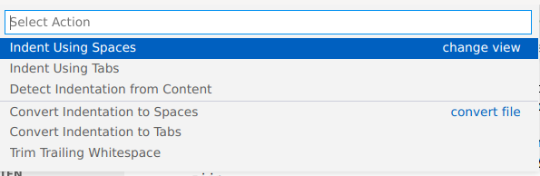

# YAML

YAML is een "human-friendly" format om data op te slagen. YAML staat voor "Yet Another Markup Language". Je herkent een YAML bestand door
de extensie `.yaml` of `.yml`. Waarom zien we YAML? Onze DevOps tools gaan code en data gebruiken voor onze infrastructuur te bouwen en beheren.
Vele tools, bijna allemaal, kozen dit te doen in YAML. YAML heeft als doel makkelijk leesbaar maar ook schrijfbaar te zijn. Hiervoor hebben ze inspiratie bij Python geleend.

YAML is een superset op JSON. YAML kunnen we naar JSON omzetten en JSON data is gewoon valide YAML data.

Dit is een voorbeeld van YAML (geschreven door AI, cool he):

```yaml
---
# This is a comment
name: John Doe
age: 43
address:
    street: 123 Main St.
    city: Anytown
    state: NY
    zip: 12345
children:
    - John
    - Jane
    - Jack
pets: ["dog", "cat", "bird"]
```

## YAML compomenten

Een YAML document start met `---` maar dit is echter optioneel, het is wel handig wanner je meerdere YAML documenten in 1 bestand wil zetten.
In YAML gaan we vaak `key: value` tegenkomen. Hiermee geven we een waarde mee aan een bepaalde key. Dit kan zijn

-   een string, schrijf gewoon de tekst
-   een getal, schrijf gewoon het getal
-   een array, die schrijven we met een nieuwe lijn gevolgd door een `-` of de waarden tussen `[]`
-   een object, die schrijven we met een nieuwe lijn gevolgd door weer keys en values

## YAML schrijven

Oke, laten we even eerlijk zijn YAML heeft zijn negatieve kanten. YAML maakt veel gebruik van spaties waardoor het niet altijd makkelijk is een fout hiertegen te vinden aangezien dit een onzichtbaar teken is. Zo hebben sommige bedacht om gewoon een meetlat te gebruiken...


Wij lossen dit liever op met goode tooling. [Visual Studio Code](https://code.visualstudio.com/) (niet te verwarren met visual studio) is een handige tool om YAML te schrijven als ook ons versiebeheer toe te passen en code te schrijven. Het helpt ons ook met de uitlijning, ook zijn er verschollende plugins beschikbaar om te helpen met YAML en andere tools in deze cursus.

### Tips

#### Linter

Een linter kan je helpen met het detecteren van fouten in YAML. `yamllint` is een veel gebruikte CLI tool die je in elke Linux distribution kunt installeren. Er zijn ook web versies als [YAML Linter](https://yamllint.com/).

#### Tabs en Spaties

Een tab of 4 spaties kan er hetzelfde uitzien, als je code kopiert kan het wel eens mislopen hiermnee. Als je de tekst selecteerd in VS Code toont het je de spaties en tabs met symbolen. Je kan ook problemen oplossen onderaan in VS Code te klikken op "spaces" (of "tabs" afhankelijk van je voorkeur instellingen). Daarna verschijnt een menu waar je je file kan omzetten naar allemaal spaces of tabs.


Ik verkies om spaces te gebruiken in dit scenario. [Daar houd ik het bij, tabs en spaces veroorzaken vaak te veel discussies onder ITers](https://www.youtube.com/watch?v=cowtgmZuai0).
